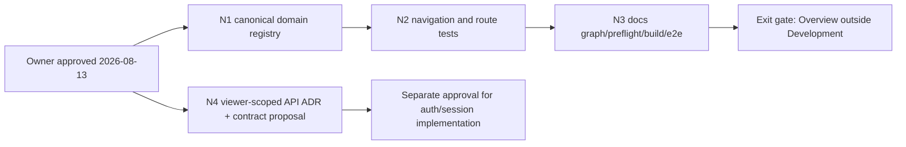

# Next Implementation Plan — Business Navigation Alignment and Viewer Contract

| Field | Value |
|---|---|
| **Version** | 0.2.0 |
| **Status** | Implemented — N1/N2/N3 gates passed; N4 deferred |
| **Date** | 2026-08-13 |
| **Inputs** | FR-039, FR-044, ADR-011, ADR-015, SDD-018, SDD-022 |
| **Preflight** | PASS — 0 critical, 0 warning |
| **Risk** | MEDIUM — navigation registry changes first; viewer API design is a later contract slice |

## 1. Objective

Align the runtime domain registry with the accepted shell model after FR-044:

```text
BusinessShell root: /overview
  └── Domain: Development
      ├── Projects
      ├── All Work
      ├── Execution
      ├── Timeline
      ├── Dependencies
      ├── Milestones & Gates
      └── Repositories
```

`Overview` must remain a Business-level root and must not appear as a Development
sub-domain. After that IA correction is verified, design the server-side viewer-scoped
entry contract so the current client-side `/api/scope` filtering cannot be mistaken for
a production authorization boundary.

## 2. Scope summary

| Workstream | Scope | Complexity | Immediate implementation? |
|---|---|---:|---|
| N1 — Canonical domain registry | Remove Overview from Development sub-domain registry and keep `/overview` as BusinessShell root | 5 points | ✅ complete |
| N2 — Navigation proof | Update Sidebar/DomainBar/Breadcrumb/command-palette contracts and route tests | 6 points | ✅ complete |
| N3 — Documentation sync | Update sitemap, interface inventory, handoff, acceptance evidence, graph/preflight | 3 points | ✅ complete |
| N4 — Viewer-scoped API design | ADR + API/FR proposal for server-filtered Business Routing and session boundary | 8 points | Documentation only; separate approval |

Out of scope: production authentication, session/token storage, new ERP domains,
Business Strategy mutations, Project schema changes, and design-token redesign.

## 3. Work DAG and critical path



Critical path: `A → B → C → D → E`.

Parallel work: N4 is documentation-only and may run beside N1–N3, but it must not
change API behavior until its ADR and requirement boundary are approved.

## 4. Sprint detail

### N1 — Canonical domain registry

**Goal:** Make `DOMAINS.projects.sub` contain only Development resources.

| Task | Evidence | Points | Dependency |
|---|---|---:|---|
| Remove `/overview` from Development sub-domain registry | `src/config/domains.js` | 2 | Plan approval |
| Keep `/overview` discoverable as BusinessShell root | `src/config/modules.js`, `DomainBar`, Business Overview links | 2 | Registry change |
| Preserve `domainForPath('/overview')` root behavior | route decision/unit test | 1 | Registry change |

**Acceptance:** Development sidebar has seven entries; `/overview` still renders the
Business Overview and no Project route changes ownership or URL shape.

### N2 — Navigation proof

**Goal:** Ensure all navigation surfaces agree with the registry.

| Task | Evidence | Points | Dependency |
|---|---|---:|---|
| Update domain-navigation unit expectations | `tests/unit/domain-navigation.test.js` | 1 | N1 |
| Add explicit sidebar exclusion assertion for Overview | `tests/unit/sidebar-visible-subdomains.test.js` | 1 | N1 |
| Verify command palette excludes Overview as a Development item | command-palette test/e2e | 1 | N1 |
| Verify Business Overview cards and DomainBar still link to `/overview` | FR-041/FR-044 browser proof | 2 | N1 |
| Verify ProjectResourceShell remains nested and unchanged | FR-040 browser proof | 1 | N1 |

**Acceptance:** no duplicated Overview entry, no dead Development link, and no
regression in Project, People, or Platform routes.

### N3 — Governance and release gates

**Goal:** Keep the route inventory and generated evidence truthful.

| Gate | Command/evidence |
|---|---|
| Unit/integration | `npm test -- --run` |
| Browser | `npm run test:e2e` plus focused Business/Project route proof |
| Build | `npm run build` with the dev server stopped and a fresh `.next` |
| Documentation | `npm run docs:graph`, `npm run docs:preflight`, `npm run docs:check` |
| Hygiene | `git diff --check`; no schema/migration change |

**Exit:** Overview is represented exactly once as BusinessShell root, the generated
graph has zero dangling edges, preflight has zero critical/warning findings, and all
existing protected-route smoke tests enter through Business Routing. ✅

### N4 — Viewer-scoped API contract (separate slice)

**Goal:** Replace demo-only client filtering with an explicitly authorized server
boundary before production authentication.

Deliverables for a later approval:

1. ADR defining whether `/api/viewer` returns the scope inventory or whether a new
   viewer-scoped `/api/entry` read model is required.
2. FR/API contract for Business Routing that makes unauthorized Business rows
   impossible to infer from the response.
3. Contract tests for OWNER, MEMBER, DEV, empty grants, and cross-tenant denial.
4. Migration/rollback note for the eventual session provider; no auth implementation
   is included in this plan.

## 5. Risk register

| ID | Risk | Probability | Impact | Score | Mitigation |
|---|---|---:|---:|---:|---|
| R-NAV-01 | Removing Overview from the registry breaks `/overview` route ownership | 2 | 4 | 8 | Keep explicit BusinessShell root mapping and browser proof |
| R-NAV-02 | Legacy tests still assume in-shell selection | 4 | 3 | 12 | Route helpers always enter `/login` → `/businesses`; skip only superseded tests with rationale |
| R-NAV-03 | Client-side scope inventory is mistaken for authorization | 3 | 5 | 15 | Keep the limitation in API docs; require N4 ADR before production auth |
| R-NAV-04 | Domain registry and sitemap drift again | 3 | 3 | 9 | Add a registry-to-sitemap assertion and run generated graph/preflight in the gate |
| R-NAV-05 | Token redesign gets mixed into IA work | 2 | 3 | 6 | Reuse current tokens; defer all visual-system changes |

## 6. Definition of done

- [x] Owner approved this plan and the N1 navigation interpretation.
- [x] Development registry contains no `/overview` sub-domain entry.
- [x] Business Overview, DomainBar, Sidebar, Breadcrumb, and command palette agree on
  the same route ownership.
- [x] Focused and full tests, build, browser proof, and docs gates are green.
- [x] N4 is explicitly deferred for separate ADR/API approval; no real auth
claim is made by N1–N3.

## 7. Verification evidence

- `npm test -- --run`: 60 test files, 321 tests passed.
- `npm run test:e2e -- --workers=1 --retries=0`: 31 passed, 4 intentional skips.
- `npm run build`: clean production build from a fresh `.next` artifact.
- `npm run docs:graph`: 580 nodes, 812 edges, 0 dangling edges.
- `npm run docs:preflight`: 0 critical, 0 warning; `npm run docs:check`: up to date.
