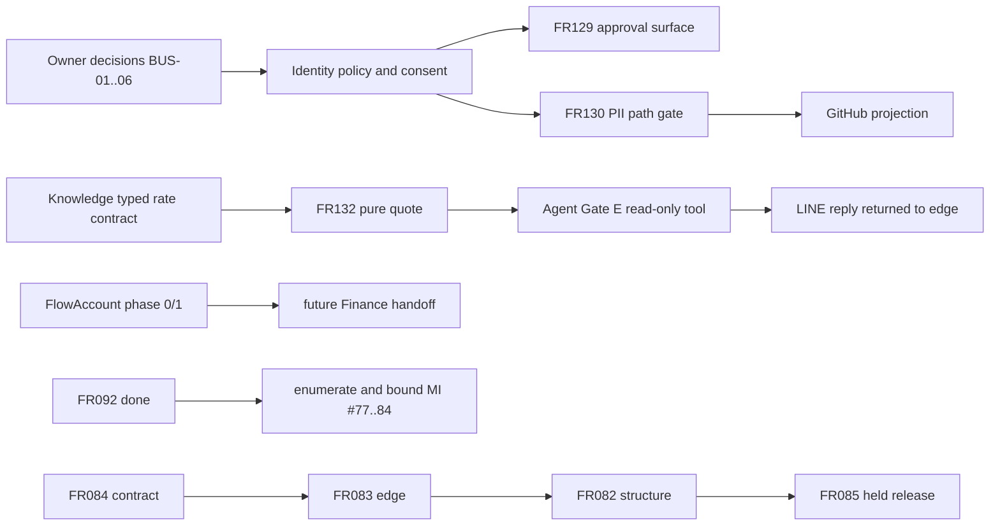

# BUSINESS pending lane: reviewable decisions and next slices

ตำแหน่งที่ตั้งใจให้ย้ายไปคือ docs/roadmap/PLAN-PENDING-BUSINESS-20260831.md; ลิงก์
ทั้งหมดจึงเขียนให้ resolve จากตำแหน่งนั้น เอกสารนี้เป็น candidate สำหรับการทบทวน
เท่านั้น ยังไม่มีการอนุมัติ implementation, schema, secret, provider call หรือ
การแก้ registry ใด ๆ

## ขอบเขตและระดับความเสี่ยง

ครอบคลุม FR125, FR126–FR132, Market Intelligence issue references #77–#84 และ
Pipeline Builder FR082–FR085 โดยเน้นตัวเลือกที่เจ้าของต้องตัดสินใจและ increment
เล็กที่ตรวจได้ แยกสิ่งที่ส่งแล้วออกจากสิ่งที่ยังค้าง ไม่ขยายเป็นแบบจำลองระบบใหม่

ระดับงานคือ C3/HIGH เพราะมีสิทธิ์ผู้อนุมัติ, PII/ข้อมูลภายนอก, LINE tool และ
ขอบเขตข้าม Integration, Identity, Knowledge, Agent, CRM, Project Manager และ
Market Intelligence หลัง owner อนุมัติเท่านั้นจึงค่อยเปิดเอกสาร implementation
ของแต่ละ lane

## แหล่งหลักฐานและขอบเขตความเชื่อมั่น

| แหล่ง | หลักฐานที่ใช้ |
|---|---|
| checkout | branch codex/parallel-backlog-review-20260831, commit 424f5fab525d20fdf1180fabee4c8cf9d16dd994; clean at review time |
| parent | [PRD/SDD registry](../PRD-SDD-v1.0.md), [feature registry](../FEATURES.md), [current roadmap](./ROADMAP.md) |
| parent decisions | [ADR-035 canvas](../decisions/ADR-035-DIRECT-MANIPULATION-PIPELINE-CANVAS.md), [ADR-053 FlowAccount](../decisions/ADR-053-FLOWACCOUNT-READ-ONLY-PULL-PIPELINE-AND-CREDENTIAL-PROVISIONING.md), [ADR-054 CRM](../decisions/ADR-054-LEGACY-ERD-IS-PRIOR-ART-FOR-CRM-INTELLIGENCE.md) |
| peer feature notes | [FR129](../domains/integration/features/FR-129-catalog-publication-approval-gate.md), [FR130](../domains/integration/features/FR-130-github-repository-projection.md), [FR131](../domains/knowledge/features/FR-131-shipping-rate-card-as-business-knowledge.md), [FR132](../domains/agent/features/FR-132-line-ladder-quotation-tool.md) |
| source evidence | [gate compliance](../../src/platform/integrations/core/pipeline-gate-compliance.js), [business knowledge contract](../../src/modules/knowledge/business-contract.js), [agent tools](../../src/modules/agent/tools.js), [LINE ingress](../../src/platform/integrations/providers/line/line-oa-webhook.js) |
| verification evidence | [FR129 tests](../../tests/integration/fr129-catalog-publication-gate.test.js), [FR130 catalog e2e](../../tests/e2e/fr130-connector-catalog.spec.js), existing CRM consent/inbox tests; no FR126–128, FR131, FR132 or projection test proves implementation |
| external state | Parent supplied open issues #99, #74 and #76–#84 with no open PR and green main CI. This is not re-verified here; issue titles are not inferred from a search miss. |

Provider/account state was not called. FlowAccount facts in ADR-053 are a dated
official-doc snapshot and must be rechecked during its phase 0. No secret or
customer data was read. Parent reported baseline governance as critical 0,
warning 0, info 23; this artifact does not run govern or rewrite generated views.

## Done, partial and remaining

| item | current classification | evidence and boundary |
|---|---|---|
| FR092 | implemented locally | [market translation note](../domains/market-intelligence/features/FR-092-market-translation-core.md), including merged PR #88 and issue #76; no production DDL claim |
| FR129 | partial, detector shipped | gate evidence is recorded and every succeeded DPS-PUBLISH is checked; enforced:false; signer policy, route and reviewer surface remain open |
| FR130 | partial, false-green fix shipped | connector catalog no longer claims unregistered connectors are connected; GitHub projection and PII attestation remain blocked |
| FR125 | declared candidate only | no schema, credential provisioner, provider call, route or pull worker is authorized |
| FR126–FR128 | declared only | ADR-054 fixes shapes and boundaries; no CRM models, service, worker or LINE writer exists for these requirements |
| FR131 | declared/planned | sell-side rates belong in governed business_knowledge; supplier scope and typed predicate are unresolved |
| FR132 | declared/planned | existing LINE ingress is usable; Gate E descriptor, intent rule and pure calculator are absent |
| MI #77–#84 | open issue backlog, enumerated | parent อ่านชื่อและเนื้อหา issue จาก GitHub แล้วตามตารางด้านล่าง; open ไม่ใช่หลักฐานว่า code ทั้งหมดใน issue ยังไม่สร้าง |
| FR082–FR085 / FEAT007 | design only | ADR-035 and the canvas note define the contract and order; no canvas implementation is authorized |

Parent enumerated issue titles and bodies on 2026-08-31. ไม่ต้องรอให้ owner ส่ง
export ซ้ำ; ก่อน implementation ให้เทียบ code/FR ล่าสุดกับขอบเขต issue ที่เลือก:

| Issue | ขอบเขตจาก GitHub | Dependency และขอบเขตสำคัญ |
|---|---|---|
| [#77](https://github.com/Freshair129/zuri.ai/issues/77) | Price Intelligence / Watch | หลัง #76; unit-price normalization, history, deduplicated notification intent |
| [#78](https://github.com/Freshair129/zuri.ai/issues/78) | Supplier / Category Intelligence | หลัง #76/#77; SupplierCandidate ไม่ใช่ Approved Vendor, category authority อยู่ GKS |
| [#79](https://github.com/Freshair129/zuri.ai/issues/79) | Competitive / Demand Intelligence | หลัง #76/#77/#78; แยก observed กับ inferred, ไม่เขียนข้อมูล domain อื่น |
| [#80](https://github.com/Freshair129/zuri.ai/issues/80) | Market Research / unified search | หลัง #76–#79; visibility, reproducible evidence, explicit insufficient-data state |
| [#81](https://github.com/Freshair129/zuri.ai/issues/81) | Procurement Intelligence | Commerce เป็นเจ้าของ; หลัง #76/#77/#78; recommendation ไม่ใช่ RFQ/PO/stock mutation |
| [#82](https://github.com/Freshair129/zuri.ai/issues/82) | first listing adapter | Integration เป็นเจ้าของ acquisition; หลัง #76; ต้องเลือก source ที่มีวิธีเข้าถึงอนุมัติแล้ว |
| [#83](https://github.com/Freshair129/zuri.ai/issues/83) | first retail-price adapter | หลัง #76/#77; source access ต้องตรวจ, bundle normalization, UNKNOWN ไม่แทนด้วยศูนย์ |
| [#84](https://github.com/Freshair129/zuri.ai/issues/84) | domain catalog / navigation | หลัง #75/#76; stable domain key, truthful disabled/implemented surface |

เสนอให้เริ่มจาก bounded #77 contract/normalization slice โดยใช้ FR092 ที่ส่งแล้ว
และเลือก #82 source แยกเป็น decision ภายหลัง ไม่ต้องเปิด external collection ก่อน
ทดสอบ deterministic price/watch logic. Issue #76 เปิดไว้เป็น Phase-1 anchor โดยตั้งใจ.

## Narrow evidence notes

- FR129 evidence is a detector over the existing PipelineGateDecision ledger. It
  checks every succeeded publish, requires a prior APPROVED and deliberately
  reports enforced:false เพราะ Tier1 บันทึก/ตรวจ แต่ external data plane เป็นผู้
  execute; การเลือก signer policy ไม่เปลี่ยนอำนาจนี้โดยอัตโนมัติ.
- FR130 already has a Project Manager owned Repository record and an Integration
  connection/secret reference boundary. Neither is a PII attestation.
- FR131 has a PRODUCT-only knowledge contract and a registeredPredicate gap; a
  free text knowledge_type or a duplicate Prisma store would create a false lane.
- FR132 can reuse the existing ingress for upstream-verified batches and normalizer.
  ตัวตรวจ LINE signature ที่มีอยู่ไม่ใช่หลักฐานว่า production route เรียกมัน;
  transport owner ยังคงเป็นผู้ verify ตาม BR-011. The missing work is
  the read-only descriptor, deterministic intent boundary and pure calculator.
- CRM has consent/inbox foundations, but no FR126, FR127 or FR128 schema/service
  proof. ADR-054 therefore supplies scope and erasure constraints only.
- FR092 proves the raw-to-observation seam and GKS resolver boundary. Its feature
  note names #77, #82 and #83 as future slices; it does not specify their
  acceptance criteria or authorize source adapters.
- ADR-035 makes a node→edge→node contract and keyboard equivalent mandatory.
  Canvas release stays held when a declared contract is unsatisfied.
- ADR-053 permits only a phased FlowAccount plan in this state. Its dated
  provider snapshot is evidence to recheck, not a current integration contract.

## Owner decisions (all recommendations are unapproved)

| local label | decision | options | recommendation for review |
|---|---|---|---|
| BUS-01 | FR129 who may approve a catalog publication | A: Business OWNER only; B: Business-scoped approver grant with named person; C: platform operator | Prefer B: Identity owns a least-privilege grant and FR129 records decidedByPersonId; do not invent a role name or route until approved. |
| BUS-02 | FR130 authority and shape of PII path attestation | A: deny projection until an attestation policy exists; B: Business owner/security authority attests; C: scanner is the authority | Keep the projection on HOLD under A now. Owner must choose B or another authority and approve the contract before a form, column or “PII-safe” claim is written; a scanner may be evidence only. |
| BUS-03 | FR131 ownership of a shipping rate card | A: Business-owned sell-side card; B: supplier-scoped card; C: both in first slice | Prefer A for one bounded Business-owned card and defer supplier selectors; this remains unapproved and must be rejected if the source contract requires supplier identity. |
| BUS-04 | FR132 intent routing | A: deterministic allow-list; B: model directly selects tool; C: model proposes, deterministic gate decides | Prefer A for the first slice: only an explicit shipping-quote intent can reach a read-only tool; no new intent ID or model contract is declared here. |
| BUS-05 | FR125 FlowAccount tenancy/provider grant | A: one client-credentials connection per Business; B: partner/multi-company grant; C: OpenID/provider-specific alternative | Prefer A as the smallest phase-1 contract, subject to official-doc recheck, owner signoff and sandbox credentials; no live account assumption is made. |
| BUS-06 | เลือก Market slice แรกจาก issue ที่ enumerate แล้ว | A: #77 price/watch contract; B: #82 external source adapter ก่อน | แนะนำ A: deterministic normalization/eligibility ก่อน external collection; issue mapping ไม่ใช่ blocker ที่ต้องให้ owner ส่งข้อมูลอีก |
| BUS-07 | Pipeline Builder implementation order | ADR-035 order: FR084 contract, FR083 edge, FR082 structure, FR085 release hold | Treat this documented order as the proposed sequence; it is not permission to code. |

BUS-01, BUS-02 and BUS-03 are the blocking business/security choices. BUS-04
depends on the rate contract. BUS-05 is a provider and owner choice, not a claim
that the current credentials or limits are valid. BUS-06 prevents issue-number
guessing from becoming product scope; mapping ได้ตรวจแล้ว เหลือเพียงเลือก slice.

## Ownership and safe file boundaries

| lane | owns the next documentation slice | must not cross |
|---|---|---|
| Integration | FR125, FR129, FR130 feature notes and provider/raw evidence contracts | no CRM writes, no repository ownership transfer, no secret values |
| Identity | approver policy, authorization context and consent/PII authority decision | no ad-hoc role, token, or attestation shape without owner decision |
| Knowledge | FR131 rate-card predicate, provenance and approved import boundary | no Prisma model in the knowledge charter, no settings-grid write path |
| Agent | FR132 read-only tool descriptor and reply boundary | no CRM model, credential, direct LINE send or MCP alias |
| CRM | FR126–FR128 schemas/services only after consent and writer decisions | no identity merge, raw PII expansion or second message writer |
| Project Manager | Repository metadata and FR082–FR085 canvas notes | no GitHub API/content persistence or unrelated PM refactor |
| Market Intelligence | issue map and post-FR092 observation slices | no raw connector, secret, cursor or GKS store ownership |

The only file written in this turn is this candidate artifact. Later edits should
be made by the owning lane in the intended docs/roadmap integration, with the
parent agent resolving generated-view updates for this documentation proposal;
การ regenerate เอกสารไม่ต้องรอ approval ของ application code.

## C3 dependency map

The graph shows dependency direction, not parallel permission. Identity and
Knowledge are required cross-lane gates; Agent cannot bypass either one.

## Bounded execution sequence after approval

| phase | smallest useful increment | dependencies | exit evidence |
|---|---|---|---|
| P0 decisions | record BUS-01..06 outcomes against the issue snapshot above; keep remaining unknowns explicit | owner, Identity | approved decision table; no invented IDs/forms |
| P1 FR129 | document approved signer policy and one narrow approval/read route design; then separately request implementation approval | BUS-01, Identity | named approver, prior approval relation, reject-to-rollback semantics and audit fields are testable |
| P2 FR130 | document source path/data-lane policy and deny-by-default attestation contract; projection remains disabled until accepted | BUS-02, Identity, PM, Integration | authority, scope, expiry/revocation and evidence retention are approved; raw bytes remain read-through |
| P3 FR131 | type the Business Knowledge rate predicate and one approved sell-side fixture; no supplier dimension unless BUS-03 selects it | BUS-03, Knowledge, Integration | tenant/business isolation, source hash, as-of, approval and density/unit boundaries are verified |
| P4 FR132 | add pure ladder calculation and one deterministic Gate E descriptor after the rate contract | BUS-04, P3, Identity, Agent | unauthorized scope denied; cost-side floor checked before return without exposing it; round upward to next 10 THB; one returned reply and no second writer |
| P5 CRM | first FR127 analysis read/write slice behind consent; then FR126 profile; then FR128 recomputable daily brief/push | ADR-054, CRM, Identity consent, one writer | erasure/recompute, tenant scope, raw-output audit and no unapproved LINE mutation are proven |
| P6 FlowAccount | phase 0 official-doc recheck and phase 1 contract/token/fixture/limiter only; production pull stays off | BUS-05, Integration owner, sandbox access | sources dated, contradictory grant/refresh detail resolved, no secrets in repo, no accounting truth claim |
| P7 MI and canvas | MI: map one enumerated issue to one bounded observation slice; canvas: FR084→FR083→FR082→FR085 | BUS-06, FR092 seam, ADR-035, PM/GKS boundary | lineage/idempotency or contract/keyboard/held-release evidence; no source adapter or free-positioning expansion |

Each phase is a new approval boundary. Completing P0 does not authorize code in
P1–P7. P3 must land before P4; P5 is independent of shipping but cannot bypass
consent; P6 has an external sandbox gate; P7 must retain the existing FR092/GKS
resolver seam and the canvas single-write-path rule.

## Required handoff packet for an approved slice

The owning lane should attach one small packet before implementation begins:

1. The accepted BUS decision and the exact existing FR/ADR subject it leaves
   unchanged.
2. A changed-file list limited to the owner table above, with any cross-lane
   file explicitly named.
3. A data-flow statement showing where scope, consent, provenance and audit are
   checked, including the failure state.
4. A fixture or redacted example that cannot contain a secret or customer payload.
5. The tests and phase exit evidence named in the verification contract.
6. A rollback or disable switch for provider, projection, tool and publish paths.
7. A statement that no new global requirement, feature, SDD or ADR ID is being
   declared unless the owner separately opens that registry change.

## Acceptance and verification contract

| slice | meaningful acceptance criteria | verification when implementation is approved |
|---|---|---|
| FR129 | every succeeded DPS-PUBLISH has an auditable prior APPROVED by an allowed person; REJECTED leads to rollback; WAIVED is not approval | unit/integration tests cover missing, late, duplicate and cross-scope approval; route/e2e proves viewer authorization |
| FR130 | default deny for un-attested path; HMAC checked on raw request; path scope is deny-by-default; file bytes and customer payload are not persisted | security tests cover signature, traversal/scope, revoked/expired authority, content non-persistence and repository ownership |
| FR131 | only approved Business Knowledge rates answer the typed predicate; provenance, source hash, as-of, unit, density and approval survive read-through | contract/RLS tests cover tenant/business isolation, 400 kg/CBM switch, tier/warehouse/method/category boundaries and inactive rows |
| FR132 | read-only authorized tool returns a rounded ladder quote with hidden margin floor and no direct send | pure boundary tests plus tool authorization and one-reply integration test; no CRM/LINE second writer |
| FR125 | connector is write-only for secrets, pulls allow-listed resources with cursor/rate/dead-letter behavior, and states no GL/TB/P&L truth | official source recheck, redacted fixtures, 401/429/pagination tests and sandbox-only run; production gate remains explicit |
| CRM | derived records are consent-scoped, recomputable, tenant-safe, erasure-aware and advisory; only existing transport can send | migration/service tests, consent/erasure/recompute tests, raw-output audit review, no ad/source revenue fields |
| MI/canvas | MI preserves raw-to-observation lineage and unknowns; canvas enforces node→edge→node contracts and held release | idempotency/lineage tests and keyboard/cycle/unsatisfied-contract tests; issue snapshot is attached |

## Risks, evidence gaps and stop conditions

The principal risk is a false control: an AuditEvent string, scanner result,
settings toggle or model choice must not be presented as an approver or PII
attestation. FR129 already detects rather than enforces; FR130 has no honest
attestation authority yet. The safe state is HOLD until BUS-01/BUS-02 are decided.

The FlowAccount snapshot may have drifted, including the documented
client-credentials versus refresh-token inconsistency. Issue scopes have been
enumerated; selected scopes still need code/FR reconciliation before implementation.
CRM declarations have no implementation proof. These
gaps are exit blockers for their phases, not reasons to invent facts.

## Owner review checklist

- [ ] BUS-01 selects the accountable FR129 approver policy.
- [ ] BUS-02 selects PII attestation authority and keeps projection HOLD until
      its approved contract exists.
- [ ] BUS-03 chooses Business-owned versus supplier-scoped rate knowledge.
- [ ] BUS-04 accepts deterministic intent as the first quote boundary.
- [ ] BUS-05 accepts the recheck-first FlowAccount phase 0/1 sequence.
- [x] Parent enumerated #77–#84 titles and bodies; no user-supplied export needed.
- [ ] BUS-06 selects the first bounded Market slice.
- [ ] Parent confirms which owning lane may open each post-approval code turn.

This document is complete for the current R5 stop: owner review is required
before application code. Parent regenerates and checks the proposal documents now.
No application test result is claimed for this
candidate; the referenced parent baseline remains the only governance evidence.

## Version diff

From no prior BUSINESS candidate artifact to 0.1.0b:

- added evidence-backed done/partial/remaining classification for FR125–FR132,
  FR092, MI #77–#84 and FR082–FR085;
- added local BUS-01…BUS-07 decision labels, unapproved recommendations,
  cross-lane dependency map, ownership boundaries and bounded phase exits;
- added AC/verification gates and explicit provider/issue evidence limits;
- changed no FR/SDD/ADR registry, source code, test, database, secret or
  generated governance artifact.

## CHANGELOG

| Version | Date | Status | Summary | Commit Hash | Agent |
|---|---|---|---|---|---|
| 0.1.0b | 2026-08-31 | candidate | Initial reviewable BUSINESS decision and sequencing pack; documentation only | 424f5fab525d20fdf1180fabee4c8cf9d16dd994 | ATHER |

โปรดทบทวนและอนุมัติเอกสารนี้ก่อนเปิด implementation ของ slice ใด ๆ
