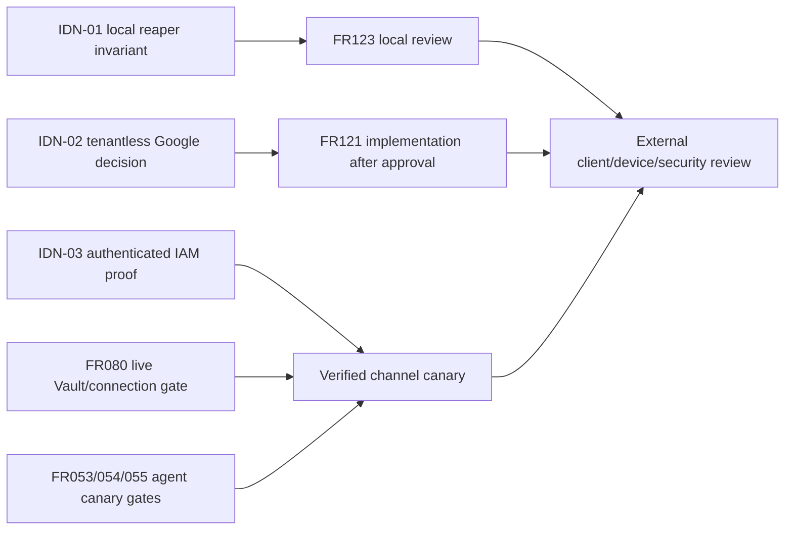

# แผน pending: Identity / LINE / Plugin

เอกสารนี้เป็นข้อเสนอเชิงออกแบบสำหรับ review เท่านั้น ยังไม่มีการอนุมัติโค้ด,
migration, credential, provider action หรือ production action ใด ๆ แผนนี้เขียนจาก
reference worktree `D:\zuri-ai-parallel-backlog-20260831` ที่ commit
`424f5fab525d20fdf1180fabee4c8cf9d16dd994`; ไม่แก้ primary checkout หรือ worktree
reference และไม่อ่านค่า `.env`/secret.

## สรุปสถานะที่ตรวจพบ

- FR123 มี local flow, tests และ consent แล้ว แต่ production migration,
  client registration, device binding/security sign-off และ reaper ยังเป็น gate.
- จุดออกแบบที่ต้องกันไว้: code มีอายุ 60 วินาที แต่ session มีอายุ 15 นาที;
  replay จะ revoke session ผ่าน `authorizationCodeId` เฉพาะเมื่อ code row ยังอยู่.
  การลบ consumed code เมื่อครบอายุอย่างเดียวจะลบหลักฐานที่ใช้ revoke ได้.
- `PluginSession.authorizationCodeId` มีอยู่แล้วและ migration ไม่มีการบังคับ FK;
  ยังไม่เสนอ DDL ใหม่สำหรับ reaper.
- FR121 ยัง blocked ตามเอกสาร: Google OAuth client ต้องให้เจ้าของสร้างภายนอก
  และ `ExternalIdentity.tenantId` บังคับ แต่ self-serve account ยังไม่มี Tenant.
- จากการ enumerate auth routes/pages ที่ reference พบเฉพาะ local password
  login/signup flow; Google adapter/callback ยังไม่มีใน source ที่ตรวจ.
- FR094–098 มี local canonical principal/session/shared-policy/channel/agent-tool
  seams แล้ว; old IAM runtime migration W7/W8 ถือว่าปิดตาม handoff แล้ว. งานที่
  เหลือคือ authenticated canary ไม่ใช่การทำ W7/W8 ซ้ำ.
- LINE/provider canary, Vault/live connection และ signed activation ยังเป็น
  external gates; local dry-run/fake golden result ไม่ใช่ provider evidence.

## แหล่งหลักและ provenance

| หลักฐาน | สิ่งที่ยืนยัน | ขอบเขต |
|---|---|---|
| [`ROADMAP.md`](ROADMAP.md) | FR121 blocked; FR123 in progress; FR080/LINE activation gates | roadmap truth |
| [`PRD-SDD-v1.0.md`](../PRD-SDD-v1.0.md) | contract, NFR/SEC และ production-open conditions | parent contract |
| [`identity CHARTER`](../domains/identity/CHARTER.md) | owner paths, ExternalIdentity, Plugin* boundary | parent lane |
| [`FR121 note`](../domains/identity/features/FR-121-google-second-way-in.md) | tenantless binding decision และ Google owner gate | peer design |
| [`FR123 note`](../domains/identity/features/FR-123-plugin-authentication-and-capability-discovery.md) | consent/code/session contract และ open reaper gate | peer design |
| [`ADR-052`](../decisions/ADR-052-PLUGIN-AUTHORIZATION-CODE-AND-TOKEN-BOUNDARY.md) | exact redirect, replay revoke, device/security open gates | security authority |
| `../../src/modules/identity/plugin-auth-service.js` | current TTLs, auto-create installation, replay behavior, hash-only token | implementation |
| `../../supabase/migrations/20260830120000_plugin_auth.sql` | Plugin tables/indexes/RLS artifact; not proof of live apply | migration artifact |
| [`PLAN-FR-079`](PLAN-FR-079-PHASE1-LINE-RUNTIME-CONNECTION-CUTOVER.md) / [`PLAN-FR-080`](PLAN-FR-080-INTEGRATION-SECRET-MANAGEMENT-UI.md) | Vault, connection and provider gates | integration peer |
| [`PLAN-FR-053-054`](PLAN-FR-053-054-PHASE1-ACTIVATION-READINESS.md) / [`PLAN-FR-055`](PLAN-FR-055-CONTROLLED-LINE-ACTIVATION.md) | canary/receipt still external | agent peer |
| [`LINE canary runbook`](../runbooks/LINE-PHASE1-CANARY.md) | PENDING dry-run, receipt vocabulary, no secret handling | operational peer |
| `../../.agent/reports/PHASE-1-ACTIVATION-READINESS.md` | fake/local readiness; real provider and signed canary NOT_RUN | evidence boundary |
| `../../.agent/reports/PHASE-1-EXTERNAL-ACTIVATION-GATE.md` | A1/A3/A5/A6/A7/A8 blocked; live isolation evidence only | external gate |
| `../../.brain/rca/2026-08-24-plugin-auth-loopback-verifier.md` | loopback/redirect RCA and exact transport boundary | RCA peer |

## Parent and peer alignment

Parent intent is the standalone product and domain spine in [`PRODUCT`](../PRODUCT.md)
and [`ARCHITECTURE`](../ARCHITECTURE-TARGET-MODULAR-MONOLITH.md). Identity owns
identity, plugin auth and channel principal decisions. Integration owns provider
metadata/Vault/connection health. Agent owns readiness, golden evaluation,
canary execution and activation receipts. This plan does not change those boundaries.

## Recommendation versus approval

ข้อเสนอที่แนะนำคือทำ local reaper เป็น slice แรก, รักษา replay linkage ตามเงื่อนไข
ด้านล่าง, แยก pre-tenant Google binding ออกจาก tenant-scoped `ExternalIdentity`,
แล้วส่ง authenticated IAM และ provider canary เป็น evidence packet ข้าม lane.
ทั้งหมดเป็น **recommendation เท่านั้น**. ยังไม่มี decision เรื่อง retention,
batch/scheduler, registration/device policy, credential หรือ production activation.

## Local slices (ยังไม่ใช่คำสั่งแก้โค้ด)

### IDN-01 — FR123 reaper และ local hardening

1. เสนอ maintenance service ที่รับ `db` และ `now` จาก caller เพื่อทดสอบได้;
   ยังไม่เพิ่ม HTTP route, scheduler, cron หรือสิทธิ์ใหม่ใน slice นี้.
2. เสนอให้พิจารณาลบ `PluginSession` เมื่อหมดอายุแล้วเท่านั้น; การ revoke ก่อน
   หมดอายุไม่เร่งการลบโดยปริยาย. Code ทุกชนิดที่จะลบต้องหมดอายุและผ่านเงื่อนไข
   ไม่มี linked session ที่ยัง active ตามข้อ 3 พร้อม retention policy ที่อนุมัติ.
3. **ห้ามลบ consumed code เพียงเพราะ `expiresAt <= now`.** ให้ลบได้ต่อเมื่อ
   ไม่มี `PluginSession` ที่อ้าง code นั้นและยัง `revokedAt IS NULL` กับ
   `expiresAt > now`; ถ้ายังมี session active ต้องคง code linkage ไว้.
   ระยะ retention เพิ่มเติมยังไม่ถูกกำหนด และต้องให้ owner อนุมัติหากจำเป็น.
4. เงื่อนไข delete และการตรวจ linked session ต้องทำใน transaction/locking shape
   ที่ป้องกัน race กับ exchange/replay; ถ้า adapter ทำ atomic claim ไม่ได้ต้อง
   หยุดและบันทึกข้อจำกัดแทนการเดา.
5. ใช้ index/fields ที่มีอยู่ก่อน; ไม่เพิ่ม model, role, retention duration,
   raw token, audit payload หรือ installation deletion ใน slice นี้.
6. Hardening finding: `findOrCreateInstallation` ปัจจุบัน auto-create ACTIVE row
   เมื่อ client config ตรง. ให้ owner ตัดสิน registration/device proof/unknown
   installation policy ก่อน live enablement; อย่าเรียกพฤติกรรมนี้ว่า production
   registration และอย่าเปลี่ยนมันโดยไม่มี approval.

Regression proof ที่ต้องมีหลัง approval: (ก) replay ก่อน cleanup revoke session,
(ข) reaper ไม่ลบ consumed code ขณะที่ linked session ยัง active, (ค) หลัง session
หมดอายุจึง cleanup ได้, (ง) exchange ชนกับ expiry/reaper แล้วไม่เกิด bearer ที่
หมดอายุหรือสูญเสีย revoke linkage, (จ) rerun idempotent และไม่มี token/hash ใน log.

### IDN-02 — FR121 Google credential และ tenantless binding

ข้อเสนอที่ปลอดภัยกว่าคือเก็บ pre-tenant external binding เป็น aggregate แยกจาก
`ExternalIdentity` เดิม เพื่อคง invariant ว่า identity ที่อยู่ใน tenant ต้องมี
`tenantId`; ยังไม่ใช่การเลือก schema ที่อนุมัติแล้ว. ทางเลือก nullable
`ExternalIdentity.tenantId` ต้องมี owner decision เรื่อง uniqueness, transfer,
cleanup และ cross-tenant lookup ก่อนเขียน migration.

หลัง approval เท่านั้นจึงออกแบบ OIDC adapter/callback สำหรับ login และ signup,
ตรวจ provider issuer/audience/state/nonce/PKCE ตาม contract ที่ owner ยืนยัน,
ใช้ `sub` เป็น provider subject. `email_verified` เป็นเงื่อนไขจำเป็นของการ link
ไม่ใช่การอนุมัติให้ auto-link จากอีเมลเพียงอย่างเดียว: FR121 ยังเปิดให้ owner
ตัดสินว่าบัญชี local เดิมเพิ่ม Google ได้หรือไม่ และเมื่อ identity/email mapping
กำกวมหรือซ้ำต้องหยุด ไม่เลือก Person แรกที่ค้นเจอ. Google sign-in ไม่ grant
tenant/business/role. การสร้าง Person และการ
onboarding ยังต้องสอดคล้องกับ FR120/FR122; ห้ามสร้าง credential หรือ redirect URI
จากการคาดเดา. Google Cloud OAuth client และค่าที่ deploy เป็น external owner gate.

### IDN-03 — authenticated IAM และ verified-channel evidence

Identity จะจัด evidence contract สำหรับ authenticated canary เท่านั้น: login ด้วย
fixture ที่เจ้าของอนุมัติ, session revalidation, logout/revocation denial,
inactive membership denial, cross-tenant denial และ policy denial ก่อน retrieval
หรือ side effect. Receipt ต้อง redact account identifiers, tokens, provider
payload และ business content. ห้ามนับ local unit/e2e หรือ W7/W8 migration เป็น
authenticated production proof.

สำหรับ FR097 ให้พิสูจน์ว่า ChannelIdentity ผูกกับ Tenant/Business ที่กำหนด,
transition จาก PENDING ไป ACTIVE มาจาก server-owned binding, revoke ปฏิเสธคำขอถัดไป
และ channel payload ไม่ขยาย scope. Agent/Integration เป็นผู้รัน provider canary;
Identity ไม่ส่ง secret และไม่อ้าง `ACCEPTED_BY_LINE` จนกว่าจะมี receipt จริง.

## C-3 dependency flow

## Owner and path boundaries

| เจ้าของ | path/การกระทำที่อยู่ในขอบเขต | ห้ามทำใน lane นี้ |
|---|---|---|
| Identity | `src/modules/identity/**`, auth/plugin routes, identity docs/tests หลัง approval | แก้ Agent/Integration หรืออ่าน secret |
| Integration | `src/platform/integrations/**`, Vault/connection evidence, FR080/079 live gate | ให้ Identity activate provider |
| Agent | `src/modules/agent/**`, readiness/golden/canary/receipt | ให้ local fake result เป็น production proof |
| Operator/owner | production migration apply, OAuth client, device proof, provider canary | ส่ง credential/secret เข้าเอกสารหรือ repo |

ไม่แตะ `D:\zuri-ai` primary, reference worktree, `.env`, production DB,
Supabase/Vault, Google Cloud, LINE หรือ `zuri-cli` ในรอบนี้. ไม่เพิ่ม FR/SDD/ADR
หมายเลขใหม่; `IDN-01` ถึง `IDN-03` เป็น label ของ lane นี้เท่านั้น.

## Dependencies and external gates

- IDN-01 ต้องผ่าน review ของ owner/security และเลือก invocation/batch policy
  ก่อน code; plugin migration `20260830120000_plugin_auth.sql` ต้องมี live
  apply evidence จาก operator แยกต่างหาก.
- IDN-02 ต้องมี owner decision เรื่อง pre-tenant shape และ Google Cloud OAuth
  client/redirect registration; ไม่มี secret หรือ credential ในแผนนี้.
- IDN-03 ต้องมี approved test identity, canonical runtime alias, redacted
  receipt store และการอนุมัติ cross-tenant test; สิ่งเหล่านี้เป็น external gate.
- FR080/079 ต้องมี live Vault provisioning/connection health; FR053–055 ต้องมี
  approved corpus, real-provider evaluation, exact binding/destination และ
  signed canary. LINE receipt ต้องแยก accepted/displayed/read ตาม runbook.
- Production readiness ห้ามประกาศจน migration, client/install/device policy,
  security review, authenticated IAM proof และ provider/LINE receipt ครบตาม owner.

## Acceptance and exit proof after approval

**IDN-01:** unit/integration proof ครอบคลุม expiry predicates, active linkage,
replay revoke, concurrent exchange/reaper, idempotency และ redacted logging;
schema/index check ยืนยันว่าไม่มี DDL ใหม่. Run project-required test/build/
govern/e2e commands only in the approved implementation turn.

**IDN-02:** callback tests ครอบคลุม state/nonce/PKCE/provider checks, verified-email
link เฉพาะเมื่อ policy อนุมัติ, duplicate/ambiguous mapping denial, one Person
mapping, replay/expiry, no implicit scope, tenant isolation และ
migration uniqueness. Exit ต้องมี code review, docs review และ owner-provided
OAuth evidence; local pass ไม่เท่ากับ production sign-off.

**IDN-03 / canary:** redacted authenticated receipts ต้องยืนยัน session lifecycle,
policy-before-side-effect, cross-tenant denial, ChannelIdentity state and revoke;
provider result ต้องระบุจริงว่า NOT_RUN, ACCEPTED_BY_LINE, DISPLAYED_UNKNOWN หรือ
READ_UNKNOWN ตามหลักฐาน ห้ามเปลี่ยนสถานะด้วยข้อความสรุป.

## Approval gate

ขอให้ owner review และอนุมัติแยกกันสำหรับ (1) IDN-01 deletion/linkage invariant
และ invocation policy, (2) IDN-02 pre-tenant model shape และ OIDC account-link
contract, (3) unknown-installation/device policy ของ Plugin123 และ (4) external
IAM/Vault/LINE canary gates. จนกว่าจะมี approval เอกสารนี้เป็น candidate plan
เท่านั้น; ไม่มี code, migration, test execution, deploy หรือ provider action.

## Version diff และ changelog

**Version diff:** ไม่มีรุ่นก่อนหน้าใน artifact นี้; `0.1.0b` เป็น candidate
docs-only plan. ไม่มี source/migration/env/provider mutation.

## CHANGELOG

| Version | Date | Status | Summary | Commit Hash | Agent |
|---|---|---|---|---|---|
| 0.1.0b | 2026-08-31 | candidate | Identity/LINE/Plugin docs-first review plan; replay-safe reaper finding; FR121 and canary gates | 424f5fab525d20fdf1180fabee4c8cf9d16dd994 (reference) | ATHER |
