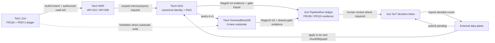

# แผนรออนุมัติ: Knowledge / MSP / GKS และ SoT decision loop

เอกสารนี้เป็นข้อเสนอระดับ **C-3 / HIGH** สำหรับช่วงที่เหลือของ knowledge ingestion และการเชื่อมต่อข้าม Tier โดยตั้งใจให้ parent นำไปวางที่ `docs/roadmap/` หลัง review. เป็นแผนตรวจสอบสัญญา เจ้าของ และหลักฐาน ไม่ใช่การประกาศว่า external runtime หรือ production พร้อมแล้ว

## ขอบเขตและกติกาการหยุด

- อ้างอิง checkout `D:/zuri-ai-parallel-backlog-20260831`, branch `codex/parallel-backlog-review-20260831`, commit `424f5fab525d20fdf1180fabee4c8cf9d16dd994` ซึ่งเป็น reference ที่ตรวจอ่านแบบ read-only
- primary `D:/zuri-ai` เป็น stale detached checkout และไม่ได้แก้ไข; ไฟล์ที่เขียนมีเพียง artifact นี้ใน visualization root
- ใช้ canonical IDs ที่มีอยู่แล้วเท่านั้น: FR-110, FR-057, FR-109, FR-100, FR-102, FR-129, ADR-041–050; ป้าย `KNO-*`, `MSP-*`, `SOT-*`, `EVD-*` ด้านล่างเป็น label ภายในแผน ไม่ใช่ requirement ใหม่
- ตาม R5 จะหยุดก่อนเขียน application code, schema, fixture, test หรือ registry; child ไม่รัน `govern` เพื่อไม่ชนกัน แต่ parent รวมและ regenerate เอกสารข้อเสนอได้ทันทีโดยไม่ต้องรอ code approval
- ไม่ทำ Tier1 calculator ซ้ำ และไม่นับหลักฐาน Stage9 หรือ local test เป็น production completion; หลักฐาน 9/17 ยังไม่ใช่ completion ของ pipeline

## Source of truth และลิงก์ระดับ parent/peer

ลิงก์ต่อไปนี้คำนวณจากตำแหน่งเป้าหมาย `docs/roadmap/`:

**Provenance:** facts marked current come from static inspection of the reference checkout at the commit in frontmatter; documented historical test counts and memory notes are context only, not current production evidence. External repository state was intentionally not re-enumerated in this turn and remains `NOT_VERIFIED`.

| แหล่ง | สิ่งที่ยืนยันได้จาก reference checkout |
|---|---|
| [Knowledge charter](../domains/knowledge/CHARTER.md) | Knowledge ถือ contract/evidence ของ catalog แต่ไม่มี Prisma model และไม่ execute GKS/Genesis |
| [FR-110 snapshot contract](../domains/knowledge/features/FR-110-published-knowledge-snapshot-contract.md) | snapshot identity, Stage17 verdict, atomic publication และ GraphRAG readiness; สถานะยัง documentary declaration |
| [FR-057/API-010](../domains/agent/features/FR-057-authorized-agent-context-and-vault-resolution.md) | AuthContext ต้องมาก่อน MSP vault resolve; opaque vault set ใช้กับ API-009 ต่อได้ |
| [Integration charter](../domains/integration/CHARTER.md) | `PipelineRun`/step/event/gate เป็น execution ledger writer เดียวของ pipeline |
| [ADR-043](../decisions/ADR-043-FOUR-TIER-COGNITIVE-ARCHITECTURE.md) และ [ADR-045](../decisions/ADR-045-CANONICAL-IDENTITY-AND-ACCESS-MANAGEMENT.md) | MSP เป็น gateway, GKS เป็น canonical authority, identity/scope ต้องมาก่อน memory/retrieval |
| [ADR-046](../decisions/ADR-046-SOT-PIPELINE-INTERIM-SERVING-AND-PULLED-DECISIONS.md) และ [ADR-047](../decisions/ADR-047-SOT-DATA-PLANE-SERVICE-ACCOUNT-KEY.md) | data plane ดึง decision ที่ตัดสินแล้วด้วย cursor; Zuri ไม่เขียน DuckDB/Genesis โดยตรง |
| [ADR-050](../decisions/ADR-050-KNOWLEDGE-INGESTION-TIER-BOUNDARY.md) | Stage 1–8 อยู่ Tier1; Stage 9–17 อยู่ GKS/Genesis ตาม owner matrix และ Zuri บันทึก evidence เท่านั้น |
| [ROADMAP](./ROADMAP.md) และ [Phase 04 MSP](./line-oa-business-agent/PHASE-04-MSP-EPISODIC-MEMORY.md) | roadmap ยังระบุ FR-110 เป็นงานค้าง; MSP phase เป็น candidate และต้องมี retention/consent/transport evidence ก่อน |

## ไฟล์ปัจจุบันที่เกี่ยวข้อง

การ enumerate ด้วย `git ls-files` ใน reference checkout พบกลุ่มไฟล์ที่ต้องใช้เป็นฐาน review ดังนี้:

- Pipeline ledger: `src/platform/integrations/core/knowledge-ingestion-executor.js`, `pipeline-tracking-contract.js`, `pipeline-tracking-service.js`, `pipeline-gate-compliance.js`
- Knowledge pure stages: `src/modules/knowledge/stage-runner.js`, `ingestion-job.js`, `quarantine.js`
- MSP boundary: `src/modules/agent/msp-vault-resolver.js`, `msp-memory-port.js`, `phase1-runtime.js`
- SoT loop: `src/modules/integration/application/sot-decision-service.js` และ routes ใต้ `src/app/api/platform/sot/decisions/`
- Pipeline routes ที่มีอยู่: `src/app/api/pipelines/runs/route.js`, `[executionRunId]/route.js`, `[executionRunId]/events/route.js`, `[executionRunId]/replay/route.js`
- Schema ที่มีอยู่: `PipelineRun`, `PipelineStep`, `PipelineEventReceipt`, `PipelineRecordEvent`, `PipelineReconciliation`, `PipelineGateDecision`, `SotDecision`, `SotDataPlaneKey` ใน `prisma/schema.prisma`
- Local proof ที่เกี่ยวข้อง: `tests/integration/fr109-knowledge-ingestion-executor.test.js`, `fr119-knowledge-ingestion-quarantine.test.js`, `agent-msp-port.test.js`, `msp-vault-memory-port.test.js`, `sot-decisions-route.test.js`

## สถานะปัจจุบันเทียบกับสิ่งที่ยังไม่รู้

| ประเด็น | Current evidence | สิ่งที่ยังไม่ยืนยัน |
|---|---|---|
| FR109 / Tier1 | executor เรียก 7 pure stages ของ Stage 2–8, บันทึก event และ quarantine; run ตั้งใจคง `RUNNING` เพราะ Stage9–17 ยัง external | ไม่มีหลักฐานว่า Stage9–17 ถูก execute หรือ report เข้า ledger ใน production |
| FR110 | มี contract note ครบเรื่อง ID/version/time/statistics/Stage17 result แต่ระบุชัดว่าไม่มี route/model/code | snapshot ที่ publish จริง, atomic swap, correction/supersession และ retrieval citation เป็น `NOT_VERIFIED` |
| FR129 | `zGateEvidence` และ compliance ปัจจุบันผูกกับ `DPL-SUPABASE-BUSINESS-KNOWLEDGE-V1` เท่านั้น | ห้ามสรุปว่า FR129 gate เป็น Stage17 gate ของ `DPL-KNOWLEDGE-INGEST-V1` |
| MSP/API-010 | Zuri adapter บังคับ `vaultSetResolver`, ตรวจ AuthContext และใช้ opaque `workspacePrivateVaultId`; tests ใช้ mock/injected transport | process จริงของ `D:\msp`, production LINE binding, revocation รอบถัดไป และ rollout เป็น `NOT_VERIFIED` |
| GKS/Genesis | ADR050 กำหนด owner ชัด; Zuri ไม่มี direct substrate writer ใน enumerated files | current checkout/deploy/contract conformance ของ `D:\gks`, Genesis และ Edge เป็น `NOT_VERIFIED` |
| SoT decision loop | `SotDecision` มี submit/decide/export ด้วย stable `(updatedAt,id)` cursor และ tenant-bound key; ROADMAP บันทึก RSK-016/migrations ปิดแล้วเมื่อ 2026-08-27 | ไม่ได้ตรวจ migration/key สดซ้ำ จึงไม่เปิดงานที่เอกสารปิดแล้วกลับมา; external pull/apply receipt และ production replay proof ยังต้องมีหลักฐาน; submit batch ปัจจุบันวน create ทีละรายการ |
| governance | parent รายงาน baseline `govern`: critical 0, warning 0, info 23 | ไม่ได้รันซ้ำใน turn นี้ตามขอบเขต และไม่อ้างผลนี้เป็น production evidence |

## Boundary architecture ที่เสนอ

หลักการคือ MSP ไม่ใช่ GKS และ Genesis ไม่ใช่ GKS. Zuri รับผิดชอบ scope, ledger, evidence และ human decision surface; GKS รับผิดชอบ canonical identity/RAG; Genesis รับผิดชอบ substrate lanes. ไม่มีเส้นทาง Tier1 ไปเขียน Tier4 โดยตรง

## Stage 10–17 ownership และ evidence loop

| Stage | Owner ตาม ADR-050 | หลักฐานที่ Zuri เก็บได้ตามขอบเขตปัจจุบัน |
|---|---|---|
| 9 Entity resolution | GKS | stage occurrence และ aggregate counters; ไม่เก็บ entity matches หรือ candidate records |
| 10 Fact/Relation extraction | GKS | aggregate counters เท่านั้น; ไม่เก็บ facts/relations หรือ source payload |
| 11 Ontology mapping | GKS | aggregate counters เท่านั้น; ไม่เก็บ ontology mapping records |
| 12 Temporal mapping | GKS | aggregate counters เท่านั้น; ไม่เก็บ bitemporal facts |
| 13 Graph construction | GKS ตัดสิน; Genesis เขียน | aggregate counters เท่านั้น; ไม่เก็บ graph หรือเปิด substrate เพื่อ verify |
| 14 Enrichment | GKS | aggregate counters เท่านั้น; ไม่เก็บ derived knowledge records |
| 15 Embedding | Genesis | aggregate counters เท่านั้น; ไม่เก็บ vectors/content และไม่กำหนด model จาก CR002 |
| 16 Multi-lane indexing | Genesis | aggregate counters เท่านั้น; ไม่เก็บ index rows หรือ per-object receipts |
| 17 Quality gate | GKS + Genesis execute; Zuri records | 5 dimensions: data, graph, knowledge, security, retrieval; verdict `PASS`, `PASS_WITH_WARNINGS`, `QUARANTINE`, `FAIL` |

Stage17 `PASS` หรือ `PASS_WITH_WARNINGS` เป็นเพียงเงื่อนไขให้ policy พิจารณา publish; `QUARANTINE`/`FAIL` และ critical security failure ต้อง block publication. `PipelineGateDecision.status` (`PENDING`, `APPROVED`, `REJECTED`, `WAIVED`) ต้องไม่ถูกใช้แทน Stage17 verdict

## Work packages หลังได้รับอนุมัติ

### KNO-01 — Freeze FR-110 evidence envelope และ state semantics

กำหนด strict, definition-scoped envelope สำหรับ `DPL-KNOWLEDGE-INGEST-V1`: run/stage/attempt identity และ scope เป็น control metadata; ผล Stage9–16 เป็น aggregate counters เท่านั้นตาม ADR-050 D4 (`records_in`, `records_out`, `records_failed`, `records_quarantined`, `processing_time`, `retry_count`). Stage17 five-dimension result, `knowledge_snapshot_id`, tenant/business binding, ontology/pipeline versions, `published_at` และ statistics อยู่ใน FR-110 decision/snapshot contract แยกจาก per-stage payload. Corpus, entity/fact records, embeddings และ Tier4 index ไม่อยู่ใน Zuri. ใช้ ledger เดิมตาม D4; D1 ทบทวน envelope/read contract ไม่ใช่เปิดตัวเลือกสร้าง ledger ใหม่

### KNO-02 — External Stage9–17 reporter และ run finalization

กำหนด service-to-service report contract ให้ GKS/Genesis ส่งเฉพาะ counters/control metadata ตาม owner table พร้อม idempotency, conflicting retry detection และ tenant scope; detailed failure envelopes อยู่กับ executor ไม่ใช่ Tier1. `knowledge-ingestion-executor.js` ไม่ควร mark terminal จาก Stage8; final state ต้องเกิดหลัง report ที่ครบและผ่าน schema/gate policy. การมี Stage9 implementation หรือ event บางส่วนไม่พอสำหรับ finalization

### KNO-03 — Snapshot publication handoff

ให้ GKS/Genesis เป็นผู้สร้างและ atomically publish corpus/index snapshot; Zuri ตรวจ envelope, บันทึก identity/statistics/evidence และเผยแพร่สถานะตาม policy เท่านั้น. Correction ต้องเป็น snapshot ID ใหม่และอ้าง `REVISION_OF` ตาม contract ที่อนุมัติ; ห้าม Zuri ทำ pointer swap หรือเรียก Genesis storage โดยตรง

### MSP-01 — API-010 transport conformance

ตรวจ API-010 กับ MSP process จริงด้วย sanitized request/response: AuthContext, tenant/principal/agent/workspace/project, H0–H4 ceiling, private permission, opaque vault IDs และ fail-closed malformed/denied response. Adapter ใน Zuri ยังคงเป็น port; การเลือก stdio/HTTP/process lifecycle และ credential placement ต้องเป็น owner ของ MSP/Edge และยังไม่อนุมัติในเอกสารนี้

### MSP-02 — Cross-tier authorization proof

พิสูจน์หนึ่ง trace ตั้งแต่ LINE/agent identity → Zuri AuthContext → API-010 → MSP memory/query → GKS scoped retrieval → `query-ir.v1` → Genesis evidence packet โดยมี tenant isolation, revoked membership denial ใน turn ถัดไป, no channel-derived vault, no Tier1 direct substrate call และ sanitized audit correlation. หลักฐานจริงจาก external runtime ยัง `NOT_VERIFIED`

### SOT-01 — Decision submit/decide/export/apply handoff

ยืนยัน tenant-bound `SotDataPlaneKey`, submit pending, browser human decision, export decided cursor และ external apply receipt ตาม ADR046/047. ก่อนแก้ code ต้องตัดสินว่า batch submit ต้อง all-or-nothing หรือยอมรับ partial results เพราะ implementation ปัจจุบัน create ทีละ item; ห้ามเพิ่ม semantics เงียบ ๆ และห้าม Zuri apply ลง DuckDB/graph

### EVD-01 — Release evidence bundle

รวม run IDs, contract/schema versions, hashes, stage receipts, gate verdict, snapshot identity, API-010 correlation, SoT cursor/apply receipt, environment/owner และ sanitized logs. แยก `implemented`, `locally tested`, `external accepted`, `deployed`, `production observed`; หากชั้นใดไม่มีหลักฐานให้ระบุ `NOT_VERIFIED` และไม่เลื่อน gate

## Dependency และลำดับงาน

1. D0: ทบทวน D1–D7 ในหัวข้อถัดไป เลือกเฉพาะ decision ที่ยังเปิด และยืนยัน implementation owner/transport โดยไม่ขอเลือก authority ที่ ADR ตัดสินแล้วซ้ำ
2. KNO-01 → KNO-02 → KNO-03; KNO-02 ต้องมาก่อนการอ้าง FR-110 publish completion
3. MSP-01 → MSP-02; MSP-02 จึงนำไป cross-tier retrieval/LINE activation proof
4. KNO-02 + MSP-02 → EVD-01 สำหรับ production decision loop; SOT-01 ทำคู่ขนานได้ แต่ต้องมี key/migration/apply owner
5. Parent review → document integration → governance pass; implementation ใด ๆ เป็นรอบถัดไปและต้องมี approval แยกตาม R5

## Owner / repository boundary

| Owner | Repo/พื้นที่ | ทำได้ในขอบเขต | ห้ามถือว่าเป็นเจ้าของ |
|---|---|---|---|
| Knowledge + Integration | `D:\zuri-ai` | FR-110 contract/evidence adapter, existing pipeline ledger, scope-bound read/status | GKS/Genesis execution, corpus, Tier4 writes, new modelโดยพลการ |
| Agent/Identity | `D:\zuri-ai` | AuthContext และ API-010 caller boundary | MSP identity resolutionซ้ำ, channel vault, production LINE claim |
| MSP | `D:\msp` | session, vault policy, API-010/API-009 transport | canonical GKS identity หรือ Genesis storage |
| GKS | `D:\gks` | entity/ontology/RAG, Stage9–14, Stage17 coordination | external current implementation ยัง `NOT_VERIFIED`; ห้ามอนุมานจาก search miss |
| Genesis / Edge | external substrate/runtime | Stage13 write, Stage15–16, runtime/secret boundary ตาม ADR | Zuri direct writes; `.env` ของ Edge ไม่อ่าน |
| Parent | `docs/roadmap/` และ governance | รวม plan, review, `govern` ใน single owner pass | ไม่ควรให้ child นี้แก้ generated registry |

## Acceptance / success / exit / test matrix

| Label | AC / SC ที่ต้องพิสูจน์ | เจ้าของหลักฐาน | สถานะก่อนอนุมัติ |
|---|---|---|---|
| KNO-01 | FR-110 envelope strict; versions/snapshot/stats/scope ครบ; external stage payload ถูกปฏิเสธ เหลือ aggregate counters ตาม D4 | Knowledge + Integration | proposed; schema test `NOT_RUN` |
| KNO-02 | Stage9–16 report ครบตาม owner, idempotent, conflict/quarantine ถูกต้อง | GKS + Genesis + Integration | `NOT_VERIFIED` |
| KNO-03 | Stage17 5 dimensions; security critical blocks; only policy-approved verdict may publish | GKS + Genesis | `NOT_VERIFIED` |
| KNO-03 / publication | atomic publish, immutable ID, correction creates new revision, failed gate has no visible publish | GKS/Genesis; Zuri observes | `NOT_VERIFIED` |
| KNO-02 / finalization | run remains non-terminal until external evidence; final state and audit correlation consistent | Integration | current code intentionally partial |
| MSP-01 | API-010 returns opaque authorized set; API-009 uses returned ID; denied/malformed is fail-closed | MSP + Agent | local injected tests exist; this turn `NOT_RUN`; production `NOT_VERIFIED` |
| MSP-02 | tenant/workspace/project/revocation/no-bypass trace is reproducible and sanitized | MSP + GKS + Edge | `NOT_VERIFIED` |
| SOT-01 | submit/decide/export cursor is tenant-bound, replay-safe, audited, and apply receipt is reconciled | Integration + data-plane owner | local code present; live apply `NOT_VERIFIED` |
| SOT-01 / boundary | Zuri never opens/writes DuckDB, Genesis, or `:8888`; external plane owns apply | Integration + security reviewer | architecture documented; runtime trace `NOT_VERIFIED` |
| EVD-01 | evidence bundle labels every claim by implementation/local/external/deployed/production state | Parent + all owners | candidate only |

Exit is blocked until all required rows have owner, versioned evidence, sanitized correlation, and explicit approval. Local tests, 9/17 stage evidence, or a green governance baseline alone cannot close the exit

## Open product/security decisions — recommendation is explicitly unapproved

| Decision | Recommendation for review | Why it remains open |
|---|---|---|
| D1: FR-110 evidence placement | Reuse existing ledger ตาม ADR-050 D4; ทบทวน strict DPL-KNOWLEDGE envelope และ snapshot read contract โดยปฏิเสธ Stage9–16 payload | ต้องกำหนดขนาด/validation/read semantics; ไม่ใช่การเลือก authority หรือ ledger ใหม่ |
| D2: external reporter auth | Use a dedicated tenant/business-scoped service identity, separate from human operator sessions; exact mechanism requires security approval | Current pipeline writer requires operator viewer; no production reporter contract is verified |
| D3: Stage17 vocabulary | Keep Stage17 result in evidence; keep FR071 gate status and FR129 catalog approval vocabulary separate | Overloading `APPROVED` would conflate automated quality with human publication approval |
| D4: publication implementation handoff | Authority ตัดสินแล้ว: GKS/Genesis performs atomic publication; Zuri records snapshot identity and decision only | ยังต้องระบุ executor implementation owner และ rollback/revision proof; ไม่เลือก authority ใหม่ |
| D5: SoT batch semantics | Decide all-or-nothing versus explicit partial submit result before changing `submitSotDecisions` | Current service loops per item and can leave a partial batch |
| D6: retention/superseded snapshots | Keep retention/deletion policy out of this slice until a separate approved decision | FR-110 explicitly does not define retention; no policy may be invented |
| D7: CR-002 catalog vault/vector proposals | Treat CR-002 as noncanonical intake; do not add `Workspace.catalogVaultId`, `vaultNamespace`, fixed embedding model/dimension, aliases, or direct Edge→Genesis route from it | ADR042–050, FR-057 and charters remain authority; ส่วนที่เปลี่ยน boundary ต้องมี ADR review ส่วนที่สอดคล้องอยู่แล้วใช้ feature/doc approval ปกติ |

## External activation handoff

Handoff packet ต้องส่งให้เจ้าของ MSP/GKS/Genesis/Edge พร้อม (1) versioned API-010/API-009 and Stage9–17 report contracts, (2) tenant/workspace/project scope fixturesที่ไม่ใช้ secret, (3) correlation/run IDs และ hashes, (4) expected deny cases, (5) rollback/replay procedure, และ (6) evidence template ของ EVD-01. ห้ามแนบ Edge `.env`, bearer values, private vault contents หรือ database dumps

สถานะ external activation ณ เอกสารนี้คือ `NOT_VERIFIED`: ยังไม่อ้างว่า D:\msp หรือ D:\gks deploy แล้ว, ไม่อ้าง Edge `:8888` live, ไม่อ้าง Genesis lane receipts, ไม่อ้าง production LINE/API-010, และไม่อ้าง SoT data-plane pull/apply สำเร็จ. การค้นหาไม่พบ implementation ใน checkout นี้ไม่ใช่หลักฐานว่า external repo ไม่มี implementation

## Version diff และ changelog

**Version diff ไม่มีเอกสาร → `0.1.0b` (candidate):** สร้างแผนฉบับแรกสำหรับ FR-110/FR-057/API-010/Stage10–17/SoT; เพิ่ม owner boundary, Mermaid boundary, current-vs-unknown, AC/SC/exit/test matrix, open decisions และ external handoff. ไม่มี canonical ID ใหม่, ไม่มี code/schema/fixture/test/registry change และไม่ได้รัน governance

## CHANGELOG

| Version | Date | Status | Summary | Commit Hash | Agent |
|---|---|---|---|---|---|
| 0.1.0b | 2026-08-31 | candidate | Initial reviewable C-3/HIGH knowledge/MSP/GKS/SoT plan; R5 stop before implementation | 424f5fab525d20fdf1180fabee4c8cf9d16dd994 | ATHER |

**Review gate:** โปรด review และอนุมัติข้อเสนอเอกสาร/decision points ก่อนสร้าง code หรือปรับ registry; หลัง approval ให้ parent เป็นผู้กำหนด implementation slice และ governance pass ถัดไป
