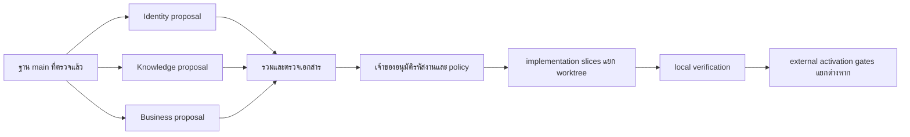

# ชุดแผนงานค้างสำหรับทำขนาน — 2026-08-31

**Version:** 0.3.0b

**Status:** beta — ผู้ใช้อนุมัติ local implementation รอบแรกด้วยคำสั่ง "ลุย"; external และ policy gates ยังเปิดอยู่

## จุดประสงค์และขอบเขต

ผู้ใช้สั่งให้ใช้ `gpt-5.6-luna` ที่ reasoning effort `max` ทำงานค้างแบบขนาน
จึงแบ่งการตรวจหลักฐานและเตรียมแผนเป็นสามสาย ก่อนรวมในเอกสารชุดนี้
การมอบหมายดังกล่าวไม่ได้ตัดสินนโยบายสิทธิ์ ขอบเขตข้อมูล หรืออนุมัติ production activation ที่ยังเปิดอยู่
R5 ของ AGENTS.md ยังคงกำหนดให้ส่งข้อเสนอเอกสารและรออนุมัติก่อนสร้างโค้ดที่ต้องพึ่งข้อเสนอนั้น

ชุดนี้เป็น C-3 เนื่องจากครอบคลุมสิทธิ์ ข้อมูล และขอบเขตหลายระบบ; ความเสี่ยงของ implementation เป็น HIGH
รอบร่าง 0.1.0b จำกัดที่เอกสาร; รอบอนุมัติ 0.2.0b เปิด local application code/schema เฉพาะรายการด้านล่าง โดยไม่เปลี่ยน credentials, deployment หรือข้อมูล production
ไม่สร้างหรือเปลี่ยนความหมายของ FR/SDD/ADR; รหัสงาน IDN/KNO/BUS เป็นป้ายภายในแผนเท่านั้น

## การอนุมัติรอบแรก — 2026-08-31

ผู้ใช้ตอบ "ลุย" หลังได้รับชุดแผนนี้ อนุมัติการลงมือในขอบเขต local ที่มีสัญญาชัดเจนต่อไปนี้
โดยใช้ gpt-5.6-luna / reasoning effort max แยกสาม worktree:

1. IDN-01: maintenance service สำหรับลบ Plugin code/session ที่หมดอายุ โดยไม่ทำลาย replay revocation ของ session ที่ยังมีผล; ไม่มี scheduler/route/DDL หรือการเปิด production
2. KNO-01: FR-110 strict snapshot และ Stage 17 decision contract พร้อม aggregate-only external stage evidence; ไม่มี external reporter route, direct Tier-4 access หรือการ publish จริง
3. Business P5 increment แรก: FR-127 ConversationAnalysis schema และ application service สำหรับอ่าน/บันทึกตาม consent และสิทธิ์เดิม รวม PDPA erasure/snapshot invariants; ไม่รวม FR-126/128, worker/LLM/provider activation หรือ public API ใหม่

รอบนี้เป็น C-3 / HIGH ใช้ tests ก่อน implementation และให้ root เป็นเจ้าของการรวม registry/generated governance เพียงผู้เดียว
อนุมัติการบันทึก commit ภายในเพื่อแยกและรวมงาน ไม่รวม remote push/merge, production migration/deploy หรือ credential changes
สถานะ candidate และข้อเสนอในเอกสารย่อยสะท้อนเวลาร่างเดิม; การอนุมัติข้างต้นมีผลเฉพาะ increment ที่ระบุ ไม่ตอบ policy ที่ยังเปิดทั้งหมดโดยปริยาย
## ฐานหลักฐาน

- ตรวจ GitHub main และ local main ที่ `424f5fab525d20fdf1180fabee4c8cf9d16dd994` ก่อนเริ่มชุดงาน
- worktree สำหรับรวมผล: `D:\zuri-ai-parallel-backlog-20260831`, branch `codex/parallel-backlog-review-20260831`
- primary `D:\zuri-ai` ยังอยู่ที่ `4ecc1f2`; ไม่ใช้สถานะของต้นไม้นั้นตัดสินงานที่ส่งมอบแล้ว
- CR-002 ถึง CR-005 ใน primary ตรงกับ blobs บน main แล้ว ไม่ใช่งานใหม่ที่ต้อง commit ซ้ำ
- CI ของฐานผ่านก่อนเริ่ม แต่ไม่ใช่หลักฐานของเอกสารใหม่หรือ runtime production
- อำนาจและสถานะปัจจุบันอิง [PRODUCT](../PRODUCT.md), [ทะเบียนข้อกำหนด](../PRD-SDD-v1.0.md), [ROADMAP](ROADMAP.md), [ADR-051](../decisions/ADR-051-THE-PRIMARY-CHECKOUT-IS-NOT-A-WORKING-LANE.md)

## การแบ่งงานและผลส่งมอบ

| สาย | Agent / การตั้งค่า | ผลส่งมอบ | ขอบเขตเจ้าของ |
|---|---|---|---|
| Identity | luna_identity / gpt-5.6-luna / max | [แผน Identity](PLAN-PENDING-IDENTITY-20260831.md) | IAM, Google entry, Plugin lifecycle, LINE/Vault evidence |
| Knowledge | luna_knowledge / gpt-5.6-luna / max | [แผน Knowledge](PLAN-PENDING-KNOWLEDGE-20260831.md) | snapshot, stage ownership, MSP/GKS handoff, external decision loop |
| Business | luna_business / gpt-5.6-luna / max | [แผน Business](PLAN-PENDING-BUSINESS-20260831.md) | approval policy, GitHub projection, shipping/quotation, CRM, FlowAccount, Market, canvas |
| รวมผล | ATHER / root | เอกสารนี้และผล governance | ตรวจความขัดแย้ง ลิงก์ หลักฐาน และ generated views เพียงผู้เดียว |

ทั้งสามสายอ่าน source ฐานเดียวกันและเขียนเอกสารแยกกัน ไม่มี agent ใดเปลี่ยน registry หรือรัน governance พร้อมกัน
เอกสารย่อยเป็นผู้ระบุรายละเอียด AC, test matrix และข้อเสนอที่ต้องอนุมัติ; เอกสารนี้ไม่สร้างคำตอบนโยบายซ้ำ

## ลำดับที่เสนอสำหรับรอบ implementation

1. ทบทวนข้อเสนอทั้งสามสาย แล้วระบุรหัสงานที่อนุมัติพร้อมคำตอบ decision ที่เป็นเงื่อนไขของงานนั้น
2. แยกงาน local ที่มีสัญญาชัดเจนออกจากการเตรียม credential, provider evidence และ production activation
3. สร้าง worktree ต่อ implementation slice; ผู้แก้ registry/ledger/generated views ต้องมีเจ้าของเดียวในแต่ละชุดรวม
4. ทดสอบใน worktree ที่มี dependency install ของตัวเอง ไม่รันทดสอบฐานข้อมูลผ่าน junction ของ primary
5. ตรวจ scope/negative tests/build/govern/e2e ตามผลกระทบ แล้วส่ง phase report ก่อนขยายขอบเขต
6. เปิด production gates แยกตาม environment, ผู้มีอำนาจ, prerequisites และหลักฐานที่แผนระบุ; local PASS ไม่ปลด gate เหล่านี้

## สิ่งที่ห้ามปิดสถานะก่อนมีหลักฐาน

| เรื่อง | สิ่งที่ห้ามใช้แทนหลักฐาน |
|---|---|
| IAM / Plugin / LINE | merged code, local tests หรือ consent screen ใช้แทน authenticated production canary และ activation sign-off ไม่ได้ |
| Knowledge 9/17 | จำนวน stage ที่มี implementation/test ใช้แทนผล ingestion ข้าม MSP/GKS จริงไม่ได้ |
| Catalog approval | ตัวตรวจ publish ที่ขาด approval ใช้แทนผู้มีสิทธิ์เซ็นหรือ enforcement ใน data plane ไม่ได้ |
| GitHub projection | แก้ connector status หรือแก้ข้อมูลใน repository ตัวอย่าง ใช้แทน policy รับรอง path ไม่ได้ |
| Shipping / CRM / FlowAccount | FR ที่ประกาศไว้ใช้แทนการอนุมัติ schema, consent, intent routing หรือ provider facts ไม่ได้ |
| GitHub issues | จำนวน issue เปิดใช้แทนจำนวนงานที่ยังไม่เริ่มไม่ได้; Phase 1 ของ Market เสร็จแล้วและ issue ยังใช้เป็น anchor |

## เกณฑ์รับเอกสารชุดนี้

- เอกสารทั้งสามสายแยกงานที่เสร็จแล้ว งานที่เสนอ และหลักฐานภายนอกที่ยังไม่ตรวจออกจากกัน
- ทุก implementation slice มี dependency, owner boundary, acceptance criteria และวิธีพิสูจน์ที่ไม่ขยายสิทธิ์โดยปริยาย
- product/security decisions ยังเป็นข้อเสนอจนกว่าเจ้าของอนุมัติ ไม่มีค่าที่เดาขึ้นแล้วประกาศเป็นนโยบายจริง
- ลิงก์ภายใน resolve จาก `docs/roadmap/`; ไม่มี generated view หรือ id ledger ถูกแก้ด้วยมือ
- `npm run govern`, `npm run docs:check` และ `git diff --check` ต้องผ่านก่อนส่งผลรวม
- tests/build/e2e ของ application ไม่ถูกอ้างว่ารันในรอบเอกสารนี้

## ผลตรวจรอบเอกสาร 0.1.0b (หลักฐานก่อน implementation)

- `npm run govern`: PASS; docs 231, critical 0, warning 0, info 23 เท่าฐานเดิม
- generated graph เพิ่ม document nodes 4 รายการ; route และ test-file counts ไม่เปลี่ยน
- root ทบทวนเพิ่ม: replay linkage ของ reaper, Google linking ที่ยังต้องมี policy,
  aggregate-only external stage evidence ตาม ADR-050 และ issue mapping ที่ตรวจจาก GitHub แล้ว
- ใช้ dependency สำหรับเอกสารใน temporary directory ของงานนี้; package manifests/lockfile
  และ dependency ของ primary ไม่เปลี่ยน ไม่รัน install scripts หรือ application tests
- ณ รอบร่าง การส่งมอบเป็น candidate docs เท่านั้น; รอบปัจจุบันบันทึก local docs commit แล้วตามขั้นเตรียม implementation โดยไม่มี remote push/merge, deploy, production migrate หรือ refresh primary

## ผล local implementation รอบแรก

ทั้งสาม increment รวมใน worktree ของแผนนี้แล้ว; ผล verification และขอบเขตที่ยังเปิดอยู่บันทึกใน
[phase report](../../.agent/reports/PARALLEL-WAVE1-20260831.md). สถานะของ FR-110/123/127 ยังเป็น partial
ตามขอบเขตจริง ไม่รวม runtime producer, production invocation หรือ atomic publication.

## Version diff

`ไม่มีเอกสารชุดนี้ → 0.1.0b`: เพิ่มแผนขนานสามสายและจุดรวมผล โดยไม่เปลี่ยนข้อกำหนดหรือสถานะ delivery ของงานเดิม

`0.1.0b → 0.2.0b`: บันทึกการอนุมัติ local wave แรกและขอบเขตที่ยังไม่เปิด; การอนุมัติไม่ใช่หลักฐานว่า implementation ผ่าน verification แล้ว

`0.2.0b → 0.3.0b`: บันทึกผล local implementation และเชื่อมรายงาน verification; ไม่ขยายการอนุมัติไปยัง external gates

## CHANGELOG

| Version | Date | Status | Summary | Commit Hash | Agent |
|---|---|---|---|---|---|
| 0.1.0b | 2026-08-31 | candidate | เตรียมชุดแผนงานค้างจาก main ที่ตรวจแล้ว ด้วย Luna max สามสาย | uncommitted; base 424f5fa | ATHER |
| 0.2.0b | 2026-08-31 | beta | บันทึกอนุมัติ local wave แรก: IDN-01, KNO-01 และ FR-127 persistence/read | local worktree | ATHER |
| 0.3.0b | 2026-08-31 | beta | รวม local implementation รอบแรกและแยกหลักฐานใน phase report | local integration branch | ATHER |
