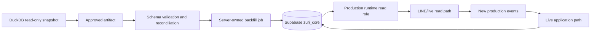
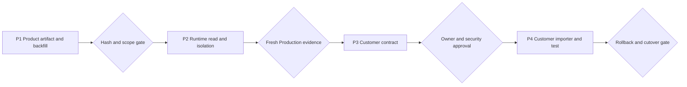

# Roadmap — SmartGift data backfill and customer import

เอกสารนี้กำหนดลำดับการทำงาน 4 ระยะเพื่อให้ SmartGift ใช้งานข้อมูลสินค้าใน
Production ได้ก่อน แล้วจึงออกแบบและนำเข้าข้อมูลลูกค้าเก่าผ่าน backfill path ที่
ควบคุมได้ แผนนี้เป็น roadmap/implementation boundary และมี current evidence
แนบไว้เพื่อแยกสิ่งที่ migrate แล้วออกจากงาน customer backfill ที่ยังไม่ได้อนุมัติ

## 1. Mission identity and approval

The execution is tracked by
[`smartgift-data-migration-mission.json`](../../contracts/migrations/smartgift-data-migration-mission.json).
The mission identity is separate from a future database `Project`, migration
run, batch or audit event ID.

| Field | Value |
|---|---|
| `missionId` | `MIS-SG-CUSTOMER-DATA-MIGRATION-001` |
| `versionId` | `VER-SG-DATA-MIGRATION-0.2.0B` |
| Approver | Boss (บอส) |
| `approver.personId` | `c82690eb-84e8-48a8-8a28-fe3d839c2276` (`PER-BOSS`) |
| Approver authority | `PLATFORM_OWNER_APPROVER`; no customer Membership created |
| Local bootstrap map | `PF-WANNAPA-WORKSPACE` / `5c621811-7e7a-42dd-ac39-ea9e8416ba98`; candidate Tenant `f477c41a-c8d4-4c89-8612-372265907089` |
| Remote Portfolio / Workspace target | `PF-WANNAPA-WORKSPACE` / `5c621811-7e7a-42dd-ac39-ea9e8416ba98` |
| Remote Tenant / Organization target | `TNT-ETOHGROUP` / `77cdbe70-3111-4a04-922a-8059be99a8b0` (existing pilot UUID, relabeled/reparented by applied migration) |
| Remote Target Business | `BUS-SMARTGIFT` / `834fa869-62f3-431c-a287-e9a95e91175b` (existing pilot UUID, preserved) |
| Remote identity state | Reconciled: customer Portfolio created, existing Tenant/SmartGift UUIDs preserved, three Business rows added |
| `bootstrapBatchId` | `32a14e35-8896-45b5-b949-4ca1dda24620` |
| Current artifact | 74 rows; remote-scope SHA-256 `769d6f83743656591ff095f945f3f32aa8d8b9702dfc5cbb4184011260082717` |
| Pre-migration backup | `BKP-SG-MIGRATION-20260818-001`; SHA-256 `33c76f7e3c761a13b73caf9fd8b3f6ae1e037c388e559049d978c478a9885178` |
| Current write state | Applied and postflight verified; migration `20260818060000`, LINE binding remains `PENDING` |
| Applied migration hash | `aa9975f27610456c359c59ac4fc3ce2734ab74f328deea4c7270a439dcd144fb` |

Post-apply evidence is recorded at
[`supabase-post-migration-verification.json`](../../artifacts/migrations/MIS-SG-CUSTOMER-DATA-MIGRATION-001/supabase-post-migration-verification.json).
It verifies the four-Business tenant hierarchy, 74 distinct SmartGift records,
zero price/currency/non-public rows, source/batch/artifact hashes, forced RLS,
the append-only cutover audit event and the still-pending LINE binding.

The manifest records all four remote Business IDs. The remote preflight
confirmed that the existing production Tenant UUID and SmartGift Business UUID
were the identities to preserve; the applied migration added the three missing
Business rows and relabeled/reparented the existing pilot scope. The local
candidate Tenant UUID remains only bootstrap evidence and was not used in the
remote SQL.

## 2. Execution mode contract

แผนนี้ใช้โหมดที่มีอยู่แล้วใน [Seven Execution Modes](../EXECUTION-MODES.md)
และไม่สร้าง canonical execution mode ใหม่

| Field | Value |
|---|---|
| `executionModeId` | `EXM-DATA-MIGRATION` |
| Legacy alias | `DATA_MIGRATION` |
| `executionContractId` | `EXC-DATA-MIGRATION-V1` |
| Progress strategy | `RECORD_VALIDATION` |
| Vocabulary | `Stage → Batch/Run → Dataset → Validation → Reconciliation` |
| Primary view | `Migration Monitor` |
| Evidence keys | `recordsTotal`, `processed`, `success`, `failed`, `validated`, `reconciled` |
| Destination boundary | Private Supabase `zuri_core`, Tenant/Business scoped |
| Live path | Production LINE/runtime reads only; not a historical-data ingress path |
| Backfill path | Server-owned artifact/import job with direct transactional Postgres write |

Progress must be evidence-based. ห้ามใช้ `tasks_done / tasks_total` เป็น progress ของ
การย้ายข้อมูล และห้ามถือว่าเอกสารหรือไฟล์ SQL ที่สร้างแล้วเป็นหลักฐานว่า import สำเร็จ

## 3. Scope and boundary

### In scope

- Approved SmartGift public product projection: 74 records, price-disabled.
- Production read-path verification after the controlled product backfill.
- A separate contract for historical customer/contact data.
- A server-owned, idempotent customer importer after the customer contract is approved.

### Out of scope

- Sending historical rows through LINE webhook, LINE reply API or a public REST endpoint.
- Importing customer/contact/document/interaction data under the product-knowledge contract.
- Importing price, cost, margin, invoice or other financial data in this roadmap.
- Browser-side writes, `anon`/`authenticated` writes, or service-role credentials in a UI.
- Enabling the LINE binding or production traffic as a side effect of a data import.
- Treating `FR-071` monitor/replay as already implemented. Its full ledger/worker/API
  remains a separately approved follow-up; this roadmap still requires batch audit,
  reconciliation and rollback evidence for every write.

## 4. Channel architecture

The destination and security boundary are shared with Production, but the ingress
channels are intentionally different:



The historical path is a controlled batch import. The live path handles new
production events and reads. Historical data must not be replayed as fake live
events because that would corrupt event meaning, audit lineage and rollback scope.

For the immediate 74-row product import, the existing
[`build_business_knowledge_import.py`](../../scripts/build_business_knowledge_import.py)
generates a transaction targeting `zuri_core.business_knowledge`. The runtime read
role remains read-only; it is not an import role. An operator-only API may start a
backfill job later, but it must not accept unrestricted raw customer payloads from a
browser.

## 5. Ordered work plan

| Phase | Name | Mode subtype | Primary deliverable | Exit gate | Estimate |
|---|---|---|---|---|---|
| P1 | Product knowledge backfill | `MIGRATION_STAGE` + `MIGRATION_BATCH` | Reconciled UUID-mapped 74-row artifact and import transaction | Hash, scope, row-count and schema gates pass | 1.5–3 hours |
| P2 | Production runtime read/isolation | `VALIDATION` + `RECONCILIATION` | Runtime can read the approved projection without cross-tenant access | Exact-scope, RLS, read-only and post-apply evidence pass | 1–2 hours plus external access gates |
| P3 | Customer backfill contract | `DATASET` + `VALIDATION` | Approved customer-data contract and entity-resolution rules | Owner, security/PDPA and destination-scope approval | 0.5–1 day |
| P4 | Customer importer implementation/test | `MIGRATION_STAGE` + `MIGRATION_BATCH` | Tested server-owned customer backfill job with rollback | Fixture, idempotency, isolation, reconciliation and rollback gates pass | 1–3 days after P3 |

The phases are ordered deliberately. P3/P4 must not be used to expand the P1
product import into an unapproved customer migration.

### P1 — Product knowledge backfill

**Goal:** Make the approved 74-row public product projection available in the
private Production data boundary without using the live LINE channel.

**Inputs and current constraint:**

- Source: SmartGift DuckDB, opened read-only.
- Approval: one source SHA-256 in
  [`smartgift-phase1-pilot.json`](../../contracts/approvals/smartgift-phase1-pilot.json).
- Fresh read-only exporter result: 74 rows, price publication disabled, remote-scope
  artifact hash
  `769d6f83743656591ff095f945f3f32aa8d8b9702dfc5cbb4184011260082717` targeting
  the reconciled production Tenant/SmartGift UUIDs.
- The prior post-apply hash beginning `63a2d542` was treated as historical evidence;
  the new artifact, audit event and postflight report now reconcile to the approved
  DuckDB source hash.

**Work items:**

| Item subtype | Work | Required evidence |
|---|---|---|
| `DATASET` | Freeze the UUID-mapped product artifact generated from the approved source | Artifact path/reference, source SHA-256, artifact SHA-256, 74 rows |
| `VALIDATION` | Validate exact fields, `PUBLIC/PRODUCT/active`, unique product codes, no price/PII | Rejected-field count, validation result, forbidden-field check |
| `RECONCILIATION` | Compare artifact bytes, report, SQL and post-apply expectations | Expected/actual rows, duplicate count, hash and scope reconciliation |
| `MIGRATION_BATCH` | Generate the guarded transaction with Tenant, Business and batch UUIDs | SQL review, transaction boundary, audit-event fields, rollback procedure |

**Exit criteria:**

- Current artifact hash is explicitly approved or the evidence is regenerated.
- Exactly 74 product records and 74 distinct product codes are reconciled.
- `sell_price`, `currency`, customer/contact/document data and cost/margin fields
  remain excluded.
- The migration transaction targets the reconciled customer identity rows,
  `zuri_core.business_knowledge`, the scope-bound RLS policies and immutable
  `bootstrap_audit_event` records; it does not activate LINE.
- The controlled Production write completed only after hash, scope, backup and
  transaction-smoke gates passed; postflight reconciliation is required for closure.

**Stop conditions:** source approval does not match the artifact, UUID mapping is
ambiguous, row count/hash differs, a forbidden field is present, or the destination
scope cannot be resolved without client input.

### P2 — Production runtime read and isolation

**Goal:** Confirm that the Production runtime can use the product projection after
backfill, while keeping LINE activation as a separate gate.

**Work items:**

| Item subtype | Work | Required evidence |
|---|---|---|
| `VALIDATION` | Execute post-apply inventory and exact-scope checks | `recordsTotal=74`, `processed=74`, `success=74`, `failed=0` |
| `VALIDATION` | Verify forced RLS, policy and direct-grant boundary | Runtime read role sees only the reserved Tenant/Business |
| `RECONCILIATION` | Verify destination rows against artifact and audit event | `validated=74`, `reconciled=74`, artifact/audit hash match |
| `VALIDATION` | Run registered product reads through the Postgres adapter | Product detail/search reads work; mutation and cross-scope reads fail |

**Runtime boundary:** production reads use the private `zuri_core` path and the
scope-bound read role. The old REST adapter pointing at a public table is not the
historical backfill channel and must not be promoted as the Production import path.

**Exit criteria:**

- Post-apply inventory passes for row count, scope, active/public flags and no prices.
- Runtime read isolation and mutation-denial evidence are fresh, not only historical.
- LINE binding remains `PENDING` unless the separate activation roadmap is approved
  and its credentials/canary gates pass.
- Product knowledge is usable by the read path without claiming that customer data
  has been migrated.

### P3 — Customer backfill contract

**Goal:** Define what historical customer data may enter Production before writing
any customer row.

This phase is contract, target-boundary and approval work. It does not import
customer data and does not reuse the product-knowledge record contract. A
fail-closed importer may be prepared after the target and contract decisions are
explicit, but it must refuse while any approval gate is incomplete.

The draft contract is [FR-078 — Customer data backfill contract](../domains/crm/features/FR-078-customer-data-backfill-contract.md).
Its machine-readable manifest fixes the current SmartGift Tenant/Business scope;
the target schema/scope proof is complete, while customer-data owner,
Security/PDPA, review-queue and historical-window approvals remain pending.

**Required contract sections:**

| Contract area | Required decision |
|---|---|
| Scope | Exact Tenant, Business, source tables/files and time window |
| Source identity | `source_ref/path`, source SHA-256, source row/key, retrieval metadata and as-of |
| Canonical identity | Stable external/source key, internal UUID mapping and collision handling |
| Entity resolution | Match rules, duplicate report, unresolved queue and owner decision |
| Field allowlist | PII classification, fields allowed into Production, redaction and retention |
| Provenance | Reversible link from destination row to source record and artifact |
| Write semantics | Insert/upsert key, version, soft delete policy and idempotency key |
| Security | Server-owned scope resolution, least-privilege migration role and RLS |
| Recovery | Staging, rollback, restore point/backup, failed-row report and rerun rules |
| Cutover | Snapshot watermark, live-delta strategy and owner of the cutover decision |
| Approval | Data owner, Zuri owner, security/PDPA decision and named operator |

**Exit criteria:**

- Contract is approved with an explicit customer row scope; “all DuckDB data” is not
  an acceptable scope.
- Entity-resolution and duplicate/orphan reports exist before import.
- Destination tables/migrations and classification are approved separately from
  `business_knowledge`.
- The backfill path, live-delta path and rollback owner are named.
- No customer row is written before this gate; any prepared importer must fail
  closed while the gate is incomplete.

### P4 — Customer importer implementation and test

**Goal:** Build a bounded, repeatable customer backfill job that can be audited,
rerun safely and rolled back without sending historical data through LINE.

**Target flow:**

```text
DuckDB read-only
  → approved customer artifact
  → schema/entity validation
  → reconciliation and duplicate report
  → private transaction-local staging
  → Tenant/Business scope resolution
  → idempotent Postgres upsert
  → audit receipt and post-apply verification
  → publish or rollback
```

**Required tests:**

- contract/schema validation, including forbidden fields and malformed provenance;
- source hash and artifact byte-hash verification;
- duplicate, collision, orphan and unresolved-identity rejection;
- idempotent rerun with no duplicate customer identity;
- tenant/business isolation and mutation authorization;
- failed-row handling with no partial publish outside the transaction;
- rollback/recovery rehearsal and redacted audit receipt;
- snapshot-to-live-delta reconciliation before any cutover;
- no raw PII in logs, monitor payloads, browser responses or error messages.

**Exit criteria:**

- Test fixture and non-production run pass all contract/security/reconciliation gates.
- A named owner accepts the import receipt and unresolved-row report.
- Production backup/restore and rollback evidence is current.
- Production execution uses the approved migration role/job, never the LINE read role.
- Post-apply counts, scope, provenance and audit receipt reconcile exactly.

## 6. Critical path and dependencies



The critical path is P1 → P2 → P3 → P4. Customer importer work may be prepared
locally only after P3 contract decisions are explicit; it may not write customer
data before the P3/P4 gates.

## 7. Milestones

| ID | Milestone | Phase | Gate criteria | Status |
|---|---|---|---|---|
| M1 | Product artifact reconciled | P1 | 74 rows, UUID scope, current artifact hash approved | complete |
| M2 | Product knowledge usable by runtime | P2 | Fresh RLS/read/mutation-denial/post-apply evidence | complete for data/RLS; LINE remains pending |
| M3 | Customer backfill contract approved | P3 | Scope, identity, PII, provenance, rollback and owner approval | draft created; approval pending |
| M4 | Customer importer non-production proof | P4 | Fixture, idempotency, isolation, failure and rollback tests pass | scaffold/tests ready; apply blocked by approval gates |
| M5 | Customer cutover decision | P4 | Live-delta, backup and signed operator receipt | separately gated |

## 8. Progress and reporting contract

The workstream reports the following evidence per batch/run:

| Metric | Meaning |
|---|---|
| `recordsTotal` | Records in the approved dataset, not all rows found in DuckDB |
| `processed` | Records examined by the current run |
| `success` | Records accepted by the destination transaction |
| `failed` | Records rejected or failed with a structured reason |
| `validated` | Records passing schema, scope and field-policy checks |
| `reconciled` | Records whose source/artifact/destination evidence matches |

Unknown values remain `unknown`/unavailable. A historical report, generated SQL or
catalog count alone cannot promote a phase to `done`.

## 9. Risk register

Risk score is Probability × Impact, on a 1–5 scale.

| ID | Risk | Prob. | Impact | Score | Mitigation | Owner |
|---|---|---:|---:|---:|---|---|
| R1 | Current artifact hash and retained post-apply evidence disagree | 4 | 5 | 20 | Freeze UUID-mapped artifact, regenerate reconciliation and obtain owner approval before write | ATHER + Owner |
| R2 | Customer identity collisions create wrong merges | 4 | 5 | 20 | Separate contract, formal entity-resolution report, unresolved queue and no implicit name-only merge | Data Owner |
| R3 | Historical data is sent through the live LINE/event path | 2 | 5 | 10 | Use server-owned batch import; prohibit webhook replay for backfill | Tech Lead |
| R4 | Migration role can read/write outside the approved scope | 3 | 5 | 15 | Dedicated least-privilege role, forced RLS, scope checks and negative probes | Security Owner |
| R5 | Customer PII enters an unapproved table or log | 3 | 5 | 15 | Field allowlist, classification, redaction scan and approval gate | Security/PDPA Owner |
| R6 | Source changes during a long backfill create a snapshot/live gap | 3 | 4 | 12 | Snapshot watermark, delta plan, cutover owner and reconciliation before enablement | Migration Owner |

## 10. Definition of done

- [x] P1 current artifact hash is reconciled with all post-apply evidence.
- [x] P1 product artifact/import contract passes schema, scope, row-count and
  forbidden-field checks.
- [x] P2 fresh Production read/isolation evidence passes; LINE activation remains a
  separate decision.
- [ ] P3 customer contract is approved with bounded scope, identity, PII,
  provenance, rollback and cutover rules.
- [ ] P4 customer importer passes fixture, idempotency, isolation, failure,
  reconciliation and rollback tests.
- [ ] No phase claims `done` from code/doc presence alone.
- [ ] `npm run govern`, `npm run docs:check`, strict preflight, relevant tests and
  build pass after implementation changes.

## 11. Source documents and current evidence

- [Execution mode contract](../EXECUTION-MODES.md)
- [FR-047 — curated business knowledge](../domains/knowledge/features/FR-047-line-business-knowledge-pilot.md)
- [FR-051 — Production Supabase tenant isolation](../domains/agent/features/FR-051-production-supabase-tenant-isolation.md)
- [FR-052 — server-owned LINE scope binding](../domains/agent/features/FR-052-server-owned-line-scope-binding.md)
- [FR-071 — data pipeline monitor and replay](../domains/knowledge/features/FR-071-supabase-data-pipeline-monitor-and-replay.md)
- [FR-078 — customer data backfill contract](../domains/crm/features/FR-078-customer-data-backfill-contract.md)
- [ADR-030 — Supabase data pipeline observability and replay](../decisions/ADR-030-SUPABASE-DATA-PIPELINE-OBSERVABILITY-AND-REPLAY.md)
- [ZV2-CR-004 — production tenant bootstrap](../changes/ZV2-CR-004-SUPABASE-PRODUCTION-TENANT-BOOTSTRAP.md)
- [Business knowledge record schema](../../contracts/business-knowledge-record.schema.json)
- [Customer data contract](../../contracts/migrations/smartgift-customer-data-contract.json)
- [Customer record schema](../../contracts/migrations/smartgift-customer-record.schema.json)
- [Customer dry-run builder](../../scripts/build_smartgift_customer_backfill.py)
- [Fail-closed customer importer](../../scripts/apply_smartgift_customer_backfill.py)
- [Customer target verification](../../scripts/verify-smartgift-customer-profile-target.mjs)
- [Customer dry-run receipt](../../artifacts/migrations/MIS-SG-CUSTOMER-DATA-BACKFILL-001/customer-backfill-dry-run.json)
- [Customer target verification artifact](../../artifacts/migrations/MIS-SG-CUSTOMER-DATA-BACKFILL-001/customer-profile-target-verification.json)
- [DuckDB exporter](../../scripts/export_smartgift_business_knowledge.py)
- [Import SQL builder](../../scripts/build_business_knowledge_import.py)
- [Production post-apply inventory](../../supabase/tests/production_import_post_apply_inventory.sql)
- [Current documentation preflight](../.preflight-report.json)

## Current state

This is a candidate roadmap. The global `PER-BOSS` platform-approver profile,
private Person/Customer/provenance target schema, live target verification and
redacted DuckDB dry-run are complete. P1 product backfill and P2
destination/isolation verification are complete for the approved 74-row
SmartGift product projection. The historical customer contract (P3) remains a
candidate: 3,569 source rows yield 3,439 new candidates and 130 review rows;
Boss has approved the Platform Owner role, but Customer Data Owner/Security/PDPA and historical-window decisions still
pending. The P4 importer scaffold and fixture tests are ready but its `--apply`
path refuses closed, so no customer/contact rows have been imported.
LINE activation remains a separate pending gate.

## CHANGELOG

| Version | Date | Status | Summary | Commit Hash | Agent |
|---|---|---|---|---|---|
| 0.5.0b | 2026-08-18 | candidate | Add private Customer target verification, platform approver profile, redacted dry-run and fail-closed importer scaffold | working-tree | ATHER |
| 0.4.0b | 2026-08-18 | candidate | Add FR-078 Customer Profile contract, read-only source inventory and explicit approval/PII/entity-resolution gates | working-tree | ATHER |
| 0.3.0b | 2026-08-18 | candidate | Record remote identity reconciliation, transactional Supabase apply and postflight verification for the 74-row SmartGift projection | working-tree | ATHER |
| 0.2.0b | 2026-08-18 | candidate | Add mission/version/approver identity, local Wannapa/TNT-EtohGroup bootstrap IDs and explicit remote reconciliation gate | working-tree | ATHER |
| 0.1.0b | 2026-08-18 | candidate | Initial four-phase SmartGift product backfill and customer-import roadmap using `EXM-DATA-MIGRATION` | working-tree | ATHER |
