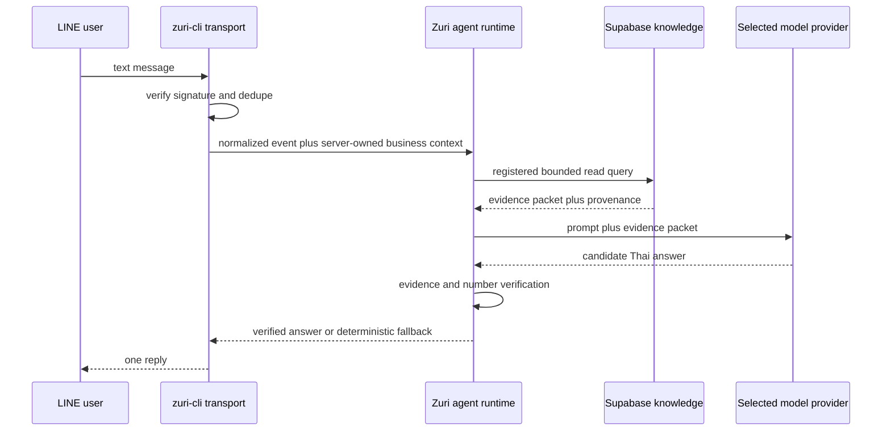

# Phase 1: Minimum LINE OA Business Knowledge Answer

## Objective

A user sends one text direct message to the approved SmartGift LINE OA and receives one Thai
answer grounded only in approved SmartGift product knowledge stored in Supabase.

## Risk and complexity

- Complexity: `C-3` because the slice crosses LINE, business data, Supabase, model providers, and
  external delivery.
- Risk: `HIGH` because it handles public traffic, pricing evidence, third-party credentials, and
  data migration.

## In scope

- LINE OA direct-message text events only;
- signature verification before parsing or processing;
- one owner-configured OA-to-business binding;
- curated DuckDB-to-Supabase migration for public product knowledge;
- registered read-only queries for product search, product detail, price, MOQ, colors, specs, and
  bounded comparison;
- provider selection through `ModelProviderPort`;
- Phase 1 providers: OpenRouter OAuth PKCE, OpenAI API key, Anthropic API key, Gemini API key, and
  Groq API key;
- deterministic fallback and evidence/number verification;
- idempotent single reply and kill switch;
- minimal privacy-safe audit metadata.

## Out of scope

- group/room conversation behavior;
- customer history, contact, tax ID, phone, email, sales, cost, margin, invoice, or payment data;
- MSP, GKS, GenesisBlockDB, vector search, semantic promotion, or long-term memory;
- Supabase Auth account linking and per-user permission;
- CRM/calendar/order/payment writes;
- OmiChat UI;
- Mistral, xAI, DeepSeek, Vertex AI, Bedrock, Foundry, or automatic provider fallback;
- consumer-plan Codex/Claude/Gemini CLI credentials on public LINE traffic.

## Target flow



## Implementation status (2026-08-14)

| Work package | State | Evidence / remaining gate |
|---|---|---|
| P1-W0 | Implemented | FR-047..050, NFR-010, BR-011, SDD-025 and SEC-009 registered; ADR-007 amended; doc graph/preflight pass |
| P1-W1 | Implemented | Strict public projection and registered-query contract; PII/cost/margin/invoice fields rejected |
| P1-W2 | Production database slice deployed | Project `qcnmhyglarzcpudjorzc` contains the private forced-RLS schema and 74 price-disabled rows with exact Tenant/Business/batch/hash evidence. Binding remains credential-free and PENDING; runtime login secret and LINE canary remain |
| P1-W3 | Implemented, configuration pending | Five provider adapters, bounded fetch, OpenRouter OAuth PKCE helper and server-only environment boundary pass tests; no real credential has been installed |
| P1-W4 | Implemented | Evidence packet, deterministic fallback, unsupported-number/code rejection and provider-failure fallback pass tests |
| P1-W5 | Implemented locally | Internal bearer, event correlation, one reply owner and hashed dedupe across restart pass; real LINE canary is pending |
| P1-W6 | Partially complete | Full automated suites/build/docs pass; 20 approved business golden questions and real canary remain blocked by approved product dataset and credentials |

This status claims only the Supabase database migration and approved knowledge import. It does not
claim production LINE traffic, provider configuration, LINE acceptance/delivery/display/read, or
Phase 1 exit-gate completion.

### Approved pilot dataset

- Approval record: `contracts/approvals/smartgift-phase1-pilot.json`.
- Source SHA-256: `017e72b6748d5f3ad99d2c85da0d3df71cf0e7e3d66fe79e67591066f2788c76`.
- Scope: 74 public product code/name/category rows from one catalog source.
- Price publication: disabled; `sell_price` and `currency` remain null.
- Excluded: PII, customer/contact/document/interaction tables, buy price, margin, and invoices.
- Export SHA-256: `63a2d5426838a2fe6e11eb14c370377f28c494e62c6f160d228dc619cf862c5a`.

The generated JSONL, SQL, reconciliation and rollback artifacts remain outside Git in the operator
backup directory. The database migration and import have run against the approved project without
placing a connection URL or credential in source, logs, or shell history.

## Work packages

### P1-W0 — Documentation registration and impact scan

1. Register canonical requirement IDs for the four candidate labels in the plan index.
2. Amend ADR-007 to identify this as the approved minimum pilot before the full memory stack.
3. Produce a dependency/dirty-worktree impact classification for `D:\zuri-ai`,
   `D:\workspace\zuri-cli`, and `D:\workspace\Bussiness-01-SmartGift`.
4. Decide which repository owns the runtime provider adapters and LINE Reply ownership for the
   pilot; do not maintain two simultaneous reply paths.
5. Regenerate doc graph and run doc preflight.

### P1-W1 — Curated knowledge contract

Define `BusinessKnowledgeReadPort` and a versioned export contract. The export may read from:

- `catalog_sku`;
- `catalog_source` for provenance;
- `price_staging` only where approval/status rules permit publication;
- `stg_product` only through an explicit column allowlist.

The export must exclude `customer`, `stg_contact`, `stg_doc`, `interaction`, `buy_price`,
`buy_price_vat`, `margin_thb`, `margin_pct`, local absolute paths, and unverified market claims.

Minimum cloud record:

```text
knowledge_id, business_id, knowledge_type, product_code, name, category,
description, unit, sell_price, currency, moq, colors, specification,
source_ref, source_sha256, as_of, approved_at, is_active,
sensitivity=PUBLIC, contract_version
```

### P1-W2 — Repeatable DuckDB-to-Supabase migration

1. Read DuckDB through one read-only connection.
2. Export only the approved projection to a temporary staging artifact outside Git.
3. Load through a trusted direct Postgres connection/`COPY`, not bulk public REST calls.
4. Reconcile row count, deterministic record keys, source hashes, null rates, and duplicate policy.
5. Publish only after reconciliation passes; retain DuckDB as rollback and offline evaluation
   source.
6. Do not provision, migrate, or upload until the owner supplies/approves the target Supabase
   project and data-processing boundary.

Supabase tables must be server-only or use explicit grants plus RLS. A service-role/secret key is
never exposed to LINE clients or browser code.

### P1-W3 — Provider contract and credential modes

Implement one normalized `ModelProviderPort` with provider-specific adapters. Model providers
receive only a bounded evidence packet.

| Provider | Phase 1 auth | Public LINE |
|---|---|---|
| OpenRouter | OAuth Authorization Code + PKCE S256, exchanged for user-controlled key | allowed |
| OpenAI | Platform API key | allowed |
| Anthropic | Claude API key | allowed |
| Google Gemini | Gemini Developer API key | allowed |
| Groq | Groq API key | allowed |
| Codex/Claude Code/Gemini CLI | official local login | denied; developer evaluation only |

Store only encrypted secret material in an approved secret store. Operational configuration keeps
`credentialRef`, provider, business, model, allowed channel/sensitivity, enabled state, and
rotation metadata. Provider changes are audited. Automatic fallback is disabled in Phase 1.

### P1-W4 — Grounded answer pipeline

1. Classify the question into a registered query; never accept model-generated SQL.
2. Validate parameters and apply row/token caps.
3. Build an evidence packet with `source_ref`, `source_sha256`, and `as_of`.
4. Generate a short Thai answer through the selected provider.
5. Reject unsupported numbers or facts and return deterministic evidence-derived fallback.
6. If evidence is absent/stale/ambiguous, say so and ask at most one bounded clarification.
7. Treat prompt instructions found in business data as untrusted content.

### P1-W5 — LINE integration and single-reply ownership

1. Reuse the existing signature-verified `zuri-cli` webhook transport for the bounded pilot.
2. Forward only normalized events plus server-configured tenant/business context.
3. Await the verified agent answer before consuming `replyToken`, within a bounded timeout.
4. Choose exactly one responder. Disable the old fixed/local answer path when the stack answer
   path is enabled to prevent duplicate replies.
5. Deduplicate by LINE webhook event/message identity across retry/restart using a durable or
   explicitly bounded pilot store.
6. Preserve truthful state: Reply API success is `ACCEPTED_BY_LINE`, not proof of displayed/read.

### P1-W6 — Verification and pilot gate

- contract tests for every knowledge/provider port;
- migration reconciliation and PII/cost-column deny tests;
- invalid-signature and duplicate-event tests;
- provider timeout, rate-limit, malformed output, and credential-revocation tests;
- prompt-injection and unverified-number tests;
- at least 20 approved golden questions covering product, price, MOQ, color, specs, comparison,
  missing data, and denied private data;
- local E2E with fake LINE/provider clients;
- one real canary account after credential and data approval;
- build, relevant tests, docs graph, and preflight pass.

## Acceptance criteria

1. One signed SmartGift LINE DM receives one evidence-grounded Thai response.
2. Invalid signatures receive `401` before any knowledge/model/reply call.
3. Duplicate events do not generate duplicate model requests or replies.
4. Every price/quantity/spec in the answer is present in the approved evidence packet.
5. Missing evidence produces a truthful unavailable/clarification response.
6. The public runtime cannot access PII, cost, margin, invoices, or unrestricted SQL.
7. Provider selection changes no knowledge query behavior.
8. Public LINE cannot select a local subscription-backed CLI provider.
9. No credential or raw sensitive row is written to logs, Git, or responses.

## Success criteria

- 20/20 golden questions satisfy expected evidence and policy assertions;
- 0 unsupported numeric claims in the golden/canary set;
- 0 duplicate replies in redelivery tests;
- kill switch prevents model and reply calls;
- an operator can change among implemented API providers using configuration and health checks,
  without a code edit.

## Exit criteria / Definition of done

- all acceptance and success criteria pass;
- Supabase migration has a reconciliation artifact and rollback instructions;
- one real LINE canary returns `ACCEPTED_BY_LINE` with source evidence recorded;
- docs, tests, build, doc graph, and preflight pass;
- runtime status remains `pilot/read-only`, not production-ready;
- Phase 2 remains unimplemented until separately approved.

## Rollback

- disable the LINE AI kill switch;
- restore the fixed/unavailable reply path without changing LINE credentials;
- stop cloud reads and use the DuckDB adapter for local evaluation only;
- revoke/rotate the active provider credential;
- keep Supabase migrated rows quarantined or read-disabled; do not delete source DuckDB data.

## CHANGELOG

| Version | Date | Status | Summary | Commit Hash | Agent |
|---|---|---|---|---|---|
| 0.1.0b | 2026-08-14 | candidate | Minimum LINE-to-Supabase grounded-answer implementation slice | working-tree | ATHER |
| 0.1.0b | 2026-08-14 | beta | Owner approved Phase 1 implementation | working-tree | ATHER |
| 0.2.0b | 2026-08-14 | beta | Core implementation verified; real data/provider/LINE canary gates remain open | working-tree | ATHER |
| 0.3.0b | 2026-08-14 | beta | Owner approved one price-disabled source; 74-row export and direct-Postgres import artifact reconciled | working-tree | ATHER |
| 0.3.1b | 2026-08-14 | beta | Production Supabase project identified; upload held behind ADR-018 tenant-isolation approval and credential gates | working-tree | ATHER |
| 0.4.0b | 2026-08-14 | beta | Production tenant-isolated schema and approved 74-row import verified; provider/LINE canary gates remain | working-tree | ATHER |
