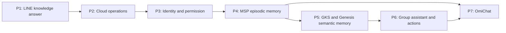

# Implementation Plan: LINE OA Business Agent

## 1. Decision

The owner approved the phase boundaries and authorized **Phase 1 documentation registration and
implementation only** on 2026-08-14. This approval does not authorize Phase 2-7 implementation,
production traffic, credential creation, Supabase provisioning, deployment, or data deletion.

This plan converts the owner direction into gated vertical slices. The first useful outcome is:

```text
LINE OA direct message
  -> verified LINE transport
  -> approved SmartGift public knowledge in Supabase
  -> selected model provider
  -> evidence-checked Thai answer
  -> one LINE reply
```

## 2. Evidence baseline (2026-08-14)

- `D:\workspace\Bussiness-01-SmartGift\data\sot.duckdb` is the current local SmartGift
  business-data source. It contains public product/price candidates and separate PII/financial
  tables; the whole database must not be copied to Supabase.
- `D:\workspace\zuri-cli` already verifies `x-line-signature`, can forward normalized LINE
  events, and contains a LINE Reply API client. Its current worktree has user-owned local changes.
- `D:\zuri-ai` has LINE ingest and agent-turn seams, but the current read-only response is a
  structured stub rather than an LLM answer grounded in the SmartGift catalog.
- `docs/.preflight-report.json` reports PASS at this baseline. The current worktree is dirty with
  unrelated FR-045 work; this plan must not be treated as a clean implementation baseline.

## 3. Binding architecture boundaries

1. Supabase is Auth + operational relational storage. It does not replace GenesisBlockDB.
2. GenesisBlockDB is the future agent-memory graph/vector/index engine. It is not in the Phase 1
   critical path.
3. Phase 1 is read-only. No CRM, calendar, order, price, payment, or policy mutation is allowed.
4. Business knowledge access is behind a port. DuckDB and Supabase are adapters, not domain APIs.
5. Model providers receive a bounded evidence packet, never unrestricted SQL or database access.
6. Public LINE runtime may use OpenRouter OAuth or provider API keys. Consumer-plan CLI login is
   local/internal-only unless the provider explicitly permits third-party production use.
7. Every later phase must pass its own approval gate. A later phase cannot silently enter an
   earlier implementation slice.

## 4. Phase map

| Phase | Plan | Deliverable | Depends on |
|---|---|---|---|
| 1 | [Minimum LINE OA Knowledge Answer](PHASE-01-MINIMUM-LINE-KNOWLEDGE.md) | One signed LINE DM receives a grounded SmartGift answer from curated Supabase knowledge | Owner approval of this plan |
| 2 | [Cloud Runtime and Operations](PHASE-02-CLOUD-RUNTIME-OPERATIONS.md) | Always-on governed webhook, outbox, secrets, observability and provider operations | Phase 1 accepted |
| 3 | [Identity and Permission](PHASE-03-IDENTITY-PERMISSION.md) | LINE identity linking and deterministic disclosure authorization | Phase 2 accepted |
| 4 | [MSP Episodic Memory](PHASE-04-MSP-EPISODIC-MEMORY.md) | Principal/thread/session transcript and episodic recall | Phase 3 accepted |
| 5 | [GKS and GenesisBlockDB Semantic Memory](PHASE-05-GKS-GENESIS-SEMANTIC-MEMORY.md) | Reviewed semantic promotion into canonical graph/vector memory | Phase 4 accepted + new ADR |
| 6 | [LINE Group Assistant and Actions](PHASE-06-GROUP-ASSISTANT-ACTIONS.md) | Mention/summary/proactive modes and governed actions | Phase 5 accepted |
| 7 | [OmiChat Unified Inbox](PHASE-07-OMICHAT-UNIFIED-INBOX.md) | Operator chat console reusing shared conversation contracts | Product roadmap approval |

## 5. Dependency flow



## 6. Requirement registration gate

Existing requirements `FR-023`, `FR-025`, `FR-027`, `FR-028`, `FR-029`, and `FR-030`
partially cover LINE ingest, read-only agent composition, runtime ports, and PostgreSQL/Supabase
readiness. The candidate labels were registered as canonical requirement IDs after owner approval:

- `FR-047` (`CAND-LINE-KB-READ`): curated business-knowledge read contract;
- `FR-048` (`CAND-LINE-PROVIDER`): provider/auth-mode selection and credential references;
- `FR-049` (`CAND-LINE-ANSWER`): evidence-grounded answer and output verification;
- `FR-050` (`CAND-LINE-DELIVERY`): one idempotent LINE reply with truthful receipt semantics.

Their supporting boundaries are `NFR-010`, `BR-011`, `SDD-025`, and `SEC-009` in
`docs/PRD-SDD-v1.0.md`. Requirement IDs are never renumbered or reused.

Issue #11 adds the approved multi-principal authorization boundary:

- `FR-057` (`AUTHORIZED-AGENT-CONTEXT`): per-turn AuthContext, policy-before-retrieval,
  and explicit MSP authorized vault set;
- `NFR-014`, `BR-015`, `SDD-030`, and `SEC-013` define revocation, scope, design, and
  fail-closed security behavior;
- `ADR-022` is the binding cross-layer decision; implementation is limited to the Zuri
  authorization seam and adapter contract until the GoVibe/MSP contract is consumed.

## 7. Program-wide definition of done

A phase is done only when:

- its acceptance, success, exit, security, rollback, and evidence criteria all pass;
- tests and build pass at the scope declared in that phase;
- no raw credential, PII export, or unrestricted database query enters logs or Git;
- the phase report distinguishes implemented, configured, deployed, accepted by provider,
  delivered, and read states;
- generated documentation is refreshed after resolving dirty-worktree overlap;
- the owner approves the next phase separately.

## CHANGELOG

| Version | Date | Status | Summary | Commit Hash | Agent |
|---|---|---|---|---|---|
| 0.1.0b | 2026-08-14 | candidate | Initial seven-phase plan and approval boundaries | working-tree | ATHER |
| 0.1.0b | 2026-08-14 | beta | Owner approved Phase 1 only; registered FR-047..050 | working-tree | ATHER |
