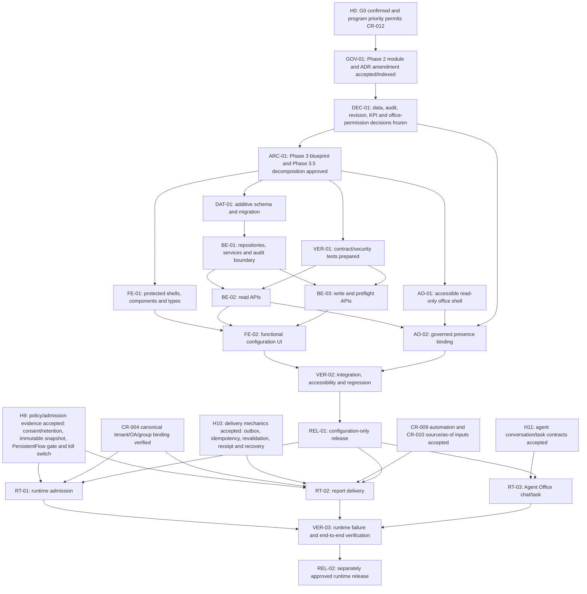

<!-- ADR-005: imported from Zuri V1 — DO NOT EDIT THIS FILE -->
> **Inherited from Zuri V1 · read-only.**
> Source: `G:/zuri/docs/.rwang-tasks/CR12-FEAT34/IP-02-dependency-report.md` @ `0b6d3c3` · imported 2026-08-11
> This describes **V1 semantics**, where *tenant* means **one shop** — V2's scope
> chain (Portfolio → Tenant → Business → Workspace) is different. Corrections belong
> in a V2 document that cites this file, never in this file. Cite its ids with a
> `V1-` prefix (e.g. `V1-ADR-060`) so they cannot be confused with V2 ids.

# IP-02 Dependency Report — CR-012 / FEAT34

**Artifact status:** proposed architecture analysis; not an implementation authorization

**Task classification:** C-3 — Architecture-Driven Implementation

**Change risk:** HIGH

**Prepared:** 2026-08-10 (Asia/Bangkok)

**Review status:** not reviewed; an independent reviewer must apply the hard gates in this report

## 1. Outcome and authority boundary

CR-012 / FEAT34 must be delivered as two deliberately separate release trains:

1. **Configuration-plane MVP:** protected Zuri pages and tenant-scoped persistence/APIs for group policy intent, reviewer scope, candidate reads, report configuration, and source/readiness states. It may request preflight, but it cannot admit a group, send LINE, create a CRM/task side effect, or claim that a schedule is live.
2. **Later runtime/delivery enablement:** governed LINE response, report delivery, Agent Office conversation, and durable task assignment. Each needs a separately accepted contract and server evidence; configuration-plane completion is not evidence that any of these behaviours are live.

All implementation locations in section 10 are **PROPOSED targets only**. They do not assert that a file, route, model, endpoint, or generated artifact exists. Evidence paths cited elsewhere in this report are current source references, not proposed edits.

### Assumptions

1. The candidate API contract remains the shape to freeze; this report does not change it.
2. No Visual Office persistence model, API route, or dashboard route currently exists in the inspected tree.
3. The inbound module and ADR-068 amendment are proposals only. They are not Phase 2 authority until the gatekeeper promotes them and the atomic index records them.
4. Calendar estimates are intentionally excluded. The critical path below is structural, based on prerequisites and acceptance evidence.
5. Current production configuration is unverified because the preflight report says branch code and operational risk documents disagree. Release must use deployment smoke evidence rather than either document alone.

## 2. Source traceability

| Key | Authority / evidence | Use in this report |
|---|---|---|
| S1 | `docs/specs/CR-012-governed-line-visual-office.md` §§Scope, Architectural Contract, Implementation Stages, Required Verification | Product boundary, staged delivery, tenant/runtime gates |
| S2 | `gks/phase1_docs/FEAT34-GOVERNED-LINE-VISUAL-OFFICE.md` §§3–7 | Behaviour, screens, AC-01–AC-07, upstream dependencies, exclusions |
| S3 | `docs/contracts/zuri-visual-office-api-v1.md` §§2–9 | Candidate resource/API/error contract, configuration/runtime split, Agent Office proposal |
| S4 | `docs/design/visual-office-design-spec.md` §§1–6 | UI states, components, state language, no-false-live design |
| S5 | `docs/design/visual-office-agent-office-spec.md` §§3–7 | Read-only presence, accessibility, renderer and interaction boundaries |
| S6 | `docs/design/visual-office-frontend-execution-plan.md` | Existing frontend lanes, unresolved `/office` permission, Phase 2/3 gate |
| S7 | `docs/.preflight-report.json` | Critical documentation drift, API registry drift, missing canonical test/AI-governance coverage |
| S8 | `docs/.doc-graph.json` | Derived authority/status: CR approved for design, API candidate, inbound proposals pending, endpoints specified-not-implemented |
| S9 | `.brain/msp/projects/G--zuri/inbound/20260810130000-codex-new_atomic-mod--visual-office-control-plane.md` | Proposed module boundary and invariants |
| S10 | `.brain/msp/projects/G--zuri/inbound/20260810133000-codex-update_atomic-adr068-visual-office-rbac.md` | Proposed `ownership` mapping and reviewer exception |
| S11 | `gks/00_index/atomic_index.jsonl` plus selected `gks/phase2_atomic/ADR-068-persona-based-rbac.md` | Current indexed Phase 2 state; the module is absent and ADR-068 has no indexed Visual Office amendment |
| S12 | `package.json`, `prisma/schema.prisma` | Current stack, test/build commands, migration surface, absence of Visual Office models |
| S13 | `src/lib/auth.js`, `src/lib/db.ts`, `src/lib/tenantContext.js`, `src/lib/permissionMatrix.js` | Existing session, tenant context, auto-scope, explicit repository-scope, fail-closed RBAC patterns |
| S14 | Representative routes/repositories/tests under `src/app/api/` and `src/lib/` | Route-to-repository separation, tenant mismatch handling, immutable audit, route guard and tenant-isolation tests |

## 3. Complexity method and overall assessment

Each work package uses the exact discrete `implementation-plan` scoring method:

- **S — Scope:** Small `1`, Medium `2`, Large `5`, XL `8`.
- **R — Technical Risk:** Low `0`, Medium `2`, High `5`.
- **D — Dependencies:** None `0`, Internal `1`, External `3`.
- **A — AI/ML Factor:** None `0`, Fine-tune `2`, Train `5`, Research `8`.
- **Total = S + R + D + A**.

The governing method defines no official total-point classes, so this report assigns **no complexity class labels**. The task classification remains C-3 and the change risk remains HIGH under repository governance; those are separate from the package-point calculation. No score is a duration estimate.

## 4. Proposed work-package inventory

| ID | Release train | Proposed package and exit evidence | S | R | D | A | Total | Sources |
|---|---|---|---:|---:|---:|---:|---|---|
| GOV-01 | Config MVP | Promote the module proposal and ADR-068 amendment through MSP; index shows both accepted artifacts; resolve Core RBAC ownership without adding an ad hoc domain | Small (1) | High (5) | External (3) | None (0) | 9 | S6, S9–S11, S13 |
| DEC-01 | Config MVP | Freeze data ownership, canonical binding source, audit sink/transaction rule, revision/CAS strategy, KPI registry, retention, alert hard cap, and `/office` read permission | Medium (2) | High (5) | External (3) | None (0) | 10 | S1–S3, S6, S12–S14 |
| ARC-01 | Config MVP | Approved Phase 3 blueprint with exact geography/API/data logic, followed by Phase 3.5 one-concern task decomposition and generated-target ownership | Large (5) | High (5) | External (3) | None (0) | 13 | S6, S9, S11 |
| DAT-01 | Config MVP | Additive tenant-scoped control-plane schema and reviewed migration; constraints/indexes/revision semantics proven; no secrets/raw transcripts/authority fields persisted from browser input | Large (5) | High (5) | Internal (1) | None (0) | 11 | S1–S3, S12–S14 |
| BE-01 | Config MVP | Repository/service foundation for groups, reviewers, reports, candidates, overview/source state and audit; every resource lookup starts with session tenant scope | Large (5) | High (5) | Internal (1) | None (0) | 11 | S3, S9, S13–S14 |
| BE-02 | Config MVP | Read API slice: overview, verified bindings, groups/detail/options, reports/detail, review queue/detail; pagination, masking and safe non-existence errors pass contract tests | Large (5) | High (5) | Internal (1) | None (0) | 11 | S3 §§4.1, 5–6 |
| BE-03 | Config MVP | Write API slice: group/reviewer/report changes and activation request; strict validation, revision conflict, transactional audit and configuration-only state pass | Large (5) | High (5) | Internal (1) | None (0) | 11 | S3 §§4.2–4.4, 6 |
| FE-01 | Config MVP | Protected route shells, contract-derived view models and reusable state components; no live-looking fixture and no client authority field | Large (5) | Medium (2) | Internal (1) | None (0) | 8 | S1–S4, S6 |
| FE-02 | Config MVP | Groups, candidates, reports, report detail and controlled API binding; all required error/source/configuration states and revision refresh behaviour pass | XL (8) | High (5) | Internal (1) | None (0) | 14 | S2–S4, S6 |
| AO-01 | Config MVP | Agent Office DOM/SVG shell, equivalent semantic list, drawer, reduced-motion/static fallback; read-only and source-unavailable without presence API | Large (5) | Medium (2) | Internal (1) | None (0) | 8 | S3 §9, S5, S6 |
| AO-02 | Config MVP | Bind server-derived presence only after `/office` permission freezes and tenant/RBAC/staleness tests pass; no fabricated working state | Medium (2) | High (5) | External (3) | None (0) | 10 | S3 §9.1, S5, S6 |
| VER-01 | Config MVP | Contract/security suite covering tenant A/B isolation, authority injection, RBAC/reviewer scope, PII/no-existence leak, session revocation, audit, revisions, disabled capability and no-delivery invariants | XL (8) | High (5) | Internal (1) | None (0) | 14 | S1 Required Verification, S2 AC, S3 §8, S13–S14 |
| VER-02 | Config MVP | Component, integration, E2E, accessibility, reduced-motion, no-deception, existing Inbox/login regression, build/lint/MSP/handfixed checks | Large (5) | High (5) | Internal (1) | None (0) | 11 | S1–S6, S12 |
| REL-01 | Config MVP | Configuration-only production handoff with reviewed migration evidence, current deployment smoke, rollback rehearsal, known runtime blockers, and explicit human approval | Medium (2) | High (5) | External (3) | None (0) | 10 | S1, S2, S7, S12 |
| RT-01 | Later runtime | Governed group runtime admission: verified binding, consent/retention, immutable policy snapshot, PersistentFlow admission, kill switch and audit | XL (8) | High (5) | External (3) | Research (8) | 24 | S1–S3, S9 |
| RT-02 | Later delivery | Governed report delivery only after policy/admission evidence and delivery mechanics both pass: verified binding, consent/retention, immutable policy snapshot, kill switch, outbox, scheduler, idempotency, send-time recipient/PII revalidation, receipt, retry/recovery, suppression and audit | XL (8) | High (5) | External (3) | None (0) | 16 | S1–S3 |
| RT-03 | Later Agent Office | Conversation and task-assignment contracts, idempotent durable enqueue, policy admission and audit; drawer action does not imply completion | XL (8) | High (5) | External (3) | Research (8) | 24 | S3 §9.2, S5 |
| VER-03 | Later runtime | Failure-injection and end-to-end evidence for blocked/stale/revoked policy, kill switch, duplicate delivery, receipt recovery, cap suppression and agent workflow | XL (8) | High (5) | External (3) | Research (8) | 24 | S1–S3, S5 |
| REL-02 | Later runtime | Separately approved canary/cutover with live credentials, observability, kill switch, outbox recovery and last-known-good rollback evidence | Large (5) | High (5) | External (3) | Research (8) | 21 | S1–S3, S7 |

## 5. Dependency DAG

### Circular-dependency check

**Result: no build-time cycle in the proposed DAG.** The following apparent loops are broken by explicit contracts:

- Frontend and backend depend on the frozen API contract; neither package defines the other dynamically.
- Group configuration produces immutable policy intent; runtime admission consumes a snapshot and returns status. A returned status is a runtime state transition, not a build dependency from runtime back to configuration persistence.
- Report configuration produces delivery intent; a later outbox consumes a versioned configuration and writes receipt/status evidence. The configuration API does not wait on a successful send.
- Agent Office renders server presence; the renderer never manufactures or mutates the presence source.
- Reviewer assignment selects existing Zuri users. Global role administration remains outside Visual Office, so Visual Office does not depend on its own reviewer UI to establish RBAC.

Any implementation that lets the browser set `runtimeAdmission`/`deliveryRuntime`, lets runtime mutate policy without an immutable version, or makes the API contract emerge from frontend fixtures would reintroduce a cycle and must fail architecture review.

## 6. Critical paths

### 6.1 Configuration-plane MVP critical path

`H0 -> GOV-01 -> DEC-01 -> ARC-01 -> DAT-01 -> BE-01 -> BE-03 -> FE-02 -> VER-02 -> REL-01`

BE-03 is on the structural critical path because the requested MVP includes saved policy/report configuration, revision conflict handling, and audit evidence. FE-01, BE-02, AO-01 and test preparation can reduce elapsed time through parallel execution, but none can bypass the critical path's gates.

AO-02 joins the release path only if governed Agent Office presence is part of the first configuration release. If `/office` permission or presence authority remains unresolved, the safe release choice is AO-01's static unavailable shell; AO-02 remains blocked and must not hold the rest of the control-plane MVP hostage.

### 6.2 Runtime/delivery critical path

`REL-01 -> (H3 verified binding + H9 policy/admission evidence) -> RT-01` and, independently, `REL-01 -> (H3 verified binding + H9 policy/admission evidence + H10 delivery mechanics + accepted CR-009/CR-010 inputs) -> RT-02`; the enabled later slices then converge at `VER-03 -> REL-02`. RT-03 joins only when separately approved.

This path cannot be shortened by calling configuration records “active.” Runtime and delivery are evidence-gated state machines, not UI labels.

## 7. Safe parallel lanes

| Lane | Earliest start | Can run concurrently | File/ownership boundary | Stop condition |
|---|---|---|---|---|
| L-A Governance/architecture | Now | Source review only | MSP/human review and future Phase 3/3.5 artifacts | Stop until inbound proposals are promoted and decisions freeze |
| L-B Data/backend | After ARC-01 | L-C, L-D, L-E | Schema/migration, repositories/services, then API routes; one owner per exact generated target | No migration or route code before approved blueprint/tasks |
| L-C Frontend foundations | After ARC-01 | L-B, L-D, L-E | Protected shells, view models, feature compositions | Shells only until backend contract tests pass; no live-looking fixtures |
| L-D Agent Office shell | After ARC-01 | L-B, L-C, L-E | DOM/SVG scene, semantic list, drawer and fallback | No presence binding before `/office` permission and source contract pass |
| L-E Verification | Test design after ARC-01; execution follows each slice | L-B–L-D | Contract fixtures, tenant/RBAC tests, component/accessibility checks | Test doubles may not weaken session tenant authority or hide cross-tenant queries |
| L-F Runtime policy | After its independent decisions and CR-004/consent gates | Delivery design, not config-plane mutation | PersistentFlow/policy/kill-switch owner | No LINE call or LLM/MCP invocation from configuration-plane code |
| L-G Delivery | After H3 verified binding, H9 policy/admission evidence, H10 delivery mechanics, and source/recipient decisions | Runtime policy implementation where files are disjoint | Outbox/scheduler/receipt/recovery owner | If consent/retention, verified binding, immutable policy snapshot, kill switch, outbox, idempotency, revalidation, receipt, or recovery evidence is absent, perform no enqueue/send and remain blocked |
| L-H Agent interactions | After separate chat/task contracts | L-F/L-G if files are disjoint | Conversation/task workflow owner | No Talk/Assign endpoint or enabled control before durable admission evidence |

Parallel writers must receive disjoint exact file sets from the approved Phase 3.5 manifest. Shared schema, shared contract types, and shared route index/guard tests are serialized integration points. A parent reviewer, not a writer, performs the final cross-lane gate.

## 8. Architecture decision gates

| Gate | Decision / evidence required | Blocks | Fail-closed outcome |
|---|---|---|---|
| H0 Program precedence | Confirm G0 is merged on `origin/main` and current program authority permits CR-012; CR-003 remains mandatory before real LINE traffic | GOV-01/merge and all runtime | Do not merge/start feature code against an unconfirmed base |
| H1 Phase 2 promotion | Accepted `MOD--visual-office-control-plane` and Visual Office ADR-068 amendment appear in `atomic_index.jsonl` | ARC-01 and all implementation | Documentation work only |
| H2 RBAC | Freeze `ownership:R/W`, named-reviewer exception, `/office` read permission, and confirm Visual Office has no role-changing endpoint | API/UI binding | 403/safe denied; role management says “managed by Zuri Team” |
| H3 Canonical binding | Identify the CR-004-owned server authority for eligible `groupBindingId`; prove tenant/OA ownership and revocation semantics | Group creation, preflight, runtime | Empty/unavailable binding picker; no arbitrary LINE/OA identifier |
| H4 Data/audit/revision | Approve model ownership, retention, append-only audit target, transaction boundary, opaque revision/CAS and deletion semantics | DAT-01/BE-03 | No persistence or mutable control |
| H5 KPI/source policy | Freeze server KPI registry, source/as-of contract, masking, retention, alert hard cap and demo/stale semantics | Reports and overview | `SOURCE_UNAVAILABLE`/demo/stale; no invented values |
| H6 Phase 3/3.5 | Blueprint exact geography/API/data logic approved; microtasks pass schema and generated-target review | Any code/schema/generated edit | No implementation |
| H7 Migration | Additive SQL reviewed; constraints/indexes verified; backup/status/apply and code-rollback plan recorded | Backend deployment | Do not deploy routes that require unapplied schema |
| H8 Backend acceptance | Tenant A/B, tenant injection, binding theft, 401/403/404 leak, revision, audit and no-side-effect tests pass | Functional frontend binding | Shell/unavailable state only |
| H9 Policy/runtime admission | Verified canonical binding, applicable consent/retention, immutable policy snapshot, PersistentFlow/policy gate, effective kill switch and audit accepted | RT-01 and RT-02 | `not_requested`/`blocked`; no LLM/MCP/LINE call and no delivery enqueue/send |
| H10 Delivery mechanics | Governed outbox, idempotency, send-time recipient/PII revalidation, receipt, retry/recovery and suppression contract accepted in addition to H9 | RT-02 | Configuration-only; `deliveryRuntime` cannot be `live`; H10 cannot substitute for H9 |
| H11 Agent interaction | Conversation and task-assignment APIs, client idempotency, durable enqueue, policy admission and audit accepted | RT-03 | Drawer read-only; Talk/Assign disabled with reason |
| H12 Release | Independent review, current production env/smoke, test suite, migration evidence, rollback rehearsal and human approval | REL-01/REL-02 | No deployment or live-capability change |

## 9. Data and migration boundaries

### 9.1 Proposed configuration-plane data boundary

The approved blueprint may introduce additive tenant-owned records for these concepts only after H4:

- reference to a canonical verified group binding owned by the upstream binding authority;
- group policy intent, capability set, trigger, visibility, revision and configuration state;
- explicit named reviewer grants and their active/revoked state;
- report template/configuration, structured schedule, allowed recipient references, KPI selection, source state and revision;
- activation/preflight request and safe returned status;
- audit evidence linked by opaque ID.

The schema must not persist browser-authoritative `tenantId`, raw LINE group/OA IDs, credentials, secret references, raw transcripts, hidden reasoning, or unmasked report PII. Every tenant-owned model needs `tenantId`, tenant-first indexes, tenant-safe uniqueness, explicit relation/delete behaviour, and repository queries that include `tenantId` even when the Prisma context guard is active.

The following are **not configuration-plane schema claims** and require later contracts: runtime policy snapshots, durable outbox entries, delivery receipts/retry state, agent conversations, task-assignment workflow state, or model prompts/outputs.

### 9.2 Migration and rollback boundary

1. **Expand only:** create new tenant-scoped tables/indexes or nullable/defaulted fields. Do not rewrite current Inbox/CRM/LINE records and do not backfill an “active/live” state.
2. **Apply before use:** verify reviewed migration SQL and database migration status before routes that require the new tables are reachable. `package.json` does not itself prove a production `prisma migrate deploy` step, so release evidence must show how the migration was actually applied.
3. **Code rollback first:** a configuration-plane rollback reverts application code/navigation while leaving additive tables and audit records intact. Do not drop data as part of an incident rollback.
4. **Data rollback is separate:** disabling/revoking Visual Office must stop only Visual Office policy; it must not delete Inbox history, CRM data, canonical LINE onboarding, audit evidence, or another module's state.
5. **Destructive contraction later:** table/column removal requires a separate approved retention/export decision, proof that no deployed code reads it, and a new migration review.
6. **Runtime rollback:** use the effective kill switch and revoke admission; do not reinterpret configuration as disabled data loss.
7. **Delivery rollback:** stop new enqueue/sends, preserve idempotency and receipts, reconcile in-flight outbox items, then revert code. Never delete receipts to make a retry look clean.

## 10. Proposed file/module geography

Every entry below is **PROPOSED** and must be made exact by ARC-01. No entry authorizes direct editing, code generation, composition, or migration.

| Area | Proposed target | Proposed responsibility / restriction |
|---|---|---|
| Phase 3 | **PROPOSED** `gks/phase3_blueprints/FEAT-034_VisualOffice.yaml` | Exact geography, API contracts, data logic, security and verification gates after Phase 2 promotion |
| Phase 3.5 | **PROPOSED** `gks/phase3.5_microtasks/FEAT-034/` | One concern per task plus manifest; generated targets are changed through tasks and composer, never hand-edited |
| Data | **PROPOSED modification** `prisma/schema.prisma` | Additive control-plane models only after H4/H6 |
| Migration | **PROPOSED** `prisma/migrations/<timestamp>_feat34_visual_office_control_plane/migration.sql` | Reviewable forward-only additive SQL; no guessed timestamp until execution |
| Validation | **PROPOSED** `src/lib/validation/visualOffice*.{js,ts}` | Strict request/enums/schedule/recipient validation; strip authority fields |
| Repositories | **PROPOSED** `src/lib/repositories/visualOffice*.{js,ts}` | Explicit tenant-first data access, optimistic revision and transaction-safe audit integration |
| Services | **PROPOSED** `src/lib/services/visualOffice*.{js,ts}` | Configuration/readiness orchestration; never LINE send or runtime admission mutation |
| Read APIs | **PROPOSED** `src/app/api/visual-office/{overview,group-bindings,groups,reports,review-queue}/.../route.js` | Exact S3 §4.1 routes with safe pagination/errors/masking |
| Write APIs | **PROPOSED** `src/app/api/visual-office/{groups,reports}/.../route.js` | Exact S3 §§4.2–4.3 writes and activation-request preflight only |
| Office API | **PROPOSED** `src/app/api/visual-office/office/route.js` | Read-only presence after H2/H8; no Talk/Assign |
| Pages | **PROPOSED** `src/app/(dashboard)/visual-office/{page.jsx,groups/,review-queue/,reports/,office/}` | Protected pages inside existing dashboard shell |
| Components | **PROPOSED** `src/app/(dashboard)/visual-office/_components/` | Existing primitives composed into explicit config/preflight/runtime/source states |
| Navigation | **PROPOSED modification** current dashboard navigation owner selected by the blueprint | Add route entry without treating menu visibility as authorization |
| Unit/contract tests | **PROPOSED** co-located `*.test.{js,jsx,ts,tsx}` beside proposed repositories/routes/components | Tenant, RBAC, revision, audit, state, accessibility and no-side-effect tests |
| Guard tests | **PROPOSED modification** `src/lib/permissionMatrix.routes.test.js` and relevant auth/tenant suites | Pin `ownership` mapping and prevent unknown-domain regressions |
| E2E | **PROPOSED** `tests/e2e/visual-office*.spec.{js,ts}` or the exact existing Playwright geography selected by ARC-01 | Login/revocation, tenant isolation, denied/not-found, keyboard and no-false-live flows |

`handfixed.lock.json` currently protects an unrelated POS route; no proposed Visual Office target is currently listed. That does not waive the AUTO-GENERATED rule: the approved blueprint/manifest determines generated ownership, and any later locked target must stop composition until reconciled.

## 11. Verification and release gates by acceptance criterion

| Acceptance / invariant | Minimum evidence before REL-01 | Additional evidence before REL-02 |
|---|---|---|
| AC-01 existing login only | Unauthenticated page/API redirect or 401 through current Zuri flow; revoked session denied | Same checks on report deep link and runtime callbacks |
| AC-02 tenant cannot be selected | Body/query/header/path authority injection tests; Tenant A cannot see Tenant B | Binding, outbox, receipt and agent-workflow tenant isolation |
| AC-03 disabled by default | New group persists no capabilities/effective admission; preflight is request-only | Runtime proves only `admitted` snapshot can invoke capability |
| AC-04 safe report denial | 403/404 contains no PII/existence clue; opaque report ID is not authority | Send-time recipient revalidation and deep-link smoke |
| AC-05 deliberate accessible states | Component/E2E matrix plus keyboard, semantic list and reduced-motion checks | Live/stale/recovery states remain accessible |
| AC-06 no secrets/transcripts/invented KPI | Response/log snapshot tests and source-unavailable rendering | Outbox/receipt/agent status telemetry remains allowlisted |
| AC-07 Inbox/login regression | Targeted current Inbox/login tests plus build/lint | Same after runtime cutover and rollback rehearsal |
| Audit/revision | Every successful write returns an existing opaque audit ID; conflict is 409; failed validation makes no mutation | Admission/send/task transitions carry separate durable audit/receipt evidence |
| No deception | Config, preflight, runtime and delivery labels remain separate; current prod demo/live state is smoke-verified | Canary confirms real source/receipt and kill-switch behaviour |

## 12. Hard-stop findings and out-of-scope notes

- The Phase 2 module is absent from the current atomic index, and the Visual Office ADR-068 text exists only in inbound. This is the first implementation blocker, not a paperwork follow-up.
- The current ADR-068 file and current permission matrix have evolved differently: the indexed ADR's older table is not enough to infer the present `ownership` contract. The inbound amendment must reconcile the authority explicitly.
- `/office` read permission remains unresolved. AO-01 may show an unavailable shell; AO-02 may not bind presence until H2/H8 pass.
- The current schema contains no Visual Office model and no canonical group-binding model evident from the inspected schema. DEC-01 must identify the upstream binding authority instead of duplicating raw LINE identifiers.
- Existing `AuditLog` is treated specially by the Prisma auto-scope guard. Any reuse therefore needs explicit tenant-scoped repository access and an approved transaction strategy; the audit ID cannot be cosmetic.
- The preflight report records critical documentation/runtime drift. REL-01 and REL-02 must verify current deployed demo/rate-limit/live-data behaviour rather than copy a stale status claim.
- Current repository findings outside CR-012, including unrelated schema defaults, legacy direct-Prisma routes, API registry drift, and generic documentation gaps, are out of scope. New Visual Office code must follow the stronger repository/session/tenant pattern without refactoring those files opportunistically.
- Global role administration, LINE webhook work, credentials, CRM/task creation from candidates, public report access, cross-domain auth, PersistentFlow implementation, delivery infrastructure, and deployment are not authorized by this report.

## 13. IP-02 self-check for reviewer handoff

| Required gate | Writer check |
|---|---|
| Completeness | Backend, data, frontend, Agent Office, runtime/delivery, verification and release packages are represented |
| Complexity | Every package uses the exact discrete Scope, Technical Risk, Dependencies and AI/ML values; totals are recomputed and no unsupported class label is assigned |
| Dependency integrity | DAG, critical paths, safe parallel lanes and circular-dependency analysis are explicit |
| Configuration/runtime separation | REL-01 is configuration-only; RT-01/02/03 and REL-02 are independent later gates |
| Tenant/RBAC preservation | Session-derived tenant, explicit repository scope, `ownership` mapping, reviewer scope and `/office` blocker are retained |
| Migration/rollback | Expand-only migration, code-first rollback, retained audit/data, runtime kill switch and outbox recovery boundaries are stated |
| Proposed geography | Every implementation target is labelled PROPOSED and deferred to the approved Phase 3/3.5 plan |
| Review independence | No acceptance or approval is claimed; independent review remains required |
