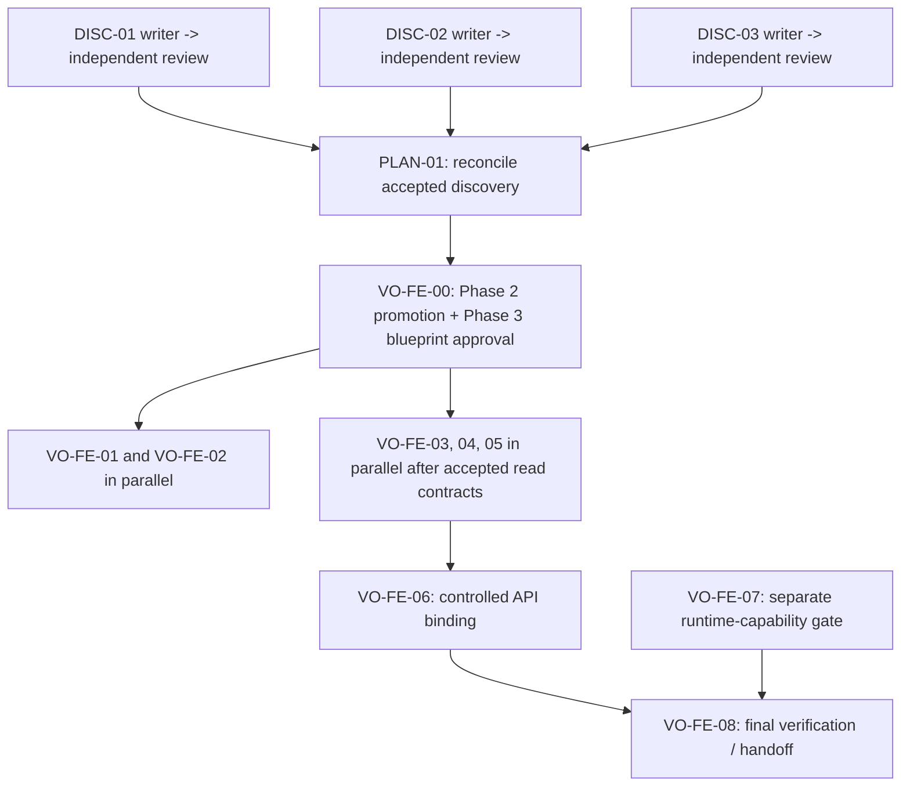

<!-- ADR-005: imported from Zuri V1 — DO NOT EDIT THIS FILE -->
> **Inherited from Zuri V1 · read-only.**
> Source: `G:/zuri/docs/.rwang-tasks/DISC-03-report.md` @ `0b6d3c3` · imported 2026-08-11
> This describes **V1 semantics**, where *tenant* means **one shop** — V2's scope
> chain (Portfolio → Tenant → Business → Workspace) is different. Corrections belong
> in a V2 document that cites this file, never in this file. Cite its ids with a
> `V1-` prefix (e.g. `V1-ADR-060`) so they cannot be confused with V2 ids.

---
task_id: "DISC-03"
title: "Automation and Gate Topology"
report_type: "writer-report"
report_role: "writer"
status: "review"
created_at: "2026-08-10T17:00:00+07:00"
scope: "Documentation-only execution topology for the Visual Office frontend"
state_authority: "docs/design/visual-office-frontend-execution-plan.md"
---

# DISC-03 — Automation and Gate Topology

## Writer-report contract

Every task writer report must contain the frontmatter above plus: (1) bounded scope and explicit out-of-scope work, (2) source paths and section-level evidence for every decision, (3) dependency and acceptance evidence, (4) validation commands actually run with exit status or an evidence-backed blocker, and (5) a `review` status.  A writer report cannot mark its task `done`.

The independent reviewer writes a separate `docs/.rwang-tasks/<TASK>-review.md` report that identifies the reviewed writer report, checks completeness, traceability, and consistency, and records one outcome: `accepted`, `changes-requested`, or `blocked`.  The controller alone records the resulting lifecycle state in both the authoritative execution plan and its Markdown companion ledger, `docs/.rwang-progress.md`.  If those records disagree, the execution plan wins and the discrepancy is a blocker rather than an inferred transition.

## Scope and evidence boundary

This topology governs parallel **documentation, local validation, and future frontend planning** only. It does not authorize frontend/backend code, deployment, credentials, browser-side tenant authority, LINE delivery, runtime capability enablement, role administration, code generation, or mutation of MSP/GKS artifacts.

| Evidence | Observed constraint | Topology consequence |
|---|---|---|
| `visual-office-frontend-execution-plan.md` §§Non-Negotiable Gates, Durable State, Automation Policy | VO-FE-00 is blocked; implementation requires MSP promotion and a Phase 3 blueprint; writer and reviewer must be separate. | No Phase 3/code task may be assigned until VO-FE-00 is demonstrably `done`. |
| `20260810130000-codex-new_atomic-mod--visual-office-control-plane.md` §§Module Boundary, Consequences | The Phase 2 module is a draft inbound proposal and demands a later approved blueprint before live use. | Draft submission is not promotion evidence; promotion failure keeps downstream work blocked. |
| `CLAUDE.md` §§Workflow: Doc-Before-Code, Write rules | Phase 2 acceptance/indexing precedes Phase 3; agents do not write Phase 2 directly. | Automation may observe/validate the gate but cannot promote a proposal or create a blueprint. |
| `CRITICAL_FACTS.md` §§Live risk flags, Status | Demo mode and fail-open login protection remain live risks. | No report or UI-state evidence may claim live/runtime readiness; such claims fail review. |

## Dependency topology

`PLAN-01` may only consume discovery reports whose separate review outcomes are `accepted`. It may update the plan only through its assigned writer/controller path; it cannot turn an unaccepted discovery conclusion into a dependency satisfaction.

`VO-FE-00` has two non-substitutable evidence elements: (a) the proposed Phase 2 module and required ADR are accepted through the MSP path and (b) the relevant Phase 3 blueprint is approved. An inbound draft, an index rebuild, or a passing local check alone is insufficient. `PLAN-02` is not assigned until the Phase 2 promotion evidence exists.

After VO-FE-00, VO-FE-01 and VO-FE-02 may be independently assigned. VO-FE-03 through VO-FE-05 additionally require their documented read contract; they remain parallel only where their contracts do not overlap. VO-FE-06 requires accepted UI work and backend acceptance. VO-FE-07 is a distinct, blocked runtime path: it cannot be implied by UI completion. VO-FE-08 requires VO-FE-06 and, only where release scope exposes a runtime capability, VO-FE-07. In every case it must verify that the UI does not represent unavailable data or blocked capabilities as live.

## Durable task transitions

| Current state | Permitted transition | Required durable evidence | Prohibited transition |
|---|---|---|---|
| `planned` | `assigned` | Controller records one writer, dependencies `done`, and a bounded artifact path. | Assigning work with a blocked or unreviewed dependency. |
| `assigned` | `in-progress` | Writer report identifies sources, scope, and acceptance target. | Editing a sibling artifact or product code. |
| `in-progress` | `review` | Writer report includes evidence, command results or blockers, and out-of-scope work. | Self-approval or a silent completion claim. |
| `review` | `done` | Separate reviewer report is `accepted`; controller updates plan and ledger consistently. | A reviewer accepting their own writer report. |
| `review` | `in-progress` | Reviewer report requests a targeted fix; cycle count remains at most three. | Resetting/retrying without recording the review outcome. |
| any non-final state | `blocked` | Concrete missing contract, failed validation, conflicting evidence, or unavailable local dependency is recorded. | Automatic retry, inferred approval, or dependency bypass. |

## Acceptance evidence and review gates

| Gate | Writer must provide | Independent reviewer must reject when |
|---|---|---|
| Discovery | Source-anchored findings, clear unknowns, scope boundary, and no change outside the assigned report. | A claim lacks a named source, or intent is represented as confirmed runtime/code truth. |
| Plan composition | Traceability from every accepted discovery report to a plan decision and a contradiction log. | Any discovery input is unreviewed, omitted, or silently reconciled. |
| MSP/Phase 3 | Promotion/acceptance evidence for Phase 2 plus approved Phase 3 blueprint evidence. | The only evidence is an inbound draft, local generated output, or a proposed architecture. |
| Future frontend work | Contract-derived state matrix; read-only capability treatment; local validation evidence. | Browser authority, IDs/secrets, Talk/Assign Task, LINE delivery, or a live claim is introduced without its independently accepted contract. |
| Final handoff | Review reports, validation results, security/accessibility evidence, and known blockers. | A failed/missing validation is treated as a pass or a runtime gate is omitted from a runtime-scoped handoff. |

## Failure handling

1. A missing dependency, promotion path, local dependency, or named checker is recorded as `blocked` with the exact missing evidence. It is not retried automatically.
2. A failed validation leaves the task in `review` or `blocked`; the failure output and affected artifact are recorded in the writer/reviewer report. It never becomes `done` on a partial pass.
3. A reviewer conflict is resolved by a targeted writer revision. After three review/fix cycles, the controller records `blocked` and escalates the unresolved decision to the human owner.
4. Any evidence of a proposed UI implying a live runtime capability, tenant authority, or external side effect is a hard rejection. The correction must remove the claim or await the separately accepted contract and runtime evidence.
5. Automation failures must not modify credentials, enable services, deploy, submit/promote MSP material, generate code, or alter product artifacts as recovery behavior.

## Automation allowlist

Automation is limited to local, non-deploying inspection and validation. It may produce a report/ledger entry for a human/controller to review; it may not change the authoritative plan by itself.

| Command or action | Safe use condition | Result handling |
|---|---|---|
| `git status --short` | Run locally from `G:\zuri`; do not stage, commit, reset, or clean. | Record the observed worktree state as context only. |
| `git diff --check` | Run locally against the existing worktree; no auto-fix. | Non-zero exit is validation failure evidence. |
| `rg -n <pattern> <named-path>` | Restrict searches to a task's declared source paths. | Capture matching path/line references in the report; no edits. |
| `npm run msp:validate` | Local dependencies are already present; no credential, promotion, or code-generation follow-up. | Record exit status; a failure blocks the applicable MSP gate. |
| `npm run msp:check` | Only where local dependencies are present, exactly as required by the execution plan; no deployment or automatic acceptance follows. | Record exit status and any local artifact diff for human review. Missing dependencies are a blocked validation, never a bypass. |
| Contract-manifest readiness checker | Only after its project-provided command/path is explicitly identified by the accepted contract/plan. | Until identified, record the checker as unresolved; do not invent or run a substitute. |

`npm run msp:index`, `npm run msp:codegen`, `npm run msp:compose`, deployment commands, Vercel commands, credential/environment commands, and runtime-enablement commands are outside this allowlist.

## Validation record

All commands below were run locally without staging, deployment, credential, runtime, MSP-promotion, code-generation, or product-code actions.

| Date/time (ICT) | Working directory | Command | Exit | Result |
|---|---|---|---:|---|
| `2026-08-10T02:57:48+07:00` | `G:\zuri` | `git diff --check -- docs/.rwang-tasks/DISC-03-report.md` | `0` | PASS — no whitespace errors in the assigned report. |
| `2026-08-10T02:57:53+07:00` | `G:\zuri` | `node D:\workspace\Bussiness-01-SmartGift-line-copilot-runtime\line-copilot-runtime\scripts\check-visual-office-readiness.mjs D:\workspace\Bussiness-01-SmartGift` | `0` | PASS — returned `{"ready":true,"code":"READY","status":"beta"}` for requirement `D:\workspace\Bussiness-01-SmartGift\docs\REQ-CR-012-visual-office-mvp.md` and manifest `D:\workspace\Bussiness-01-SmartGift\dashboard-app\contracts\line-copilot-visual-office-v1.json`. The project-provided checker is therefore known and was run; it is not an unresolved validation path. The manifest is the runtime-manifest path named by `visual-office-frontend-execution-plan.md` line 26, and that plan requires this checker after contract/manifest changes at line 69. |
| `2026-08-10T02:57:59+07:00` | `G:\zuri` | `npm run msp:check` | `1` | BLOCKED — `msp:index` stopped before validation with `ERR_MODULE_NOT_FOUND: Cannot find package 'yaml' imported from G:\zuri\scripts\msp\build-l0-index.mjs` (Node.js `v24.16.0`). No dependency was installed, and this blocked local validation is not treated as acceptance or a bypass. |

## Writer conclusion

DISC-03 is ready for independent review. The controlling dependency remains VO-FE-00: the supplied Visual Office module is an inbound Phase 2 draft, not promotion evidence, and no approved Phase 3 blueprint is identified. Therefore this report authorizes only the bounded documentation/review topology above; it authorizes no frontend implementation or runtime action.

## Review Report — DISC-03

**Verdict: FAIL — completeness is a hard-gate failure; the report cannot be accepted until its required validation evidence is recorded.**

This is an independent review of this writer report against `DISC-03-brief.md` and the four source paths named there. Per the review assignment, this section is appended to the assigned report only; it does not itself transition DISC-03 or replace the separately durable reviewer artifact required by the execution plan.

| Gate | Result | Evidence |
|---|---|---|
| 1. Completeness **(hard)** | **FAIL** | The writer-report contract at lines 14-18 requires validation commands actually run with exit status or an evidence-backed blocker. The report's allowlist at lines 92-105 defines possible commands, but no command result, exit status, working directory, or blocker is recorded anywhere. |
| 2. Traceability **(hard)** | PASS | The evidence table at lines 24-29 names all four required sources and links the conclusions to relevant sections. The Phase 2/Phase 3 gate matches the plan lines 28-35 and 39-49, and the inbound proposal is correctly treated as `draft` (inbound lines 11-15) rather than promotion evidence. |
| 3. Internal consistency **(hard)** | PASS | The dependency graph, durable transitions, acceptance gates, failure handling, and conclusion consistently keep VO-FE-00 blocking implementation and keep VO-FE-07 distinct from UI completion. This is consistent with the plan lines 41-49 and 63-74 and the inbound invariants/consequences at lines 30-45. |
| 4. Scope and authorization boundary | PASS | Lines 20-22 and 94-105 prohibit code, deploys, credentials, runtime enablement, MSP promotion, and code generation, as required by the brief and plan lines 63-70. |
| 5. Writer/reviewer and state separation | PASS | Lines 57-61 and 67-72 require independent review, controller-owned state transitions, durable evidence, and no self-approval; these align with the plan lines 51-69. |
| 6. Failure and automation safety | PASS | Lines 84-105 define evidence-backed blocking, no automatic retry, and a read-only/local automation allowlist. The restrictions preserve the MSP and runtime gates in `CLAUDE.md` and the live-risk boundary in `CRITICAL_FACTS.md`. |

### Required fixes

1. Add a `## Validation record` before the writer conclusion. For every command actually run, record the exact command, working directory, date/time, exit status, and a concise result. If a command was not run, name it and record a concrete blocker with evidence; do not leave the allowlist as a substitute for results.
2. Explicitly record the unresolved contract-manifest readiness checker as a blocker or non-applicable condition, including the plan/source location that lacks its project-provided command. This is required before any later contract/manifest change can use the topology's validation path.
3. After the validation record is added, obtain a new independent review and have the controller—not this report—record any lifecycle transition in the authoritative execution plan and companion ledger.

### Reviewer checks performed

| Check | Result |
|---|---|
| Required brief/source paths exist | PASS — all six paths named by the brief and this report were present at review time. |
| `git diff --check -- docs/.rwang-tasks/DISC-03-report.md` (from `G:\zuri`) | PASS — exit status `0`. |

No deploy, credential, runtime, MSP-promotion, code-generation, or product-code command was run.

## Re-review Report — DISC-03

**Verdict: ALL PASS — the targeted validation-record fix closes the prior completeness hard-gate finding.**

| Gate | Result | Re-review evidence |
|---|---|---|
| 1. Completeness **(hard)** | PASS | The `## Validation record` now records each applicable validation command, working directory, ICT timestamp, exit status, and result; the blocked MSP validation includes the concrete failure and explicitly rejects bypass. This satisfies the writer-report contract. |
| 2. Traceability **(hard)** | PASS | The report still identifies all brief-required sources and section-level constraints. The readiness command identifies the plan's runtime-manifest path and requirement artifact without treating either as promotion or runtime-enable evidence. |
| 3. Internal consistency **(hard)** | PASS | The recorded `msp:check` failure remains consistent with the report's failure policy: it is `BLOCKED`, does not transition VO-FE-00, and does not alter the conclusion that no implementation/runtime action is authorized. |
| 4. Scope and authorization boundary | PASS | The executed checks were local/read-only validation only. No deployment, credential, runtime-enablement, MSP-promotion, code-generation, or product-code action is recorded or implied. |
| 5. Writer/reviewer and state separation | PASS | The report remains in `review`; this re-review neither self-accepts the writer task nor records a lifecycle transition. Controller-owned state remains required. |
| 6. Validation record accuracy | PASS | Reproduced from `G:\zuri`: `git diff --check -- docs/.rwang-tasks/DISC-03-report.md` exited `0`; the documented readiness checker exited `0` and returned `ready:true`, `code:READY`, `status:beta`; `npm run msp:check` exited `1` before validation with `ERR_MODULE_NOT_FOUND` for package `yaml` from `scripts/msp/build-l0-index.mjs` on Node `v24.16.0`. |

The earlier review's required fixes 1 and 2 are resolved. The recorded `msp:check` dependency failure remains an evidence-backed validation blocker for the applicable MSP gate, not a DISC-03 reporting defect or an acceptance bypass. No further writer change is required for this review gate.
