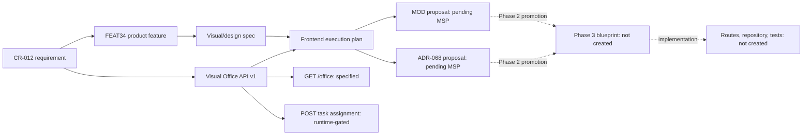

<!-- ADR-005: imported from Zuri V1 — DO NOT EDIT THIS FILE -->
> **Inherited from Zuri V1 · read-only.**
> Source: `G:/zuri/docs/appendices/D-traceability.md` @ `0b6d3c3` · imported 2026-08-11
> This describes **V1 semantics**, where *tenant* means **one shop** — V2's scope
> chain (Portfolio → Tenant → Business → Workspace) is different. Corrections belong
> in a V2 document that cites this file, never in this file. Cite its ids with a
> `V1-` prefix (e.g. `V1-ADR-060`) so they cannot be confused with V2 ids.

# Appendix D — Visual Office Traceability Matrix

*Generated by RWANG doc-graph on 2026-08-10T21:41:30+07:00. This matrix is a navigation and drift-detection aid; the cited source document remains authoritative.*

| Requirement / contract | Defined by | Design / decision | Code | Tests | Status |
|---|---|---|---|---|---|
| CR-012 Governed LINE Visual Office | `docs/specs/CR-012-governed-line-visual-office.md` | FEAT34, Visual Office design spec | — | — | Approved for contract/design; not implemented |
| Tenant-scoped Visual Office overview | Visual Office API v1: `GET /api/visual-office/overview` | Frontend execution plan | — | — | Specified; no route binding |
| Agent Office presence view | Visual Office API v1: `GET /api/visual-office/office` | Agent Office spec | — | — | Blocked: `/office` permission mapping and tenant/RBAC tests not accepted |
| Agent task assignment | Visual Office API v1: `POST /api/visual-office/agents/:agentId/task-assignments` | Agent Office spec | — | — | Runtime-gated; durable workflow/policy admission absent |
| Visual Office control plane | MSP inbound MOD proposal | CR-012 and frontend execution plan | — | — | Pending MSP Phase 2 promotion |
| Visual Office RBAC amendment | MSP inbound ADR-068 proposal | CR-012 | — | — | Pending MSP Phase 2 promotion |

## Brand System Traceability

| Requirement / contract | Defined by | Design / decision | Code | Tests | Status |
|---|---|---|---|---|---|
| Zuri Brand System v1 | `docs/design/zuri-brand-system-v1.md` | Amber Beacon + Zuri Guide concept board | — | — | Candidate; production assets and UI code not yet authorised |
| Zuri Brand System rollout | `docs/design/zuri-brand-system-implementation-plan.md` | Brand System v1 | — | — | Candidate; must enter Phase 1–3 before code |

## Current Coverage

| Metric | Value | Interpretation |
|---|---:|---|
| Visual Office requirements with design/contract links | 1/1 | 100%; graph links are recorded |
| Specified API endpoints with route implementations | 0/3 tracked endpoints | Expected until Phase 2 promotion and blueprint approval |
| Visual Office requirements with automated tests | 0/1 | Expected; no functional implementation exists |
| Pending Phase 2 proposals | 2 | The direct implementation blocker |
| Brand-system production asset masters | 0 | Approved raster concept is preserved; reviewed SVG masters are still required |

## Visual Office Change Graph

## Drift Rules

- A change to CR-012, FEAT34, or the API contract marks downstream design/plan nodes for review.
- A Phase 2 promotion clears only the proposal-status node; it does not imply a route, database access, LINE response, or runtime capability exists.
- Code and test edges may be added only after an accepted Phase 3 blueprint names the implementation paths and verification artifacts.
- A change to the Brand System marks Visual Office design presentation for visual-governance review only. It does not change the Visual Office API, RBAC, or runtime-admission contract.

## Tenant Ingestion Traceability

| Requirement / contract | Defined by | Design / decision | Current code or test evidence | State |
|---|---|---|---|---|
| CR-014, FR-001–FR-008, NFR-001–NFR-003, SEC-001–SEC-002, DR-001–DR-003, BR-001–BR-003, AC-006–AC-015 | [`CR-014`](../specs/CR-014-tenant-ingestion-api-compute.md) | [`ADR-088` inbound proposal](../../.brain/msp/projects/G--zuri/inbound/20260810211633-codex-new_atomic-adr088-tenant-ingestion-api-compute.md); [`SDD`](../architecture/tenant-ingestion-compute.md) | Existing CR-008 snapshot/event routes and tests only; generic record endpoints, worker, and new schema are not implemented | Candidate / pending MSP and Phase 3 gates |
| FR-001, NFR-001, SEC-001 | [`CR-014`](../specs/CR-014-tenant-ingestion-api-compute.md) | ADR-088 Decisions 1–2; SDD §§3, 7 | [`apiKeyAuth.js`](../../src/lib/apiKeyAuth.js), import/export route tests, tenant-spoof tests | Current evidence is partial; generic record contract remains planned |
| FR-003–FR-005, DR-001–DR-003 | [`CR-014`](../specs/CR-014-tenant-ingestion-api-compute.md) | ADR-088 Decisions 3–5; SDD §§4–6 | [`importSnapshotRepo.js`](../../src/lib/repositories/importSnapshotRepo.js), [`exportEventRepo.js`](../../src/lib/repositories/exportEventRepo.js) | Existing aggregate transport evidence; durable generic landing/compute is pending |
| FR-006–FR-008, AC-011–AC-015 | [`CR-014`](../specs/CR-014-tenant-ingestion-api-compute.md) | Candidate [`API contract`](../contracts/zuri-tenant-ingestion-api-v1.md) and [`operations runbook`](../runbooks/tenant-ingestion-operations.md) | No generic record read/replay route or worker evidence yet | Planned; do not claim production capability |

The graph links the candidate documents to current implementation symbols for evidence only. It does
not convert planned endpoints into implemented behavior or promote ADR-088 out of MSP inbound.
