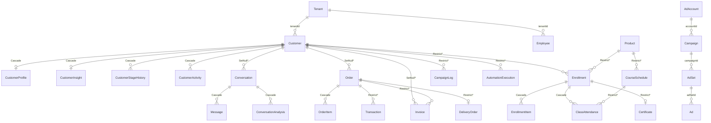

<!-- ADR-005: imported from Zuri V1 — DO NOT EDIT THIS FILE -->
> **Inherited from Zuri V1 · read-only.**
> Source: `G:/zuri/docs/architecture/data-models/crm-customer-360.md` @ `0b6d3c3` · imported 2026-08-16
> This describes **V1 semantics**, where *tenant* means **one shop** — V2's scope
> chain (Portfolio → Tenant → Business → Workspace) is different. Corrections belong
> in a V2 document that cites this file, never in this file. Cite its ids with a
> `V1-` prefix (e.g. `V1-ADR-060`) so they cannot be confused with V2 ids.

# Canonical Data Model — CRM Customer 360

> **Scope**: the `Customer` aggregate and every reference that crosses into or out of it.
> **Issue**: [#113 — CRM Customer 360: harden missing relations and publish canonical ERD](https://github.com/Freshair129/zuri1.0/issues/113).
> **Related**: [`ADR-033--identity-resolution`](../../../gks/phase2_atomic/ADR-033--identity-resolution.md) · [`ADR-056--shared-db-multi-tenant`](../../../gks/phase2_atomic/ADR-056--shared-db-multi-tenant.md) · [`full-schema.md`](../database-erd/full-schema.md) (whole-schema ERD; this document is the CRM-focused canonical view)
> **Companion**: [`crm-attribution.md`](./crm-attribution.md) — first-touch attribution (D1/D2/D6).

## Status — schema and database have diverged

**Phase 2 has landed in `schema.prisma` but not in any database.** That gap is the entire
subject of this document, so read the tables below with it in mind:

| | State |
|---|---|
| **§1 and §3 describe the DATABASE as deployed** | Unchanged since 2026-08-04. No migration has run. |
| **`prisma/schema.prisma` now declares 19 more relations** | 18 from Phase 2 plus the D3 composite agreement key (§4.1). Per [`FEAT-033`](../../../gks/phase3_blueprints/FEAT-033_CRMRelationIntegrity.yaml). Marked **`→ declared`** in §3. |
| **The migration is written but gated** | [`crm-relation-migration.review.sql`](./crm-relation-migration.review.sql), held outside `prisma/migrations/` so `prisma migrate dev` cannot apply it. |
| **The gate** | ADR-086 D-B: [`crm-relation-audit.sql`](./crm-relation-audit.sql) must return zero orphans and zero cross-tenant rows first. It has not been run. |

Until that migration runs, a column marked `→ declared` is still enforced by nothing at
runtime — the Prisma client will offer a navigation property the database cannot back.

This document distinguishes two kinds of reference, and the distinction is the whole point of it:

| Kind | Meaning | Enforced by |
|---|---|---|
| **Enforced relation** | Declared `@relation` in `schema.prisma` → a real `FOREIGN KEY` constraint in PostgreSQL | the database |
| **Logical reference** | A bare `String` column holding another row's id, by application convention only | nothing |

A logical reference can hold a deleted id, an id belonging to a different tenant, or a syntactically valid id that never existed. The database will not object.

---

## 1. ERD — enforced relations only

Solid lines below are the relations PostgreSQL actually enforces today. Logical references are deliberately **absent** from this diagram; they are listed in §3.



`*` = **not declared in the schema** — this is the Prisma default referential action inferred from field optionality (optional relation → `SetNull`, required relation → `Restrict`). Only the `Cascade` entries are written explicitly. Every `*` is an undocumented default that nobody chose deliberately, and #113 Phase 3 should make each one explicit.

### 1.1 Enforced relations — full table

| Child | FK field | Parent | `onDelete` | Declared? |
|---|---|---|---|---|
| `CustomerProfile` | `customerId` (unique) | `Customer.id` | `Cascade` | explicit |
| `CustomerInsight` | `customerId` (unique) | `Customer.id` | `Cascade` | explicit |
| `CustomerStageHistory` | `customerId` | `Customer.id` | `Cascade` | explicit |
| `CustomerActivity` | `customerId` | `Customer.id` | `Cascade` | explicit |
| `Conversation` | `customerId` (nullable) | `Customer.id` | `SetNull` | **default** |
| `Order` | `customerId` (nullable) | `Customer.id` | `SetNull` | **default** |
| `Invoice` | `customerId` (nullable) | `Customer.id` | `SetNull` | **default** |
| `Enrollment` | `customerId` | `Customer.id` | `Restrict` | **default** |
| `CampaignLog` | `customerId` | `Customer.id` | `Restrict` | **default** |
| `AutomationExecution` | `customerId` | `Customer.id` | `Restrict` | **default** |
| `Message` | `conversationId` | `Conversation.id` | `Cascade` | explicit |
| `ConversationAnalysis` | `conversationId` | `Conversation.id` | `Cascade` | explicit |
| `OrderItem` | `orderId` | `Order.id` | `Cascade` | explicit |
| `Transaction` | `orderId` | `Order.id` | `Restrict` | **default** |
| `Invoice` | `orderId` | `Order.id` | `Restrict` | **default** |
| `EnrollmentItem` | `enrollmentId` | `Enrollment.id` | `Cascade` | explicit |
| `ClassAttendance` | `enrollmentId` | `Enrollment.id` | `Cascade` | explicit |
| `ClassAttendance` | `scheduleId` | `CourseSchedule.id` | `Restrict` | **default** |
| `Certificate` | `(enrollmentId, customerId)` | `Enrollment (id, customerId)` | `Restrict` | **D3 — composite agreement key**, supersedes the single-column FK |
| `DeliveryOrder` | `orderId` (unique) | `Order.orderId` ⚠️ **business key, not `id`** | `Restrict` | **default** |
| `Enrollment` | `productId` | `Product.id` | `Restrict` | **default** |
| `CourseSchedule` | `productId` | `Product.id` | `Restrict` | **default** |

**13 of the 22** relations above ran on an undeclared default. (Count excludes the
`Tenant` relations, which every model carries and which are also undeclared.)

Phase 2 wrote all 13 out explicitly, plus `Order → PosTable` and the two
`DeliveryOrder → DeliveryDriver`/`DeliveryZone` references — 16 in total. Each declared
value **equals the default it replaces**, which is why the generated migration contains
zero `DROP`/`ALTER CONSTRAINT` statements: no runtime behaviour changes.

Ad hierarchy (note the join keys — see §5):

| Child | FK field | Parent | Referenced column |
|---|---|---|---|
| `Campaign` | `adAccountId` | `AdAccount` | `accountId` (Meta business key, **not** `id`) |
| `AdSet` | `campaignId` | `Campaign` | `campaignId` (Meta business key) |
| `Ad` | `adSetId` (nullable) | `AdSet` | `adSetId` (Meta business key) |

---

## 2. Soft delete interacts with every `Cascade` above

`Customer.deletedAt` exists ([schema.prisma:277](../../../prisma/schema.prisma#L277)) and the customer aggregate is soft-deleted in normal operation. That means the `Cascade` rules above **do not fire** during ordinary deletion — they only fire on a hard `DELETE`, which is not part of the normal application path.

Consequence: the enforced relations protect against hard deletes that essentially never happen, while the logical references in §3 degrade continuously under ordinary operation (employee offboarding, tenant churn, merge). The integrity risk in this aggregate is concentrated almost entirely in §3, not in §1.

---

## 3. Logical references — no foreign key exists *in the database*

Phase 2 status for everything in this section:

- **`→ declared`** — `schema.prisma` now declares the relation; the database does not yet
  have the constraint. **18 of the 20** references below are in this state: all 12 in §3.1,
  and in §3.2 `Order.conversationId`, `Enrollment.orderId`, `Certificate.customerId`,
  `Task.customerId`, `ConversationLog.conversationId` and `Customer.mergedInto`.
- **still logical, by decision** — `Conversation.firstTouchAdId` and `Customer.originId`.
  Settled in Phase 4: see [`crm-attribution.md`](./crm-attribution.md) §3 and §8. Neither will
  ever get a foreign key.

### 3.1 → `Employee.id`

| Model | Field | Line | Marked in schema? | Would need relation name |
|---|---|---|---|---|
| `Customer` | `assigneeId` | [267](../../../prisma/schema.prisma#L267) | comment `// Employee.id` | `CustomerAssignee` |
| `CustomerStageHistory` | `changedBy` | [310](../../../prisma/schema.prisma#L310) | comment `// Employee.id` | `StageHistoryActor` |
| `CustomerActivity` | `actorId` | [330](../../../prisma/schema.prisma#L330) | comment `// Employee.id` | `ActivityActor` |
| `Conversation` | `assigneeId` | [411](../../../prisma/schema.prisma#L411) | **no marking** | `ConversationAssignee` |
| `Message` | `responderId` | [437](../../../prisma/schema.prisma#L437) | **no marking** | `MessageResponder` |
| `Enrollment` | `soldById` | [673](../../../prisma/schema.prisma#L673) | **no marking** | `EnrollmentSeller` |
| `CourseSchedule` | `instructorId` | [768](../../../prisma/schema.prisma#L768) | **no marking** | `ScheduleInstructor` |

**Not listed in issue #113 but in the same aggregate and the same failure class** — any Phase 2 that adds `Employee` back-relations must account for these too, or the `Employee` model ends up with an inconsistent half-set of back-relations:

| Model | Field | Line |
|---|---|---|
| `Order` | `closedById` | [461](../../../prisma/schema.prisma#L461) — comment `// Employee.id` |
| `Order` | `approvedById` | [479](../../../prisma/schema.prisma#L479) — comment `// Employee.id` |
| `Task` | `assigneeId` | [1364](../../../prisma/schema.prisma#L1364) |
| `Task` | `createdById` | [1365](../../../prisma/schema.prisma#L1365) |
| `AuditLog` | `actorId` | [1547](../../../prisma/schema.prisma#L1547) — comment `// canonical Employee.id when known` |

That is **12** distinct `Employee` references across the schema, not 7. Every one requires an explicit `@relation(name:)` because Prisma cannot disambiguate multiple relations to the same model.

Phase 2 declared all 12 (relation names in
[`FEAT-033`](../../../gks/phase3_blueprints/FEAT-033_CRMRelationIntegrity.yaml)), each
`onDelete: SetNull` — an employee leaving must not erase the record they touched.

### 3.2 Cross-domain

| Model | Field | Line | Intended target | Note |
|---|---|---|---|---|
| `Order` | `conversationId` | [462](../../../prisma/schema.prisma#L462) | `Conversation.id` | the sole revenue↔attribution link; **no index** |
| `Enrollment` | `orderId` | [672](../../../prisma/schema.prisma#L672) | `Order.id` | **no index** |
| `Certificate` | `customerId` | [1179](../../../prisma/schema.prisma#L1179) | `Customer.id` | denormalized — see §4 |
| `Task` | `customerId` | [1363](../../../prisma/schema.prisma#L1363) | `Customer.id` | not in #113 scope, same class |
| `ConversationLog` | `conversationId` | [1975](../../../prisma/schema.prisma#L1975) | `Conversation.id` | comment `// Conversation.id` |
| `Conversation` | `firstTouchAdId` | [410](../../../prisma/schema.prisma#L410) | unresolved | see §5 |
| `Customer` | `originId` | [268](../../../prisma/schema.prisma#L268) | unresolved | see §5.3 |
| `Customer` | `mergedInto` | [269](../../../prisma/schema.prisma#L269) | `Customer.id` (self) | comment `// primary customer id when this is a secondary` |

---

## 4. `Certificate.customerId` — the indirect-only question

Issue #113 asks for either a `Customer` relation or explicit approval of the indirect-only design. The relevant facts:

- `Certificate.enrollmentId` is `@unique` and **is** an enforced relation to `Enrollment`.
- `Enrollment.customerId` is required and **is** an enforced relation to `Customer`.
- Therefore `Certificate → Enrollment → Customer` is already a fully enforced path.
- `Certificate.customerId` is a **second, unenforced copy** of a value the enforced path already yields.

The failure mode is not orphaning — it is **divergence**: nothing prevents `Certificate.customerId` from disagreeing with `Certificate.enrollment.customerId`. The audit in §6 checks for exactly this.

### 4.1 Resolution (D3) — keep the column, enforce agreement with a composite key

The issue offers two options: add the FK, or drop the column. There is a third that is strictly
better than either, and it is what Phase 2+D3 implements.

**The column stays**, because it is genuinely used: `GET /api/culinary/certificates?customerId=`
filters on it directly ([`certificateRepo.js:46-51`](../../../src/lib/repositories/certificateRepo.js#L46)),
backed by `@@index([customerId])`. Dropping it would turn a single indexed lookup into a join
through `enrollments` on every certificates list.

**Agreement is enforced declaratively**, by a composite foreign key rather than a trigger:

```sql
CREATE UNIQUE INDEX ON enrollments (id, customer_id);
ALTER TABLE certificates
  ADD CONSTRAINT certificates_enrollment_id_customer_id_fkey
  FOREIGN KEY (enrollment_id, customer_id) REFERENCES enrollments (id, customer_id);
```

A certificate's `(enrollment_id, customer_id)` pair must match a real enrollment's. Divergence
becomes **structurally impossible** — not "prevented by convention", not "checked nightly".
`ON UPDATE CASCADE` keeps the two in step if an enrollment is ever reassigned.

This supersedes the single-column `certificates_enrollment_id_fkey`, which the composite
subsumes. The migration adds the composite *before* dropping the old one, so
`certificates.enrollment_id` is never left unprotected.

Why divergence was possible in the first place:
[`certificateRepo.createForEnrollment`](../../../src/lib/repositories/certificateRepo.js#L107)
takes `customerId` as a **parameter from the caller** rather than deriving it from the
enrollment. Its one caller ([`check-completion/route.js:58`](../../../src/app/api/workers/check-completion/route.js#L58))
passes `enrollment.customerId`, so nothing is wrong today — the invariant rests on one line of
discipline in one call site. The composite key moves that guarantee into the database, and
needs no application change: `enrollmentId` and `customerId` remain plain scalars in the
generated client.

The direct `Certificate → Customer` FK from Phase 2 is kept alongside it. It is redundant for
*validity* — the composite already guarantees the customer exists, transitively — but it is what
provides the `Customer.certificates` back-relation that Customer 360 wants.

---

## 5. First-touch attribution — the chain cannot currently be resolved

### 5.1 What the chain joins on

The ad hierarchy does **not** join on internal `id`. It joins on Meta business keys throughout:

```
Ad.adSetId ──→ AdSet.adSetId ──→ AdSet.campaignId ──→ Campaign.campaignId
                                                    └→ Campaign.adAccountId ──→ AdAccount.accountId
```

Since every enforced hop uses the Meta key, `Conversation.firstTouchAdId` referencing **`Ad.adId` (Meta `ad_id`)** is the only choice consistent with the rest of the chain. This is corroborated by the write path documented in [`FEAT09-MARKETING.md:234`](../../../gks/phase1_docs/FEAT09-MARKETING.md) — `firstTouchAdId: adId || null`, where `adId` arrives from the Meta webhook referral payload, and by [`ProfileTab.jsx:100`](../../../src/components/inbox/ProfileTab.jsx#L100), which renders the value as an opaque monospace "Ad ID".

### 5.2 Why the chain still cannot be tenant-validated

`Ad`, `AdSet`, and `Campaign` have **no `tenantId` column**. Only `AdAccount` does. Tenant is therefore reachable only by walking the full chain to `AdAccount.tenantId` — and `Ad.adSetId` is **nullable**, so an `Ad` with a null `adSetId` has no path to any tenant at all.

This has two consequences that Phase 3's "validate tenant consistency for both sides of every relation" cannot satisfy as written:

- A `Conversation → Ad` FK cannot be tenant-checked at the database level, because the child side knows its tenant and the parent side does not.
- The same gap applies to `Message.responderId`: `Message` has no `tenantId` either (it inherits tenancy through `Conversation`), so a `Message → Employee` FK likewise has no two-sided tenant check available.

Per [`ADR-056`](../../../gks/phase2_atomic/ADR-056--shared-db-multi-tenant.md), models without `tenantId` are skipped by the Prisma `$extends` tenant guard (read from DMMF). These references sit outside that safety net by construction.

### 5.3 Three attribution reads that resolve to nothing today

The issue lists "attribution data that exists in UI expectations but cannot be reliably resolved from the schema" as a risk. It is not a risk — it is already the case, in three places:

| Location | Reads | Actual schema | Effect |
|---|---|---|---|
| [`ProfileTab.jsx:97,100`](../../../src/components/inbox/ProfileTab.jsx#L97) | `customer.firstTouchAdId` | `firstTouchAdId` is on **`Conversation`**, not `Customer` | always `undefined` → the panel renders "Direct" for every customer, including ad-sourced ones |
| [`marketingRepo.js:691`](../../../src/lib/repositories/marketingRepo.js#L691) | `metadata->>'firstTouchAdId'` on `orders` | `orders` has **no `metadata` column** | raw SQL referencing a non-existent column |
| `Customer.originId` [268](../../../prisma/schema.prisma#L268) | — | documented in [`full-schema.md:145`](../database-erd/full-schema.md) as "firstTouchAdId จาก webhook referral" | **never read anywhere in `src/`** — a second, dead attribution field competing with `Conversation.firstTouchAdId` |

These are cited here because they are evidence for the ADR-086 decision, not as a fix request. They should be filed separately from the schema work.

---

## 6. Identity uniqueness, per tenant

Declared on `Customer` ([schema.prisma:297-299](../../../prisma/schema.prisma#L297)):

| Constraint | Guarantees |
|---|---|
| `@@unique([tenantId, phonePrimary])` | one customer per tenant per primary phone |
| `@@unique([tenantId, lineId])` | one customer per tenant per LINE id |
| `@@unique([tenantId, facebookId])` | one customer per tenant per Facebook id |

Three properties of these constraints that dedup logic must not assume away:

1. **NULLs do not collide.** PostgreSQL treats `NULL` as distinct in a unique index, so a tenant may hold unlimited customers with `phonePrimary IS NULL`. The constraint enforces "no two customers share a *known* phone", not "every customer has a phone".
2. **`phoneSecondary` is unconstrained.** It appears in no unique index. The same number may be one customer's `phonePrimary` and another's `phoneSecondary` within the same tenant. Phone-based dedup per [`ADR-033`](../../../gks/phase2_atomic/ADR-033--identity-resolution.md) must decide whether it searches both columns; the database will not stop a duplicate that hides in `phoneSecondary`.
3. **Uniqueness is scoped to tenant, deliberately.** The same person at two tenants is two `Customer` rows. This is correct under [`ADR-056`](../../../gks/phase2_atomic/ADR-056--shared-db-multi-tenant.md) row-level isolation and must not be "fixed".

`Customer.mergedInto` records the surviving primary after a merge, as a logical self-reference with no FK and no index.

---

## 7. Audit before any of this becomes a foreign key

Adding a `FOREIGN KEY` to a column that already holds invalid data fails at migration time and takes an `ACCESS EXCLUSIVE` lock while it validates. Every candidate column in §3 must be audited first.

The audit queries live in [`crm-relation-audit.sql`](./crm-relation-audit.sql). They report, per candidate relation:

- **orphan** — non-null value with no matching parent row
- **cross-tenant** — matching parent row exists but belongs to a different tenant
- **divergent** — (Certificate only) denormalized copy disagrees with the enforced path

A non-zero count in any category means that relation is not yet eligible for a FK; the count itself is the input to the backfill-or-null decision.

---

## 8. Decisions — all six resolved

| # | Decision | Status |
|---|---|---|
| D1 | `firstTouchAdId` → `Ad.adId` or `Ad.id` | **Resolved** — `Ad.adId`. See [`crm-attribution.md`](./crm-attribution.md) §2 |
| D2 | Whether a `Conversation → Ad` FK is added at all | **Resolved** — no. A FK would reject webhook inserts whenever a click outruns the hourly ad sync, losing the conversation and its messages. [`crm-attribution.md`](./crm-attribution.md) §3 |
| D3 | `Certificate.customerId`: add FK + agreement check, or drop the column | **Resolved** — keep the column (it backs a live `?customerId=` filter) and enforce agreement with a composite FK to `enrollments(id, customer_id)`. See §4.1 |
| D4 | `onDelete` per relation | **Resolved** in Phase 2 — 16 written out, each equal to the default it replaced |
| D5 | Scope of the `Employee` back-relations: 7 or 12 | **Resolved** in Phase 2 — all 12 |
| D6 | Whether `Customer.originId` is retired | **Resolved** — deprecated; drop deferred behind the audit gate. [`crm-attribution.md`](./crm-attribution.md) §8 |

---

*Phase 1 of issue #113. Phase 2 (schema relations) requires a `gks/phase3_blueprints/` blueprint declaring geography before any `schema.prisma` edit, per `CLAUDE.md` doc-before-code.*
