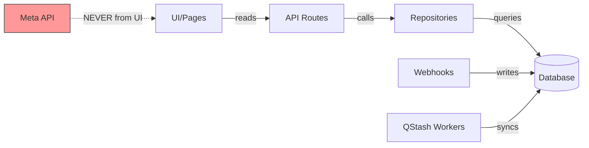

<!-- ADR-005: imported from Zuri V1 — DO NOT EDIT THIS FILE -->
> **Inherited from Zuri V1 · read-only.**
> Source: `G:/zuri/docs/architecture/logic/data-flow.md` @ `0b6d3c3` · imported 2026-08-11
> This describes **V1 semantics**, where *tenant* means **one shop** — V2's scope
> chain (Portfolio → Tenant → Business → Workspace) is different. Corrections belong
> in a V2 document that cites this file, never in this file. Cite its ids with a
> `V1-` prefix (e.g. `V1-ADR-060`) so they cannot be confused with V2 ids.

# Architectural Law: Data Flow & Integrity

- **UI Status**: Reads from DB only. Never call Meta Graph API or LINE Messaging API directly from components.
- **Workers**: QStash workers sync external data -> DB every 1 hour (`/api/workers/sync-hourly`).
- **Webhooks**: FB/LINE webhooks write inbound messages to DB. Respond 200 immediately (NFR1: < 200ms).
- **Realtime**: Pusher triggers realtime updates to connected clients.
