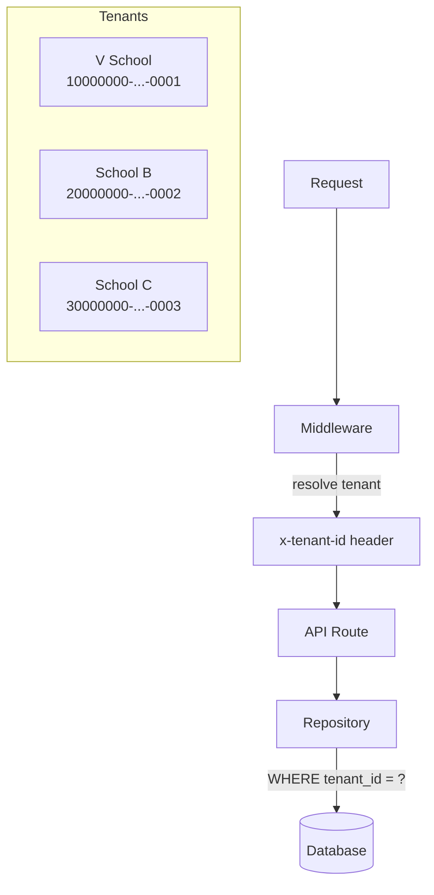

<!-- ADR-005: imported from Zuri V1 — DO NOT EDIT THIS FILE -->
> **Inherited from Zuri V1 · read-only.**
> Source: `G:/zuri/docs/architecture/logic/multi-tenancy.md` @ `0b6d3c3` · imported 2026-08-11
> This describes **V1 semantics**, where *tenant* means **one shop** — V2's scope
> chain (Portfolio → Tenant → Business → Workspace) is different. Corrections belong
> in a V2 document that cites this file, never in this file. Cite its ids with a
> `V1-` prefix (e.g. `V1-ADR-060`) so they cannot be confused with V2 ids.

# Architectural Law: Multi-Tenancy

- **Identification**: Every core table MUST have a `tenant_id` column.
- **Resolution**: Middleware resolves tenant from domain/context and injects `x-tenant-id` header.
- **UI Branding**: Use `TenantContext` for all UI branding. Never hardcode tenant-specific UI.
- **Default (V School)**: `10000000-0000-0000-0000-000000000001`
- **Isolation**: Handled by the Repository Pattern ensuring all queries use `tenantId`.
