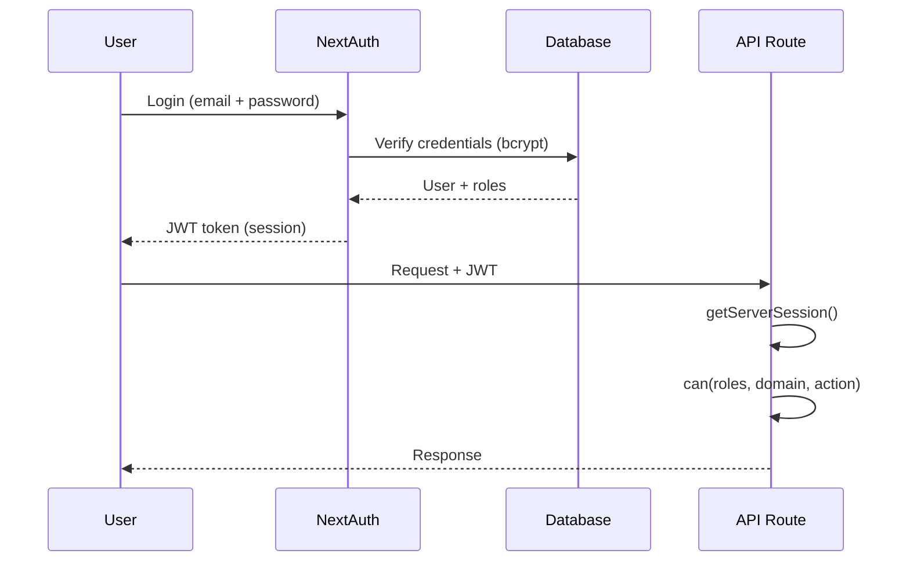

<!-- ADR-005: imported from Zuri V1 — DO NOT EDIT THIS FILE -->
> **Inherited from Zuri V1 · read-only.**
> Source: `G:/zuri/docs/architecture/logic/rbac-security.md` @ `0b6d3c3` · imported 2026-08-11
> This describes **V1 semantics**, where *tenant* means **one shop** — V2's scope
> chain (Portfolio → Tenant → Business → Workspace) is different. Corrections belong
> in a V2 document that cites this file, never in this file. Cite its ids with a
> `V1-` prefix (e.g. `V1-ADR-060`) so they cannot be confused with V2 ids.

# Architectural Law: RBAC & Security

- **Roles**: DEV, OWNER, MANAGER, SALES, KITCHEN, FINANCE, STAFF.
- **Enforcement**: Use `can(roles, domain, action)` centralized in `src/lib/permissionMatrix.js`.
- **Storage**: Roles are stored in `Employee.roles[]` (array of UPPERCASE strings).
- **Session**: NextAuth v4 handles session via JWT strategy.
