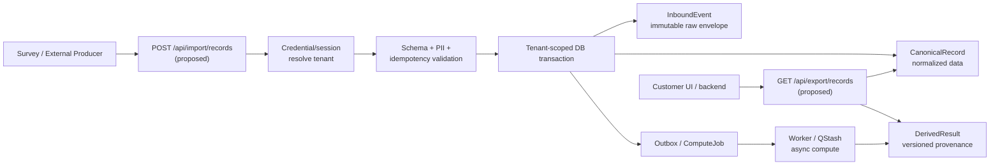

<!-- ADR-005: imported from Zuri V1 — DO NOT EDIT THIS FILE -->
> **Inherited from Zuri V1 · read-only.**
> Source: `G:/zuri/docs/architecture/tenant-ingestion-compute.md` @ `0b6d3c3` · imported 2026-08-16
> This describes **V1 semantics**, where *tenant* means **one shop** — V2's scope
> chain (Portfolio → Tenant → Business → Workspace) is different. Corrections belong
> in a V2 document that cites this file, never in this file. Cite its ids with a
> `V1-` prefix (e.g. `V1-ADR-060`) so they cannot be confused with V2 ids.

---
version: "0.2.0b"
created_at: "2026-08-10T21:16:33+07:00,ATHER (Codex),uncommitted"
last_update: "2026-08-10T21:16:33+07:00,ATHER (Codex)"
status: "candidate"
superseded_by: null
attributes:
  domain: "platform-core"
  doc_type: "software-design-description"
  scope: "tenant-scoped external data ingestion and compute"
  language: "bilingual"
---

# Tenant Ingestion & Compute Pipeline — SDD

| Field | Value |
|---|---|
| **Version** | 0.2.0b |
| **Status** | Candidate — design only; Phase 3 blueprint required before code |
| **Author** | ATHER (Codex) |
| **Created** | 2026-08-10 |
| **Last Updated** | 2026-08-10 |
| **Approved By** | — |

## Version History

| Version | Date | Author | Changes |
|---|---|---|---|
| 0.1.0b | 2026-08-10 | ATHER (Codex) | Initial SDD for durable landing and post-commit compute |
| 0.2.0b | 2026-08-10 | ATHER (Codex) | Added explicit technology, API, and error-handling design sections for SWE preflight coverage |

## Referenced Standards and Decisions

- IEEE 1016-2009 — software design description
- IEEE 29148-2018 — requirements and traceability
- `docs/specs/CR-014-tenant-ingestion-api-compute.md`
- `docs/contracts/zuri-tenant-ingestion-api-v1.md`
- `[[ADR-056--shared-db-multi-tenant]]` and `[[PROTO--repo-pattern]]`
- `[[PROTO--data-flow]]` and `[[PROTO--automation-cron]]`
- `docs/contracts/smartgift-zuri-transport-v1.md` (existing aggregate transport boundary)

## 1. Design Decision

Use a **durable-landing-first** pipeline:

1. Authenticate the machine or user and derive the tenant from the trusted credential/session.
2. Validate the envelope and normalize only deterministic, lossless fields.
3. In one tenant-scoped transaction, write the immutable source envelope, canonical record, and an
   outbox/compute-job reference.
4. Acknowledge ingestion once the transaction commits.
5. Compute expensive scores, aggregates, enrichment, or AI results asynchronously.
6. Persist derived results with source revision and algorithm/profile provenance.
7. Serve canonical and derived data through a tenant-scoped read API.

This keeps the database as the source of truth while allowing compute to fail, retry, or be upgraded
without losing the source record.

## 2. Context and Architecture

The diagram is a design target. The existing CR-008 routes implement the snapshot/event subset, not
the proposed generic record endpoints.

### Technology Baseline

The design targets the existing Zuri baseline: Next.js route handlers, the repository/service boundary,
Prisma-backed PostgreSQL, the tenant context/auto-scoping extension, and the approved worker or queue
substrate after it is selected in a Phase 3 blueprint. These are compatibility constraints, not a claim
that the generic record pipeline or worker already exists.

### API Design

The candidate wire contract is [`zuri-tenant-ingestion-api-v1.md`](../contracts/zuri-tenant-ingestion-api-v1.md).
The API surface is intentionally split into an authenticated write boundary, tenant-scoped reads, and
an operator-controlled recompute boundary. Route handlers validate and delegate; repositories own data
access. The existing snapshot/event routes remain separate compatibility evidence.

## 3. Component Responsibilities

| Component | Responsibility | Must not do |
|---|---|---|
| Ingestion route | Parse bounded body, authenticate, validate envelope, call service | Read a caller-supplied tenant as authority; run direct Prisma in the route |
| Tenant/auth adapter | Resolve tenant and scopes; arm tenant context | Return a cross-tenant selector or raw secret |
| Validation/normalization service | Schema/version checks, deterministic normalization, PII/secret checks | Perform network AI calls or mutate domain state |
| Ingestion repository/service | Transactionally persist source, canonical record, and job/outbox | Overwrite immutable source history |
| Compute worker | Load source/canonical record, run versioned compute, persist derived result | Claim success before durable result; delete source on failure |
| Read service | Enforce scope, cursor, source state, and provenance | Return SQL, DB credentials, or fabricated values |
| Audit/observability | Opaque request/ingest/job IDs, safe audit, metrics, alerts | Log keys or raw PII |

## 4. Compute Placement Policy

| Work | Placement | Reason |
|---|---|---|
| Auth, schema, size, secret, and idempotency checks | API before transaction | Reject unsafe input before mutation |
| Tenant and uniqueness invariants | DB transaction/constraints | Atomic and authoritative |
| Lossless normalization | API service or transaction helper | Deterministic and replayable |
| Scoring, aggregation, enrichment, AI | Post-commit worker | Retryable and does not block ingestion |
| Simple filters and bounded projections | Read service/SQL | Data-local and consistent |
| Repeated dashboard metrics | Derived table/materialized result | Avoid repeated expensive computation |
| UI formatting | Customer UI | Presentation only; never authorization or policy |

If a caller needs an immediate score, the API may return `computeStatus: queued` and a later read may
provide the result. A synchronous provisional score is allowed only when the profile is deterministic,
bounded, and the raw/canonical write remains the source of truth; it must still record its algorithm
version and be safe to recompute.

## 5. Logical Data Model

These are design entities, not an authorization to change `prisma/schema.prisma`.

| Entity | Required fields | Invariant |
|---|---|---|
| `InboundEvent` | `id`, `tenantId`, `source`, `schemaVersion`, `externalId`, `occurredAt`, raw/reference, hash, receivedAt | immutable; unique per tenant/source/external identity |
| `CanonicalRecord` | `id`, `tenantId`, `inboundEventId`, normalized data, validation state, revision | derived only from a specific source revision |
| `ComputeJob` | `id`, `tenantId`, `recordId`, profile/version, status, attempts, idempotency key | retries do not create conflicting active results |
| `DerivedResult` | `id`, `tenantId`, `recordId`, profile/version, result/ref, source revision, status, computedAt | never presented as current when stale/blocked |
| `IntegrationCredential` | `tenantId`, hash, prefix, scopes, revokedAt, lastUsedAt | raw secret never persisted |

Existing `TenantApiKey`, `ImportSnapshot`, and `ExportEvent` models are current CR-008 evidence and may
be reused where their semantics match. A new model or migration requires its own Phase 3 geography,
data migration review, and MSP-approved decision.

## 6. Transaction, Idempotency, and Replay

- The source transaction writes source and canonical data together where normalization is lossless.
- The outbox/job reference is created in the same transaction; a worker must not depend on a best-effort
  post-response enqueue.
- The idempotency identity is `(tenantId, source, externalId)` or an explicit scoped idempotency key.
- Duplicate submissions return the original `ingestId` and current status; they do not re-run compute by
  default.
- Replay creates a new compute attempt/result linked to the same immutable source revision.
- A new algorithm/profile may produce a new derived version without changing the old evidence.

## 7. Tenant Isolation and Security

1. API key or session resolves `tenantId`; request fields cannot override it.
2. `withApiKey`/`withAuth` arms the tenant context before service/repository work.
3. Every repository query includes tenant scope or uses the existing DMMF-aware extension.
4. Route handlers do not import `getPrisma` directly; data access stays in the repository/service layer.
5. Cursor and opaque IDs are tenant-bound lookups, not global lookup-then-check patterns.
6. Payload classification controls whether raw data may be passed to a compute provider.
7. Error responses reveal neither a foreign tenant's existence nor its identifiers.

## 8. Read API Semantics

The read API returns canonical and derived state separately enough for a consumer to distinguish:

- `sourceState: ready|stale|unavailable|redacted`;
- `computeStatus: not_requested|queued|running|succeeded|failed|blocked`;
- `asOf`, `computedAt`, and `algorithmVersion` where applicable;
- stable cursor and bounded limit;
- an opaque `requestId` for support correlation.

The API never returns SQL or an internal database connection string. A customer-owned UI is just another
API consumer and cannot bypass the same authorization path.

## 9. Reliability and Observability

- Ingestion uses at-least-once delivery semantics with idempotent landing.
- Worker retries are bounded by an operational policy and produce a dead-letter/blocked state when the
  policy is exhausted.
- Metrics include accepted/rejected/duplicate counts, queue age, compute success/failure, retry count,
  tenant-safe latency, and source freshness.
- Logs contain `requestId`, `tenant-safe integration prefix`, `ingestId`, and `jobId`, never raw keys or
  unrestricted survey payloads.
- Backups cover raw/canonical/derived data and the retention/erasure process is tested by tenant.

### Error Handling Strategy

- Validation and policy failures are returned before domain mutation with stable error codes.
- Authentication, scope, tenant mismatch, and inaccessible-record cases fail closed without revealing
  foreign tenant existence.
- Duplicate idempotent submissions return the original landing identity and status.
- Worker failures transition the compute state to retrying or blocked while preserving the source record.
- Unexpected failures return a safe request ID; keys, stack traces, and unrestricted PII remain server-side.

## 10. Deployment and Change Management

- Build and deploy through the approved Zuri runtime; no customer code is executed inside the API.
- New routes and models require a Phase 3 blueprint with geography and API contracts before code.
- Schema changes use the repository's migration gate; `db:push:LOCAL_ONLY` is not a production migration.
- Contract versions are additive where possible. Breaking changes require a new path/version and a
  migration/rollback plan.
- The current demo-mode and login rate-limit flags remain release blockers; this SDD does not claim
  production readiness.

## 11. Alternatives Considered

| Alternative | Decision | Reason |
|---|---|---|
| Compute before persistence | Rejected | Loss of source data and no reliable replay when compute fails |
| Compute synchronously inside every request | Rejected by default | Couples availability and latency to heavy work |
| Direct customer DB access | Rejected | Bypasses tenant policy, audit, schema evolution, and secret boundary |
| Store only the computed result | Rejected | Cannot reproduce or explain a result after formula/model changes |
| One database per tenant | Deferred | Possible enterprise tier, but not required for the shared Zuri lean path |

## 12. Verification Plan

The companion CR-014 specification defines AC-006 through AC-015. Minimum verification before any live
tenant onboarding:

- contract tests for auth, tenant mismatch, schema, idempotency, cursor, errors, and source state;
- integration tests for transaction atomicity and no cross-tenant rows;
- worker tests for retry, duplicate delivery, versioned recompute, and dead-letter state;
- security tests for secret/PII redaction, rate limits, and audit evidence;
- restore and erasure rehearsal with an approved non-production tenant.

## 13. Open Decisions

- exact payload/retention limits and supported schema registry;
- compute profile ownership and whether AI providers may see classified fields;
- worker substrate and dead-letter retention;
- enterprise dedicated-database tier and data residency requirements;
- API SLA and capacity targets after load-test evidence.

## CHANGELOG

| Version | Date | Status | Summary | Commit Hash | Agent |
|---|---|---|---|---|---|
| 0.1.0b | 2026-08-10 | candidate | Initial SDD for tenant ingestion and post-commit compute | uncommitted | ATHER (Codex) |
| 0.2.0b | 2026-08-10 | candidate | Added explicit technology, API, and error-handling sections | uncommitted | ATHER (Codex) |
