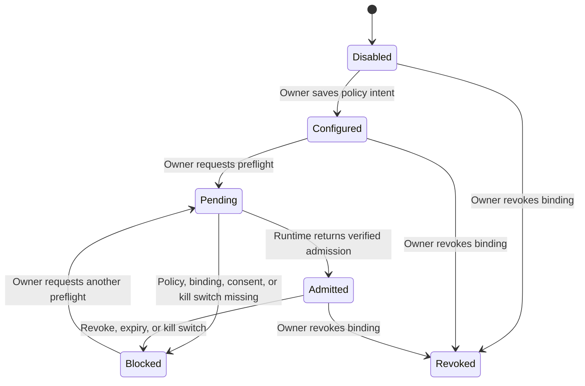

<!-- ADR-005: imported from Zuri V1 — DO NOT EDIT THIS FILE -->
> **Inherited from Zuri V1 · read-only.**
> Source: `G:/zuri/docs/design/visual-office-design-spec.md` @ `0b6d3c3` · imported 2026-08-16
> This describes **V1 semantics**, where *tenant* means **one shop** — V2's scope
> chain (Portfolio → Tenant → Business → Workspace) is different. Corrections belong
> in a V2 document that cites this file, never in this file. Cite its ids with a
> `V1-` prefix (e.g. `V1-ADR-060`) so they cannot be confused with V2 ids.

# Visual Office Design Specification

**Status:** approved for mockup and component planning; not authorization to implement functional UI  
**Version:** 0.1.0  
**Design source:** `PRODUCT.md`, `DESIGN.md`, `docs/contracts/zuri-visual-office-api-v1.md`  
**Route:** `/visual-office`
**Mockup:** `docs/design/mockups/visual-office-overview-v1.png`
**Companion workspace spec:** `docs/design/visual-office-agent-office-spec.md`

## 1. Information architecture

| Surface | User job | Data contract | Runtime rule |
|---|---|---|---|
| Overview | See whether the tenant is safe to configure, blocked, or ready for review | `GET /api/visual-office/overview` | never implies LINE is live |
| Groups | Register a verified binding and configure capability intent | group binding and group-policy endpoints | configuration and runtime admission are separate |
| Review queue | Inspect a candidate for an assigned group | review-queue endpoints | read-only, no task/CRM/send action |
| Reports | Configure KPI cards, recipients, schedule, and alert cap | report endpoints | configuration-only until delivery contract is live |
| Report detail | Reach a protected report from a LINE card | `/visual-office/reports/:reportId` then authorized API read | login and RBAC required every time |

## 2. Component inventory

| Component | Compose from | Responsibility | Required states |
|---|---|---|---|
| `VisualOfficePageHeader` | page heading + `Badge` | title, tenant-safe summary, primary action | default, demo, denied |
| `ReadinessBanner` | `Card`, `Badge`, icon | distinguish configuration-only, blocked, pending, admitted, unavailable | info, warning, blocked, admitted |
| `GroupReadinessTable` | `DataTable`, `Badge`, `EmptyState`, `LoadingSkeleton` | group name/type, configuration status, runtime admission, safe action | loading, empty, denied, source-unavailable |
| `GroupPolicyForm` | `Input`, `Dropdown`, `Button`, inline validation | capabilities, trigger, reviewer selection, visibility | default, focus, validation error, conflict, disabled |
| `VerifiedBindingPicker` | `Dropdown`, `EmptyState` | select only a server-listed verified `groupBindingId` | loading, no eligible binding, revoked, denied |
| `ActivationPreflightPanel` | `Card`, `Badge`, `Button` | explain runtime blockers and request preflight | blocked, pending, admitted, unavailable |
| `ReviewerScopeList` | `DataTable`, `Modal` | show existing Zuri users and their group scope | loading, empty, forbidden |
| `ReportTemplateChooser` | `Card`, `Badge` | choose a report template, not a live delivery | default, selected, disabled |
| `ScheduleBuilder` | form fields, calendar popover | structured day/time/exception input, never Cron | default, invalid, conflict |
| `DeliveryReadinessPanel` | `Card`, `Badge` | show configuration state versus delivery runtime state | configuration-only, blocked, pending, live |
| `CandidateList` | `DataTable`, `EmptyState` | inspect summary/task candidates | loading, empty, denied, expired |
| `SourceState` | `Badge`, supporting text | source, `asOf`, stale/demo/unavailable explanation | ready, stale, demo, unavailable |

All components reuse current Zuri primitives. New components are feature compositions, not a parallel component library.

## 3. UI state model

The UI labels these as **Configuration**, **Preflight**, and **Runtime admission**. It never uses a generic “Active” chip for a group. For reports, use **Configuration status** and **Delivery runtime** as separate labelled values.

## 4. Frontend type map

The UI uses these named shapes as the mapping layer between screen components and the versioned API. They are contract names, not a claim that TypeScript files or endpoints already exist.

| UI type | API source | Fields displayed | Fields the browser must never own |
|---|---|---|---|
| `VisualOfficeOverview` | `/overview` | counts, source health, suppression summary, `source`, `asOf` | `tenantId`, permission result, live-delivery assertion |
| `GroupBindingOption` | `/group-bindings` | `id`, display name, type, verification state | raw LINE group ID, OA ID, token |
| `GroupPolicyView` | `/groups/:groupId` | `configurationStatus`, `runtimeAdmission`, block reasons, allowed capabilities, trigger, reviewers, revision | tenant scope, effective runtime permission, policy snapshot content |
| `ActivationRequestResult` | `/activation-requests` | group ID, pending/admitted/blocked state, safe reason, audit ID | runtime admission value chosen by UI, kill-switch state mutation |
| `ReviewerOption` | `/reviewer-options` | Zuri user opaque ID, display name, role, selectable | role mutation, email/token/hidden-user data |
| `ReportConfigurationView` | `/reports/:reportId` | template, allowed KPIs, schedule, recipient counts, configuration status, delivery runtime, source state | recipient authorization, alert hard cap, delivery receipt |
| `CandidateSummary` | `/review-queue` | opaque ID, group display name, candidate kind, source state | task/CRM/send action |
| `ApiFailure` | any failed request | code, request ID, field errors | server stack, SQL message, another tenant identifier, raw PII |

## 5. Mockup brief

The first mockup is the desktop Overview state. It shows the existing dark Zuri shell, a warm light work surface, a readiness banner stating that configuration is not runtime admission, one group row blocked on verification, one group pending preflight, report configuration marked as delivery blocked, and a review queue card. It intentionally contains no fake KPI values, raw identifiers, or claim of live LINE delivery.

## 6. Design acceptance criteria

- The first screen can be understood without reading technical documentation: configuration, preflight, and runtime admission are visibly distinct.
- A disabled, blocked, pending, admitted, stale/demo, and denied state have both text and icon treatment.
- No primary CTA says “Enable LINE” or “Go live”; the only runtime CTA is “Request preflight”.
- A report card distinguishes “Configuration saved” from “Delivery runtime blocked”.
- The mockup stays recognisably inside the current Zuri Amber Citrus shell.
