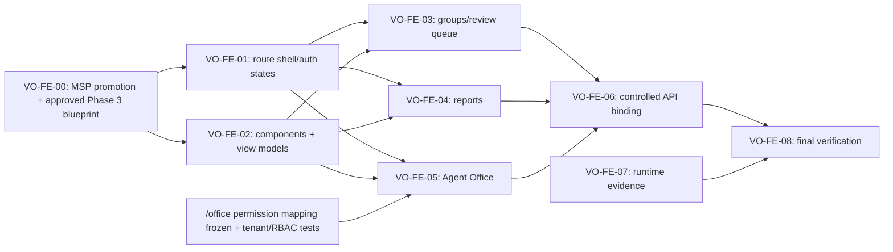

<!-- ADR-005: imported from Zuri V1 — DO NOT EDIT THIS FILE -->
> **Inherited from Zuri V1 · read-only.**
> Source: `G:/zuri/docs/design/visual-office-frontend-execution-plan.md` @ `0b6d3c3` · imported 2026-08-11
> This describes **V1 semantics**, where *tenant* means **one shop** — V2's scope
> chain (Portfolio → Tenant → Business → Workspace) is different. Corrections belong
> in a V2 document that cites this file, never in this file. Cite its ids with a
> `V1-` prefix (e.g. `V1-ADR-060`) so they cannot be confused with V2 ids.

---
id: "PLAN-VISUAL-OFFICE-FRONTEND-001"
version: "0.2.4b"
status: "beta"
created_at: "2026-08-10T17:00:00+07:00"
last_updated_at: "2026-08-10T19:10:00+07:00"
owner: "Zuri Frontend"
execution_mode: "subagent-driven"
state_authority: "this_file"
---

# Visual Office Frontend Execution Plan

## Purpose

This is the durable execution state for the Zuri Visual Office frontend. It plans a Zuri-hosted control plane and Agent Office without authorizing browser-side tenant authority, LINE delivery, direct LINE identifiers, role administration, or workflow side effects.

## Source of Truth and Constraints

- Product/API contract: `docs/contracts/zuri-visual-office-api-v1.md`
- Product scope: `docs/specs/CR-012-governed-line-visual-office.md`
- Interaction design: `docs/design/visual-office-design-spec.md`
- Agent Office design: `docs/design/visual-office-agent-office-spec.md`
- Phase 1 feature: `gks/phase1_docs/FEAT34-GOVERNED-LINE-VISUAL-OFFICE.md`
- Phase 2 module proposal: `.brain/msp/projects/G--zuri/inbound/20260810130000-codex-new_atomic-mod--visual-office-control-plane.md`
- Runtime manifest: `D:/workspace/Bussiness-01-SmartGift/dashboard-app/contracts/line-copilot-visual-office-v1.json`

## Non-Negotiable Gates

1. Zuri session and server are authoritative for actor, tenant, roles, and PII policy.
2. Visual Office has no global role-administration action; Zuri Team RBAC remains its authority.
3. Group configuration, capabilities, and report schedules are configuration-only until their documented runtime evidence is admitted.
4. Browser input contains no tenant authority, arbitrary LINE/OA ID, or `externalGroupRef`; group selection uses a canonical server-verified `groupBindingId`.
5. Candidate review and Agent Office selection are read-only. Talk and Assign Task remain unavailable until their own approved durable contracts exist.
6. No implementation begins until the MSP proposal is promoted to Phase 2 and a Phase 3 blueprint is approved.

## Durable State

| ID | Workstream | Status | Owner | Evidence / exit criterion | Blocker |
|---|---|---|---|---|---|
| VO-FE-00 | Contract & MSP promotion | blocked | MSP / human gate | Phase 2 module + ADR accepted; Phase 3 blueprint approved | Environment validation now passes; target Phase 2 module/ADR files remain absent, only inbound proposals exist, and no repository promotion command was found. |
| VO-FE-01 | Route, shell, auth state | planned | frontend agent | Protected routes and complete non-live state matrix | VO-FE-00 |
| VO-FE-02 | Design system & typed view models | planned | frontend agent | Reusable components and contract-derived types | VO-FE-00 |
| VO-FE-03 | Group, reviewer, candidate UI | planned | frontend agent | Read-only candidates; config/runtime state separation | VO-FE-00 + accepted read contract |
| VO-FE-04 | Report builder & card preview | planned | frontend agent | Config-active distinct from delivery runtime | VO-FE-00 + accepted read contract |
| VO-FE-05 | Agent Office scene & accessible list | blocked | frontend agent + API/RBAC owner | DOM/SVG scene, drawer, reduced-motion fallback; `/office` read permission frozen and tenant/RBAC tests pass before API presence binding | VO-FE-00 + unresolved `/office` read-permission mapping + unaccepted presence contract/tests |
| VO-FE-06 | Controlled API binding | planned | frontend + backend | Contract tests and client error handling pass | VO-FE-03..05 + backend acceptance |
| VO-FE-07 | Runtime capability enablement | blocked | backend/runtime + frontend | Durable gate, receipts, policy evidence; no false-live UI | PersistentFlow and delivery contracts not accepted |
| VO-FE-08 | Final verification & release handoff | planned | reviewer | Tests, accessibility, security and docs checks pass | VO-FE-06..07 as applicable |

## Subagent-Driven Operating Model

Each task has one isolated writer, a different reviewer, and at most three targeted fix cycles. Agents write only their designated report/artifact and never modify a sibling task's files. The controller updates this state table after every review gate.

| Task | Writer scope | Independent review gate | Automation |
|---|---|---|---|
| DISC-01 | Inspect existing Zuri App Router/auth/design-system conventions | Code alignment and route boundary | static file inventory + report |
| DISC-02 | Reconcile API contract, frontend specs, and manifest | Authority/runtime/binding/delivery consistency | contract-manifest checker |
| DISC-03 | Define task dependency graph, state transitions, and verification gates | No premature functional/runtime enablement | ledger consistency check |
| PLAN-01 | Assemble the execution plan from reviewed discovery reports | Traceability and contradictory-gate audit | Markdown/link/state validation |
| PLAN-02 | Create the future Phase 3 blueprint after Phase 2 promotion only | MSP/blueprint/schema validation | `npm run msp:check` |

## Automation Policy

- **State source:** this file; `docs/.rwang-progress.md` is the machine-readable companion ledger.
- **Task lifecycle:** `planned -> assigned -> in-progress -> review -> done`, or `blocked` with an evidence-backed blocker.
- **Dispatch trigger:** only a task whose dependencies are `done` may be assigned; blocked work must not retry automatically.
- **Review trigger:** every writer report must have a separate review report. Completeness, traceability, and internal consistency are hard gates.
- **Validation trigger:** run the contract-manifest readiness checker after contract/manifest changes. Run `npm run msp:check` only when the local dependencies are present; missing dependencies record a blocked validation, never a bypass.
- **No autonomous release:** automation may create reports and local verification evidence but cannot deploy, change credentials, or enable a runtime capability.

## Reviewed Discovery Inputs

| Input | Review verdict | Plan decision |
|---|---|---|
| `docs/.rwang-tasks/DISC-01-report.md` | ALL PASS | Place new pages under `src/app/(dashboard)/visual-office/`; reuse the dashboard shell and existing primitives; do not assume dashboard membership is a page guard. |
| `docs/.rwang-tasks/DISC-02-report.md` | ALL PASS | Browser routes remain `/api/visual-office/*`. The manifest's `/v1/visual-office/*` strings are automation identifiers only; `zuri_browser_path` is the backend implementation target. |
| `docs/.rwang-tasks/DISC-03-report.md` | ALL PASS | Use a controller-owned Markdown ledger, isolated writer/reviewer reports, and local read-only validation only. Missing `yaml` keeps MSP validation blocked rather than bypassed. |

## Environment Validation Evidence — 2026-08-10

The local dependency tree was restored from `package-lock.json`. `npm run msp:check` passed after restore: L0 index wrote 102 entries; 91 atomic files scanned; 0 errors and 0 warnings. The generated `gks/00_index/atomic_index.jsonl` reflects that run. This closes the local `yaml` dependency blocker only; it does not accept or promote the inbound Phase 2 proposals.

## Contradiction and Action Ledger

| ID | Conflicting or unresolved position | Required action | Owner | Acceptance evidence | Affected gate |
|---|---|---|---|---|---|
| VO-CX-01 | Requirement baseline RQ-02 says a Tenant Owner may assign/revoke every tenant role; the Contract Lock limits global-role changes to Zuri Team/Employee RBAC. | Annotate/amend RQ-02 to preserve the Contract Lock; keep Visual Office role-management controls unavailable. | Core RBAC/Team contract owner | Accepted Core RBAC/Team contract, tenant-scoped role-change tests, and requirement-row amendment. | No Visual Office role-management exposure; VO-FE-03 may select existing reviewers only. |
| VO-CX-02 | Requirement baseline RQ-03 says a Tenant Owner may approve every role/action; the Contract Lock requires the canonical RBAC contract to prove the Owner flow before Visual Office exposes role-changing controls. | Reconcile RQ-03 with the Contract Lock and document the proven Owner flow, if any. | Core RBAC/Team contract owner | Accepted Core RBAC/Team contract, tenant-scoped authorization tests, and requirement-row amendment. | No Visual Office role-management exposure; any future role-changing scope remains outside this plan. |
| VO-CX-03 | Requirement baseline RQ-10 permits immediate read-only auto-reply after capability configuration; the Contract Lock and API contract require runtime admission evidence. | Mark RQ-10 superseded at the requirement row and retain configuration/preflight-only UI until runtime evidence is accepted. | PersistentFlow/runtime and policy owner | Canonical binding, consent/retention, immutable policy snapshot, runtime gate, kill switch, and audit evidence accepted. | VO-FE-07 runtime capability enablement. |
| VO-CX-04 | Agent Office design targets a Tenant Owner, while proposed `GET /api/visual-office/office` currently specifies only a tenant-scoped read. | Freeze an explicit read-permission mapping before the browser binds Agent Office presence data. | Visual Office API and Core RBAC/Team contract owners | Accepted `/office` permission mapping plus tenant-isolation, 401/403, and RBAC tests. | VO-FE-05 API presence binding remains blocked. |

## Architecture and Route Plan

### Protected page geography

All proposed files are additive and require VO-FE-00 before creation. The existing `(dashboard)` layout remains the shared shell.

| Proposed file | Page / responsibility | Authorization and non-live boundary |
|---|---|---|
| `src/app/(dashboard)/visual-office/page.jsx` | Overview | Page-level `getSession()` and normal `/login` redirect when session or `user.tenantId` is absent; no privileged data from the page path alone. |
| `src/app/(dashboard)/visual-office/groups/page.jsx` | Group readiness list | Separate `configurationStatus` from `runtimeAdmission`; no runtime enablement control. |
| `src/app/(dashboard)/visual-office/groups/[groupId]/page.jsx` | Group policy, reviewer scope, binding picker, preflight state | Browser selects only opaque `groupBindingId`; no `tenantId`, `externalGroupRef`, LINE group ID, or OA ID. |
| `src/app/(dashboard)/visual-office/review-queue/page.jsx` | Candidate queue | Read-only; named reviewers may read only their explicitly granted groups. |
| `src/app/(dashboard)/visual-office/reports/page.jsx` | Report configuration list | Distinguish configuration status from delivery runtime. |
| `src/app/(dashboard)/visual-office/reports/[reportId]/page.jsx` | Protected report detail | Opaque report ID is not authorization; every data read is separately server-authorized. |
| `src/app/(dashboard)/visual-office/office/page.jsx` | Agent Office scene, semantic list, drawer | Read-only presence; reduced-motion, stale-source, or renderer failure uses a static usable fallback. |
| `src/app/(dashboard)/visual-office/_components/` | Feature compositions | Reuse existing Zuri primitives; no parallel component library. |

### Server authorization matrix

The frontend cannot enforce these permissions; it renders only server decisions.

| Operation | Required future server policy | Frontend behavior |
|---|---|---|
| Overview, groups, reports, reviewer options | `withAuth` with `ownership:R`, then resource/PII scope | Render data or safe denied state. |
| Candidate queue/detail for named reviewer | `withAuth` without a broad domain, explicit active reviewer grant, group scope, and PII policy; `ownership:R` remains an allowed alternative | Read-only queue; never infer wider access from menu visibility. |
| Group/report/reviewer configuration writes | `withAuth` with `ownership:W`, revision check, audit event | Present change controls only after accepted write contract; map `409` to refresh/review. |
| Activation request | Server preflight only; runtime admission is out of band | Never display configured/preflight as LINE enabled. |
| Agent Office Talk / Assign Task | Separate future contract, durable workflow, policy admission, idempotency, audit | Disabled with an explanatory reason until independently accepted. |

### Contract-binding matrix

| Contract area | UI work package | Binding condition | Explicitly excluded until runtime evidence |
|---|---|---|---|
| Group policy | VO-FE-03 | Accepted read contract; writes require backend tests | Direct LINE activation, arbitrary external binding, runtime admission mutation. |
| Candidate queue | VO-FE-03 | Accepted tenant/reviewer scoped read contract | Task/CRM/send/publish side effect. |
| Reports | VO-FE-04 | Accepted read/configuration contract with source/asOf | Claiming schedule active means delivery live; sending a LINE card. |
| Agent Office presence | VO-FE-05 | Proposed read contract and its `/office` permission mapping must be frozen; tenant/RBAC tests must pass before binding | Fabricated busy state, raw task/PII detail, Talk, Assign Task. |
| Runtime/delivery | VO-FE-07 | Durable policy gate/outbox/receipt evidence | Any UI action that enables an external capability. |

## Component and Type Plan

### Shared feature compositions

`VisualOfficePageHeader`, `ReadinessBanner`, `SourceState`, `PermissionDeniedState`, `VersionConflictNotice`, `GroupReadinessTable`, `VerifiedBindingPicker`, `ActivationPreflightPanel`, `ReviewerScopeList`, `CandidateList`, `ReportTemplateChooser`, `ScheduleBuilder`, `DeliveryReadinessPanel`, and `LineCardPreview` compose existing Zuri `Button`, `Input`, `Modal`, `Badge`, `DataTable`, and dashboard layout patterns.

### Typed frontend view models

Define view models from the accepted contract, not from API payload guesses:

- `GroupPolicyView`: `configurationStatus`, `runtimeAdmission`, `runtimeBlockReasons`, capabilities, trigger, reviewers, revision.
- `ReportView`: `configurationStatus`, `deliveryRuntime`, `latestSource`, schedule summary, recipient counts, revision.
- `SourceState`: `ready | stale | unavailable | demo`, with `source` and `asOf` whenever a metric is displayed.
- `CandidateView`: masked, read-only candidate information plus scope/source state.
- `AgentPresenceView`: allowlisted display name, desk, visual state, safe work summary, update time, and source state.

No type includes client-authoritative `tenantId`, raw LINE/OA identifier, raw transcript, credentials, unmasked PII, runtime admission write field, or delivery-live assertion.

## Work Packages and Parallel Execution

| Package | Can run in parallel with | Definition of done | Hard stop |
|---|---|---|---|
| VO-FE-01 Route shell/auth states | VO-FE-02 | All protected page shells render loading, empty, denied, expired, offline, stale, demo, and source-unavailable states. | Do not bind live data or treat the dashboard layout as authorization. |
| VO-FE-02 Components/types | VO-FE-01 | Reusable compositions and contract-derived view models compile with no unauthorized fields. | Do not create a parallel design system or fixture that looks live. |
| VO-FE-03 Groups/candidates | VO-FE-04, VO-FE-05 | Config/runtime separation; candidate UI has no side effect; reviewer scope is visible but server-authoritative. | No mutable connection until backend contract tests are accepted. |
| VO-FE-04 Reports | VO-FE-03, VO-FE-05 | Builder/card/detail states clearly distinguish config-active, blocked, and live delivery runtime. | No real delivery or false-live card. |
| VO-FE-05 Agent Office | VO-FE-03, VO-FE-04 | DOM/SVG 2D/2.5D scene and equivalent keyboard-accessible list remain synchronized; drawer is read-only. API presence binding requires the frozen `/office` permission mapping and passing tenant/RBAC tests. | Blocked pending the presence gate; no PixiJS dependency by default; no Talk/Assign action. |
| VO-FE-06 API binding | none | Accepted backend contract tests, error handling, audit/revision UI behavior, and tenant/RBAC integration checks. | Do not bind unaccepted endpoints or use manifest runtime identifiers as browser URLs. |
| VO-FE-07 Runtime enablement | independent of UI build | PersistentFlow/runtime/outbox/receipt/kill-switch evidence accepted by owners. | UI completion cannot satisfy this package. |
| VO-FE-08 Verification/handoff | after VO-FE-06; VO-FE-07 only if runtime scope releases | All required tests, visual/accessibility review, known-blocker record, and documentation checks pass. | No deploy, credential, or live-capability action from this plan. |

## Agent Office Implementation Decision

Start with React DOM plus SVG/CSS pixel-art assets. It fits the existing React 18 application, supports responsive layout and the semantic accessibility list, and avoids introducing a renderer migration before there is measured scene-performance evidence. A future renderer evaluation may be proposed only if the DOM scene demonstrably fails the agreed performance budget; it is not part of this plan.

## Test and Acceptance Matrix

| Layer | Required evidence |
|---|---|
| Page/component | Loading, empty, denied, session-absent redirect, stale/demo, offline, source-unavailable, and conflict presentation. |
| API contract | Tenant A cannot access Tenant B; session revocation is denied; reviewers cannot exceed group scope; 403 does not leak resource/PII; revision conflict is safe. |
| Runtime boundary | Configured group / `answer` capability does not imply admission; configured report does not send or claim live delivery. |
| Binding boundary | Browser cannot use `tenantId`, `externalGroupRef`, raw LINE/OA ID, or cross-tenant binding to select authority. |
| Agent Office | DOM list/scene parity, keyboard access, reduced-motion static fallback, stale state accuracy, and disabled Talk/Assign actions. |
| Visual/accessibility | Responsive dashboard fit, contrast/status text beyond colour alone, usable error states, and no misleading live fixture. |

## Automation Runbook

### State protocol

The controller updates this document and `docs/.rwang-progress.md` together after every review. A mismatch is `blocked`; automation cannot infer or repair state. Each work package receives a dedicated brief/report path beneath `docs/.rwang-tasks/`.

### Allowed automations

| Trigger | Local action | Pass condition | Failure handling |
|---|---|---|---|
| Any plan/report edit | `git diff --check` scoped to changed docs | Exit 0 | Keep task in review; record output. |
| Contract/manifest edit | `node D:/workspace/Bussiness-01-SmartGift-line-copilot-runtime/line-copilot-runtime/scripts/check-visual-office-readiness.mjs D:/workspace/Bussiness-01-SmartGift` | JSON reports `READY` | Mark contract work blocked; never substitute `/v1` automation identifiers into browser fetches. |
| MSP artifact validation | `npm run msp:check` | Exit 0, when dependencies are installed | Missing `yaml` is an evidence-backed blocked validation; do not install, bypass, or promote automatically. |
| Task completion | independent reviewer appends an accepted verdict | Completeness, traceability, and consistency all pass | Targeted fix cycle; escalate after three failed cycles. |

Automations may inspect, validate, and write their assigned Markdown reports. They may not deploy, modify credentials, run codegen/composer, submit/promote MSP proposals, enable a runtime capability, stage/commit, or mutate product code outside an approved work package.

## Next Executable State

Boss approved this plan. Frontend implementation remains **blocked** only by the MSP/human promotion gate: the Visual Office Phase 2 module/ADR proposals must be accepted before PLAN-02 can create and approve the Phase 3 blueprint. The next authorized work after promotion is PLAN-02, followed by parallel assignment of VO-FE-01 and VO-FE-02 through this ledger.

## Change Log

| Version | Date | Status | Summary |
|---|---|---|---|
| 0.2.4b | 2026-08-10 | beta | Restored local dependencies and recorded passing MSP validation; only Phase 2 human/MSP promotion remains blocked. |
| 0.2.3b | 2026-08-10 | beta | Reconfirmed VO-FE-00 blocker: only inbound proposals exist and no promotion command is available in the repository. |
| 0.2.2b | 2026-08-10 | beta | Boss approved the frontend execution plan; implementation remains blocked by MSP Phase 2 promotion. |
| 0.2.2b | 2026-08-10 | candidate | Final independent re-audit passed; plan is ready for Boss approval while implementation remains blocked. |
| 0.2.1b | 2026-08-10 | draft | Added the cross-section contradiction/action ledger, formalized accepted discovery-review records, and blocked Agent Office API presence binding pending `/office` permission acceptance and tests. |
| 0.2.0b | 2026-08-10 | draft | Added reviewed route/auth decisions, component/type plan, parallel work packages, test matrix, and bounded automation runbook. |
| 0.1.0b | 2026-08-10 | draft | Created stateful frontend execution plan and subagent-driven workflow. |

## Cross-Section Audit

**Verdict: FAIL** — the plan preserves most discovery constraints, but it does
not yet meet the DISC-03 plan-composition hard gate for traceable contradiction
handling and independently evidenced discovery acceptance. No lifecycle state
is changed by this audit.

| Audit area | Result | Evidence and concrete finding |
|---|---|---|
| Terminology and route/path authority | **PASS** | The plan consistently treats `/api/visual-office/*` as the Zuri browser/API route family and `/v1/visual-office/*` as manifest automation identifiers (plan §§Reviewed Discovery Inputs, Contract-binding matrix, and Automation Runbook), matching DISC-02. It also keeps protected page paths distinct from API paths. |
| RBAC and reviewer exception | **PASS** | The authorization matrix preserves the required named-reviewer path: `withAuth` without a broad domain plus active reviewer grant, group scope, and PII policy, with `ownership:R` as the allowed alternative. Writes remain `ownership:W`, matching DISC-01. |
| Configuration versus runtime/delivery | **PASS** | Non-Negotiable Gates, the contract-binding matrix, work-package hard stops, and the test matrix consistently distinguish configuration/preflight from runtime admission and report configuration from live delivery. |
| Agent Office boundary | **FAIL** | DISC-02 records an unresolved authorization decision for `GET /api/visual-office/office`: the design targets a Tenant Owner while API contract §9.1 states only tenant-scoped read. The plan requires the proposed read contract to be frozen/tested before binding, but does not record that permission mapping as an explicit acceptance criterion or blocker. Add it before VO-FE-05 can bind presence data. |
| Discovery traceability and contradiction log | **FAIL** | DISC-03 requires plan composition to trace every accepted discovery report and include a contradiction log. Although the input table links all three reports, the plan has no contradiction log or equivalent action record for DISC-02’s open baseline amendments (RQ-02/RQ-03/RQ-10) and the unresolved Agent Office read permission. These must be recorded with an owner, acceptance evidence, and downstream gate. |
| State and ledger consistency | **FAIL** | The plan records DISC-01 through DISC-03 as `ALL PASS`, while DISC-03 requires a separate `docs/.rwang-tasks/<TASK>-review.md` artifact with an `accepted` outcome before the controller records `done`. The evidence available in the three cited report files is appended review text, not the required separate accepted-review artifacts. Reconcile this documented topology with the controller/ledger record; do not infer acceptance from an appended verdict. |
| Dependencies and automation safety | **PASS** | VO-FE-00 remains blocked pending Phase 2/ADR acceptance and Phase 3 blueprint approval; VO-FE-07 remains independent of UI completion. The automation runbook remains local, non-deploying, non-promoting, and treats missing `yaml` as a blocker rather than a bypass, consistent with DISC-03. |

### Required remediation before PLAN-01 acceptance

1. Add a contradiction/action ledger that carries forward the two DISC-02
   open decisions: baseline RQ-02/RQ-03/RQ-10 reconciliation and the Agent
   Office presence-read permission mapping. Each entry must name an owner,
   acceptance evidence, and the affected work package/gate.
2. Resolve the independent-review topology: either create the separate accepted
   reviewer artifacts required by DISC-03 and reconcile the controller ledger,
   or approve and document a superseding review-artifact convention before any
   task is treated as `done`.
3. Keep VO-FE-05 presence binding blocked until the `/office` read permission
   mapping is explicitly accepted, frozen, and covered by tenant/RBAC tests.

## Final Cross-Section Re-audit

**Verdict: PASS** — the remediation requirements of the preceding Cross-Section Audit are now represented consistently in the plan, the accepted discovery-review records, and the companion ledger. This re-audit does not change any lifecycle state or authorize implementation.

| Audit area | Result | Evidence |
|---|---|---|
| Contradiction/action ledger completeness | PASS | `VO-CX-01` through `VO-CX-04` cover the RQ-02 role-assignment, RQ-03 Owner-approval, RQ-10 runtime-admission, and `/office` read-permission conflicts. Each entry names a required action, owner, acceptance evidence, and affected gate. The retained actions match the open source-artifact work in accepted DISC-02. |
| Accepted discovery traceability | PASS | **Reviewed Discovery Inputs** records DISC-01, DISC-02, and DISC-03 as `ALL PASS` with a plan decision for each. Each writer report has a corresponding separate `DISC-0N-review.md` record marked `accepted`, which identifies the reviewed writer report and its ALL PASS re-review evidence. |
| Review-artifact convention | PASS | The separate review records satisfy the DISC-03 convention that a reviewer record identify the writer report and store an `accepted` outcome. The controller ledger records DISC-01 through DISC-03 as `done` / `ALL PASS`; this evidence is no longer inferred solely from review text appended to writer reports. |
| VO-FE-05 binding blocker | PASS | Durable State marks VO-FE-05 `blocked` with the unresolved `/office` read-permission mapping and unaccepted presence contract/tests. The Contract-binding matrix, dependency diagram, package definition of done, and hard stop repeat that binding cannot begin until the mapping is frozen and tenant/RBAC tests pass. |
| State and ledger consistency | PASS | The plan’s accepted discovery-input table and the controller ledger agree that all three discovery tasks are complete and accepted. PLAN-01 remains in `review` in the ledger; this re-audit does not promote it or infer any VO-FE transition. |
| Automation safety | PASS | The runbook limits automation to scoped document checks, the project-provided readiness checker, and `msp:check`; it prohibits deploys, credentials, codegen/composer, MSP promotion, runtime enablement, staging/commits, and unapproved product-code mutation. Missing `yaml` remains an evidence-backed blocked validation, not a bypass. |

### Deterministic re-audit checks

| Check | Result |
|---|---|
| Required discovery reports, separate review records, and `docs/.rwang-progress.md` | PASS — all present. |
| `git diff --check -- docs/design/visual-office-frontend-execution-plan.md` | PASS — exit status `0`. |

No deployment, credential, runtime, MSP-promotion, code-generation, staging, commit, or product-code command was run.
