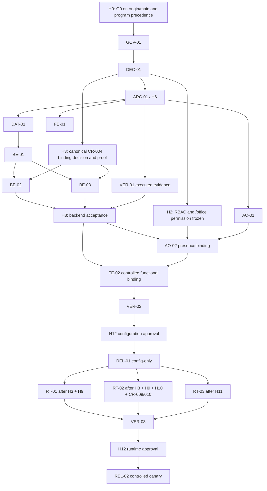

<!-- ADR-005: imported from Zuri V1 — DO NOT EDIT THIS FILE -->
> **Inherited from Zuri V1 · read-only.**
> Source: `G:/zuri/docs/implementation-plan.md` @ `0b6d3c3` · imported 2026-08-11
> This describes **V1 semantics**, where *tenant* means **one shop** — V2's scope
> chain (Portfolio → Tenant → Business → Workspace) is different. Corrections belong
> in a V2 document that cites this file, never in this file. Cite its ids with a
> `V1-` prefix (e.g. `V1-ADR-060`) so they cannot be confused with V2 ids.

---
id: "CR12-FEAT34-IMPLEMENTATION-PLAN"
version: "0.2.0b"
created_at: "2026-08-10T00:00:00+07:00, ATHER"
last_update: "2026-08-10T00:00:00+07:00, ATHER"
status: "draft"
attributes:
  doc_type: "implementation-plan"
  scope: "CR-012 / FEAT34 Governed LINE Visual Office"
  timezone: "Asia/Bangkok"
---

# CR-012 / FEAT34 Implementation Plan

> [!CAUTION]
> **CRITICAL preflight warning — implementation is conditionally blocked.**
> [`CRITICAL_FACTS.md`](../CRITICAL_FACTS.md) carries live platform risks. In addition, the
> [preflight report](.preflight-report.json) is `critical` (CRIT-001..003): operational-risk drift,
> inconsistent rate-limit documentation, and API-registry/route-tree divergence. This plan
> is a proposal, not implementation authorization. Code/schema/generated work requires its
> applicable H0..H6 gates; functional binding requires H8; runtime, delivery, and agent actions
> require their applicable H9..H11 evidence; each release boundary requires H12 approval.

## 1. Executive summary and readiness verdict

CR-012 / FEAT34 is a tenant-scoped, authenticated **Visual Office control plane** for
configuration intent, governed preflight, safe reads, reporting configuration, and a
read-only Agent Office projection. It is not a LINE Copilot, report-delivery runtime, or
agent-workflow implementation.

**Readiness verdict: BLOCKED / CONDITIONAL.** The candidate API is not bound, Phase 2
module/RBAC amendment promotion is pending, `/office` permission is unresolved, the
canonical group-binding authority is unresolved, and preflight remains critical. A saved
configuration, audit ID, schedule, animation, or UI state is never evidence that LINE,
delivery, or an agent workflow is live.

This artifact complements and does not supersede
[`visual-office-frontend-execution-plan.md`](design/visual-office-frontend-execution-plan.md).
That plan remains the frontend execution authority; this document integrates its gates with
the accepted IP-01 scope, IP-02 dependency, and IP-03 delivery reports.

## 2. Authority, scope, and boundaries

### 2.1 Authority hierarchy

| Rank | Authority | Planning use |
|---|---|---|
| 1 | Current code, executed tests, deployment/runtime evidence | Determines what is actually implemented or live. |
| 2 | `gks/00_index/atomic_index.jsonl` and promoted Phase 2 artifacts | Determines accepted architecture/atomic authority. |
| 3 | `docs/specs/CR-012-governed-line-visual-office.md` | Approved product/architectural boundary. |
| 4 | `gks/phase1_docs/FEAT34-GOVERNED-LINE-VISUAL-OFFICE.md` | Design intent and AC-01..AC-07. |
| 5 | `docs/contracts/zuri-visual-office-api-v1.md` | Candidate API/state contract; not yet bound. |
| 6 | Visual Office design, Agent Office, and frontend execution plans | Design/execution intent, subject to higher authority. |
| 7 | `docs/.doc-graph.json` and planning artifacts | Derived traceability/status only, never implementation proof. |

The preflight trust hierarchy governs conflicts: planning claims cannot override current
code, executed tests, or runtime smoke evidence. `CRITICAL_FACTS.md` is a required live-risk
input, not a substitute for a current release verification.

### 2.2 Exact source-to-plan coverage

These are the eight authoritative inputs accepted by IP-01. Section references identify where
each source is consumed; the reverse package matrix in §11.4 returns from implementation work
to requirements, NFRs, evidence, gates, and windows.

| Authoritative input | Exact source scope used | Plan coverage |
|---|---|---|
| `docs/specs/CR-012-governed-line-visual-office.md` | Scope; Architectural Contract; Implementation Stages; Required Verification; Out of Scope | §§1–3, 5–6, 9–12; IP-REQ-001..003, 007, 009, 014..015, 018 |
| `gks/phase1_docs/FEAT34-GOVERNED-LINE-VISUAL-OFFICE.md` | §§1, 3–7; AC-01..AC-07 | §§1–4, 6, 9–12; IP-REQ-001..018 |
| `docs/contracts/zuri-visual-office-api-v1.md` | §§1–9, especially §§4.3–4.4 and §5 | §§2–6, 9–12; IP-REQ-001..019 |
| `docs/design/visual-office-design-spec.md` | §§1–6 | §§3, 6, 9, 11; IP-REQ-003..007, 009..012, 014, 018 |
| `docs/design/visual-office-agent-office-spec.md` | §§1–7 | §§3, 5–6, 9, 11; IP-REQ-016..018 |
| `docs/design/visual-office-frontend-execution-plan.md` | Non-Negotiable Gates; Durable State; authorization/binding matrices; VO-FE-01..08; tests | §§1, 5–9, 11–12; authoritative frontend topology |
| `docs/.preflight-report.json` | `overall`, `trust_hierarchy`, CHK-02..07, CRIT-001..003, WARN-001..005 | §§1–2, 6, 9, 12; release criticality/exception rule |
| `docs/.doc-graph.json` | `authority_notice` and Visual Office document/API nodes | §§1–3, 6; derived specified-not-implemented status only |

### 2.3 In scope

- Existing Zuri login and server-derived session, tenant, role, plan, and revocation context.
- Protected `/visual-office` views; group/reviewer/policy configuration; read-only candidate
  review; report configuration/detail; explicit source/readiness states.
- Configuration-only preflight requests, tenant-safe audit/revision evidence, and optional
  read-only Agent Office projection after its permission/source gate closes.

### 2.4 Non-goals and hard exclusions

- A second identity system, public Visual Office/report URL, browser-held secret, external
  login, OAuth/OIDC, shared/cross-domain cookie, or client tenant authority.
- LINE ingress/webhook work, arbitrary LINE/OA identifiers, browser-to-LINE calls, credentials,
  PersistentFlow changes, GoVibe changes, or Vercel Blob as authority.
- Runtime admission, report sending, candidate-to-CRM/task/publish side effects, Talk, Assign
  Task, durable workflow, global role administration, or live-looking fixtures.
- Refactoring unrelated legacy routes, schema, API registries, documentation, or existing
  production issues under this feature.

### 2.5 Baseline numbers and assumptions

| Baseline | Value |
|---|---:|
| Local requirements | 19 (`IP-REQ-001..019`) |
| Candidate configuration endpoints | 15 |
| Proposed/future Agent Office endpoints | 3 (`GET /office`, message, task assignment) |
| Frozen Visual Office DB models | 0 |
| Accepted work packages | 19 |
| Package points | 260 |
| Planning horizon | 14 conditional two-week sprints |

Assumptions are deliberately provisional: the candidate API shape may be frozen only through
the named gates; no Visual Office persistence/route/page is treated as existing; and calendar
windows begin only after H0. A failed gate pauses dependent work and consumes neither scope nor
contingency.

### 2.6 Third-party and infrastructure inventory

| Dependency | Current/proposed/unresolved status | Required evidence / gate |
|---|---|---|
| Zuri auth and tenant context | Existing platform authority; Visual Office use is proposed | Current session/revocation and tenant A/B tests; H8. |
| PostgreSQL + Prisma | Existing platform; zero frozen Visual Office models | H4/H7 additive model, migration review, apply/status, rollback evidence. |
| LINE / CR-004 canonical binding | Upstream authority unresolved for this feature | H3 tenant/OA ownership, opaque binding, revocation proof. |
| CR-009 automation + CR-010 source/as-of | Upstream inputs required only for later delivery | Accepted input contracts before RT-02/H10; no live-state inference. |
| PersistentFlow | Later runtime dependency; not accepted as Visual Office admission evidence | H9 immutable snapshot, policy gate, kill switch, audit. |
| Governed outbox/scheduler/receipt/recovery | Proposed later delivery infrastructure; unresolved | H10 contract, idempotency, revalidation, receipt/retry/recovery/suppression evidence. |
| Redis and operational smoke | Existing platform dependency; current deployment truth remains unverified by this plan | H12 current Redis/demo/login/live-data smoke plus preflight remediation/exception. |
| Observability | Existing platform capability; Visual Office telemetry/dashboards are proposed | Allowlisted non-production validation before H12; live canary evidence only after H12. |

## 3. Requirement baseline and endpoint status

### 3.1 Requirement summary

| Requirement set | Contracted outcome |
|---|---|
| IP-REQ-001..003 | Existing authenticated dashboard, server tenant authority, deliberate safe states. |
| IP-REQ-004..008 | Canonical binding only; disabled defaults; config/preflight split; reviewer scope. |
| IP-REQ-009..015 | Read-only candidates; report config; protected report detail; source/as-of; no Inbox/login regression. |
| IP-REQ-016..019 | Read-only accessible Agent Office; actions disabled; route/keyboard parity; safe 422/429 validation/rate-limit states. |

Every read/write must start from session-derived tenant scope. URL/body/query/header values may
be compatibility fields only; a mismatch returns safe `403 TENANT_MISMATCH`, never selects
authority. All mutable writes require revision/CAS and an opaque audit ID; failed validation or
authorization has no mutation.

### 3.2 Stable non-functional requirements

| ID | Binding non-functional requirement |
|---|---|
| NFR-VO-001 | Tenancy: derive tenant from the authenticated server context; tenant-first lookup and repository scope on every read/write. |
| NFR-VO-002 | RBAC: enforce `ownership:R/W` and active named-reviewer group grants server-side; deny by default; no Visual Office role administration. |
| NFR-VO-003 | PII/secrets: server-mask/filter; never expose credentials, raw IDs/transcripts/reasoning/task payloads, unmasked PII, or cross-tenant identifiers. |
| NFR-VO-004 | Audit/concurrency: successful writes return durable opaque audit evidence and use revision/CAS; failed writes mutate nothing. |
| NFR-VO-005 | Availability/fail-closed: unavailable, stale, revoked, denied, or missing evidence blocks action and returns safe documented states. |
| NFR-VO-006 | Performance/freshness: cursor pagination with server-clamped limit 25; source/presence includes `updatedAt`/`asOf`; renderer changes require measurement. |
| NFR-VO-007 | Accessibility: keyboard path, semantic state text, non-colour cues, contrast, reduced motion/static fallback, and Agent Office DOM-list parity. |
| NFR-VO-008 | No-deception: configuration, preflight, admission, delivery, demo, and source truth remain distinct; UI/animation/fixture is never live evidence. |

### 3.3 Endpoint and resource classification

| Surface | Status | Boundary |
|---|---|---|
| `/visual-office` protected pages | Proposed | Page visibility never grants authorization. |
| 15 config/read endpoint routes | Proposed | Candidate contract only; no implementation claim. |
| Group activation request | Blocked | Preflight request only; cannot set runtime admission. |
| Runtime group admission | Blocked | Needs H3/H9 evidence. |
| Report-delivery transition | Blocked | Needs H3/H9/H10 and accepted inputs. |
| `GET /api/visual-office/office` | Proposed but blocked | Needs explicit `/office` permission plus H8 tests. |
| Agent message endpoint | Future / out of scope | Separate contract and approval. |
| Agent task-assignment endpoint | Future / blocked | Durable enqueue, idempotency, policy and audit required. |

Configuration records must begin disabled, with no capabilities and
`runtimeAdmission: not_requested`. Candidate capabilities are bounded to `answer`,
`summary_candidate`, and `task_candidate`; no browser request can make them effective at
runtime. Report configuration never proves delivery.

## 4. Work packages and complexity method

### 4.1 Exact complexity rubric

Each package is scored exactly as follows. Totals are planning-complexity points, **not**
duration estimates or approved class labels.

| Factor | Allowed values |
|---|---|
| S — Scope | Small `1`, Medium `2`, Large `5`, XL `8` |
| R — Technical Risk | Low `0`, Medium `2`, High `5` |
| D — Dependencies | None `0`, Internal `1`, External `3` |
| A — AI/ML Factor | None `0`, Fine-tune `2`, Train `5`, Research `8` |
| Total | `S + R + D + A` |

Task classification is C-3 (Architecture-Driven Implementation) and change risk is HIGH;
these are repository governance classifications, not inferred from the point total.

### 4.2 Accepted package inventory

| ID | Work package | S/R/D/A | Pts |
|---|---|---:|---:|
| GOV-01 | Promote module proposal and ADR-068 amendment through MSP/index | 1/5/3/0 | 9 |
| DEC-01 | Freeze ownership, binding, audit, revision, KPI, retention, cap, `/office` | 2/5/3/0 | 10 |
| ARC-01 | Phase 3 blueprint and Phase 3.5 one-concern decomposition | 5/5/3/0 | 13 |
| DAT-01 | Additive tenant data model and migration | 5/5/1/0 | 11 |
| BE-01 | Tenant repositories/services/audit boundary | 5/5/1/0 | 11 |
| BE-02 | Read APIs with masking, paging, safe errors | 5/5/1/0 | 11 |
| BE-03 | Config writes and preflight-only API | 5/5/1/0 | 11 |
| FE-01 | Protected shells, state components, view models | 5/2/1/0 | 8 |
| FE-02 | Groups/candidates/reports binding and safe states | 8/5/1/0 | 14 |
| AO-01 | Read-only DOM/SVG office shell, list, fallback | 5/2/1/0 | 8 |
| AO-02 | Server-derived presence binding after permission/tests | 2/5/3/0 | 10 |
| VER-01 | Contract, tenant, RBAC, PII, revision, audit tests | 8/5/1/0 | 14 |
| VER-02 | Integration, E2E, accessibility, regression checks | 5/5/1/0 | 11 |
| REL-01 | Configuration-only release handoff | 2/5/3/0 | 10 |
| RT-01 | Governed group runtime admission | 8/5/3/8 | 24 |
| RT-02 | Governed report delivery | 8/5/3/0 | 16 |
| RT-03 | Agent conversation/task assignment | 8/5/3/8 | 24 |
| VER-03 | Runtime failure injection/end-to-end evidence | 8/5/3/8 | 24 |
| REL-02 | Optional runtime canary/cutover | 5/5/3/8 | 21 |
| **Total** | **19 packages, allocated once** |  | **260** |

## 5. Dependencies, critical path, and parallel lanes

### 5.1 Dependency DAG

### 5.2 Critical paths and cycle check

- Configuration release convergence: `H0 → GOV-01 → DEC-01 → ARC-01 → DAT-01 → BE-01`
  joins `DEC-01 → H3` at BE-02/BE-03; executed VER-01 then joins both at `H8`. The mandatory
  frontend path is `H8 + H2 + AO-01 → AO-02 → FE-02 → VER-02 → H12 → REL-01`.
- Runtime branch: `REL-01 → H3/H9 → RT-01`; delivery branch additionally requires H10 plus
  CR-009/CR-010 inputs before RT-02; Agent interaction needs H11.
- **Cycle check: PASS in this proposed topology.** Contract freezes precede frontend/backend
  binding; config produces versioned intent rather than runtime evidence; outbox/receipts are
  later consumers; Agent Office only renders server presence; reviewer selection never creates
  a role. Any inverse dependency fails architecture review.

H8 accepts the converged H3-backed BE-02/BE-03 and **executed** VER-01 evidence before any
functional frontend binding. AO-01 remains buildable as a non-binding static shell before
H2/H8, but AO-01 plus AO-02 together constitute authoritative VO-FE-05. Because VO-FE-05 is a
predecessor of VO-FE-06, unresolved AO-02 blocks FE-02 completion and REL-01. H12 is not
supported by a production canary: non-production/staging/dark-run evidence,
observability readiness, rollback rehearsal, and independent review precede H12. REL-02 then
produces live canary telemetry, followed by human promotion, controlled expansion, or rollback.

### 5.3 Parallel lanes and integration rule

| Lane | Work | Start / stop condition |
|---|---|---|
| B — backend/data | schema, repositories, services, API routes | After H6; no schema/route edit before approved blueprint/tasks. |
| F — frontend | protected shell, config views, Agent Office static shell | After H6; functional binding waits for H8; no live-looking fixtures. |
| V — verification/security | contract, tenant/RBAC, accessibility, regressions, release proof | Test design after H6; execution follows each slice; no weakened authority doubles. |

Runtime policy, delivery, and agent interaction are later disjoint lanes, only after their
separate gates. Exact shared schema, contract types, route guard tests, and generated targets
are serialized. Writers receive disjoint approved file sets; an independent parent reviewer
performs cross-lane and final-gate review.

### 5.4 Frontend authority crosswalk and topology decision

The Boss-approved frontend execution plan remains authoritative. This synthesis adopts its
combined VO-FE-05 topology; it does not amend or supersede that plan.

| Implementation package | Frontend authority work package | Binding interpretation |
|---|---|---|
| FE-01 | VO-FE-01 + VO-FE-02 | Protected route/auth states plus reusable components/contract view models. |
| AO-01 | VO-FE-05 static subset | DOM/SVG shell, semantic list, drawer, and fallbacks may build before H2/H8, but do not complete VO-FE-05. |
| AO-02 | VO-FE-05 governed-binding subset | `/office` permission and tenant/RBAC/presence evidence complete VO-FE-05. |
| FE-02 | VO-FE-03 + VO-FE-04 + VO-FE-06 | Group/candidate/report UI and controlled API binding; VO-FE-05 is a predecessor. |
| RT-01/02/03 | VO-FE-07 as applicable | Separately gated runtime/delivery/action enablement; not required for config-only UI except safe disabled state. |
| VER-02 | VO-FE-08 verification subset | Final configuration tests, accessibility, security, regression, and known-blocker evidence. |
| REL-01 | VO-FE-08 configuration handoff | Requires completed VO-FE-05/06 and accepted configuration release evidence. |

**Decision VO-TOP-001:** IP-03's optional non-blocking AO-02 release path is rejected in this
final synthesis. Unresolved AO-02 blocks REL-01 because combined VO-FE-05 precedes VO-FE-06.
A future static-shell-only release requires a separately approved amendment to
`visual-office-frontend-execution-plan.md`; this plan cannot create that split implicitly.

## 6. Gate and decision ledger

| Gate | Required acceptance evidence | Fail-closed outcome |
|---|---|---|
| H0 | G0 confirmed on `origin/main`; program priority permits CR-012; CR-003 before real LINE traffic | No feature merge/code against unconfirmed base. |
| H1 | Visual Office module and ADR-068 amendment promoted/indexed by MSP | Documentation only. |
| H2 | `ownership:R/W`, reviewer exception, `/office` read permission frozen | 403/safe denied; no role mutation. |
| H3 | CR-004 canonical `groupBindingId`, tenant/OA ownership and revocation proven | Empty/unavailable picker; no arbitrary ID. |
| H4 | Data ownership, audit transaction, CAS/revision, retention/deletion frozen | No persistence/mutable control. |
| H5 | KPI registry, source/as-of, masking, alert cap, demo/stale semantics frozen | Source unavailable/demo/stale, not invented KPI. |
| H6 | Phase 3 geography/API/data logic plus valid Phase 3.5 tasks | No code/schema/generated edit. |
| H7 | Additive migration review, backup/status/apply and rollback plan | No dependent route deployment. |
| H8 | H3-backed BE-02/BE-03 plus executed VER-01: canonical-binding ownership/revocation, A/B isolation, injection/binding theft, safe denial, revision/audit/no-side-effect tests | Shell/static unavailable only. |
| H9 | Binding, consent/retention, immutable snapshot, PersistentFlow gate, kill switch, audit | `not_requested`/blocked; no LLM/MCP/LINE/enqueue. |
| H10 | Outbox, idempotency, send-time revalidation, receipt, retry/recovery, suppression | Config only; cannot substitute for H9. |
| H11 | Conversation/task contract, idempotent durable enqueue, policy, audit | Drawer read-only; Talk/Assign disabled. |
| H12 | Independent review, current smoke, tests, migration, rollback rehearsal, human approval | No release/capability change. |

### 6.1 Explicit blockers and decisions

| ID | State | Required resolution |
|---|---|---|
| B-01 | Base `ADR-068-persona-based-rbac.md` exists and is indexed; Visual Office amendment is pending | Promote amendment; do not call base ADR the amendment. |
| B-02 | Visual Office module is inbound/pending, not Phase 2 authority | MSP promotion and atomic-index evidence. |
| B-03 | `/office` read permission unresolved | Accepted mapping and H8 tenant/RBAC/401/403 tests. |
| B-04 | Canonical CR-004 binding authority not frozen | H3 contract and revocation evidence. |
| B-05 | Consent/retention, alert cap, recipient policy unresolved | H5/H9 owner decision; never guess policy. |
| B-06 | CRIT-001 production/deployment truth unverified | Current Redis/demo/login/live-data smoke evidence when release is in scope. |
| B-07 | CRIT-002 rate-limit documentation inconsistent | Separately governed documentation correction; no stale claim as proof. |
| B-08 | CRIT-003 API registry differs from route tree | Separately governed inventory correction; no registry claim as proof. |
| B-09 | H8 backend acceptance pending | No functional UI binding. |
| B-10 | H9/H10/H11 runtime/delivery/action evidence pending | No real LINE, delivery, Talk, or Assign Task. |
| B-11 | H12 release acceptance pending | No configuration deployment or runtime canary. |
| B-12 | IP-03 allowed AO-02 to remain non-blocking, conflicting with authoritative VO-FE-05 → VO-FE-06 | VO-TOP-001 rejects that option; AO-02 blocks REL-01 unless the frontend plan is separately amended and approved. |

### 6.2 Default-off feature and server gates

UI state is descriptive only. The server-side evidence/enforcement below is authoritative; a
saved configuration, preflight card, audit ID, or animation never satisfies a gate.

| Capability / surface | Default-off UI state | Server evidence and enforcement | Mechanism decision | Owner / gate | Fail-closed result |
|---|---|---|---|---|---|
| Group capabilities and runtime | New group shows no capability and `runtimeAdmission: not_requested` | Server persists default-off intent; only H9-admitted immutable snapshot may invoke capability | Server invariant + policy gate + effective kill switch; concrete feature-flag mechanism unresolved at H9 | Runtime/policy owner; H9 | No LLM/MCP/LINE call. |
| Activation request | “Request preflight” only; no enabled/active control | BE-03 accepts configuration preflight only; H8 verifies no side effect; H9 decides admission | Server invariant; preflight is not admission; admission policy gate unresolved at H9 | Backend then policy owner; H8/H9 | Pending/blocked; no admission mutation. |
| Report configuration and send | Schedule/configuration labeled “not delivering” | H8 validates config; H9 policy and H10 outbox/idempotency/revalidation/receipt/recovery are required to enqueue/send | Server invariant + policy gate + delivery kill switch; concrete feature flag unresolved at H9/H10 | Report/policy/delivery owners; H8/H9/H10 | No enqueue/send; source/unavailable or blocked state. |
| Agent Office presence | Static/unavailable semantic list until permitted source exists | H2 freezes `/office` permission; H8 proves tenant/RBAC/staleness source binding | Server RBAC/source gate; no client flag is authority | RBAC and backend owners; H2/H8 | No fabricated presence; static unavailable scene; REL-01 blocked. |
| Talk / Assign Task | Drawer-only; controls disabled with reason | H11 requires accepted action contract, idempotent durable enqueue, policy admission, audit | Server action policy gate; feature flag/kill-switch decision unresolved at H11 | Agent workflow owner; H11 | No message/task side effect. |
| Release / canary | No release-live badge; runtime controls remain blocked | H12 needs independent review, evidence, preflight closure/exception, and human approval | Human release gate; runtime canary also requires effective kill switch; flag implementation unresolved before H12 | Operations/human approver; H12 | No deployment/canary/capability change. |

## 7. Delivery roadmap and capacity model

### 7.1 Capacity boundary

Three lanes have **20 nominal points each** per sprint: 60 nominal. Each commits at most
**15 points**, for **45 committed** and **15-point (25%) buffer** per sprint. Specialist or
reviewer participation does not add capacity. The 14-sprint envelope is 630 committed points;
only the accepted 260 points are scheduled, and unused capacity authorizes no new scope.

Minimum staffed leads use `ceil(max lane commitment / 15)`: with a 15-point maximum commitment
per B, F, and V lane, `ceil(15 / 15) = 1`, so the plan needs **one lead for each of B/F/V**,
plus one delivery owner and one independent reviewer. Specialists are consulted only and add no
capacity. The 45-point sprint cap and non-self-acceptance rule remain unchanged.

| Role | Responsibility | Capacity rule |
|---|---|---|
| Backend/data lead | B lane: schema, repositories, services, APIs | 15-point B cap. |
| Frontend lead | F lane: protected pages/accessibility/state | 15-point F cap. |
| Verification/security lead | V lane: evidence, tests, release safety | 15-point V cap. |
| DB/RBAC/CR-004/AI/policy/operations specialists | Consult decision/gate owners | Consulted; no capacity inflation. |
| T3 delivery owner + independent reviewer | Coordinate and independently gate | A writer cannot accept its own work. |

### 7.2 First detailed horizon: S1–S5

| Sprint | B | F | V | Total | Conditional objective / exit |
|---|---:|---:|---:|---:|---|
| S1 | 9 | 0 | 10 | 19 | GOV-01 then DEC-01; H1/H2/H4/H5 decisions proposed/accepted. |
| S2 | 13 | 0 | 0 | 13 | ARC-01; H6 blueprint and microtask evidence. |
| S3 | 11 | 8 | 14 | 33 | DAT-01, FE-01, VER-01; non-live tenant-safe foundation. |
| S4 | 11 | 8 | 0 | 19 | BE-01 and AO-01 static semantic office shell. |
| S5 | 11 | 0 | 0 | 11 | After H3, BE-02 canonical-binding/read APIs; contribute binding ownership/revocation evidence to H8. |

S1–S5 allocate 95 points (36.5% of 260), exceeding the required first-30% detailed horizon.
Each lane is at or below 15 and each sprint is at or below 45. Gates within a sprint remain
ordered; later work does not start merely because it shares a row.

### 7.3 Conditional later phases

| Window | Package allocation | Points | Exit boundary |
|---|---|---:|---|
| S6 | BE-03 | 11 | After H3, binding/config write and preflight-only validation, 409, audit; submit H8 evidence. |
| S7–S9 | FE-02, AO-02, VER-02, REL-01 | 45 | H8; complete combined VO-FE-05 and VO-FE-06; then H12 configuration approval. AO-02 blocks REL-01. |
| S9 detail | REL-01 scheduling detail | Included above | REL-01's 10 points are already included in the S7–S9 45-point aggregate; no new allocation. |
| S10–S14 | RT-01, RT-02, RT-03, VER-03, REL-02 | 109 | Optional later train; individual starts only when named H3/H9/H10/H11 conditions hold. |
| S14 detail | REL-02 scheduling detail | Included above | REL-02's 21 points are already included in the S10–S14 109-point aggregate; optional canary only after H12 runtime approval. |

Arithmetic: `95 + 11 + 45 + 109 = 260`. REL-01 must not pull runtime scope forward. REL-02
is not a promised date or release; it is a conditional package after the runtime gates.

## 8. Milestones and release gates

| Milestone | Evidence | Result |
|---|---|---|
| M0 Governance ready | H0, H1, H2, H4, H5, H6 | Implementation may be planned through approved artifacts only. |
| M1 Safe foundation | DAT-01, FE-01, VER-01, BE-01 | Tenant-safe non-live shell/state foundation. |
| M2 Backend evidence | M1 plus accepted H3 canonical binding; H3-backed BE-02/03 and executed VER-01 converge at H8 | Functional UI may bind only after H8 acceptance. |
| M3 Config release readiness | Completed AO-01+AO-02/VO-FE-05, FE-02/VO-FE-06, VER-02, migration/apply, smoke, rollback, independent review | H12 config approval may permit REL-01. |
| M4 Runtime evidence | REL-01 plus enabled RT package and H3/H9/H10/H11 evidence | No production canary yet. |
| M5 Runtime release | non-production verification, observability, rollback rehearsal, independent review then H12 | REL-02 controlled canary, telemetry, human promote/rollback decision. |

## 9. Quality, security, accessibility, and operations

### 9.1 Test and evidence ladder

- Unit/contract: validation, repositories, audit, revisions, safe state labels, default-off
  capabilities, `422 VALIDATION_FAILED`, and `429 RATE_LIMITED` retry/no-leak handling.
- Integration: tenant A/B isolation, authority injection, binding theft, reviewer scope,
  revocation, 401/403/404 safe behavior, masking, and no side effect.
- Component/E2E/accessibility: login/deep link, loading/empty/error/denied/expired/revoked/
  stale/offline/demo/source-unavailable states, keyboard path, contrast, reduced motion,
  semantic Agent Office list parity, and disabled actions.
- Regression/release: targeted Inbox/login behavior; applicable `msp:check`, lint, build, and
  handfixed checks. Missing dependencies are recorded blocked, never bypassed.
- Runtime: non-production/staging/dark-run failure injection for stale/revoked policy, kill
  switch, duplicate delivery, receipt recovery, alert-cap suppression, and agent workflow.

### 9.2 Security and privacy controls

- Session-derived tenant/RBAC only; resource lookup begins tenant-scoped and uses explicit
  repository scope even where automatic context guards exist.
- `ownership:R/W` and named-reviewer group grants are enforced server-side. No global role
  mutation and no `/office` binding before its permission decision.
- Never return/render/log raw LINE/OA IDs, credentials, secret refs, raw transcripts, hidden
  reasoning, raw task payloads, unmasked PII, SQL/internal errors, or another tenant identity.
- Errors are safe, status-specific, and do not disclose resource existence across tenants.

### 9.3 Accessibility and no-deception controls

Every screen state has text plus icon/status treatment, keyboard operation, contrast beyond
colour, usable denied/error states, reduced-motion/static fallback, and Agent Office DOM-list
equivalence. Metrics/presence include source and `asOf`; unavailable, stale, demo-only, or
unauthorized data must remain visibly so. Scene motion or configuration cannot simulate work.

### 9.4 Deployment, observability, and rollback

- **REL-01:** reviewed additive migration; migration apply/status evidence; current environment
  smoke; independent review; rollback rehearsal; H12 human approval. It makes no runtime or
  delivery claim.
- **REL-02:** H12-authorized controlled canary only after non-production evidence. It records
  live source/receipt telemetry and awaits human promotion/controlled expansion/rollback.
- Telemetry is allowlisted: audit/request/correlation IDs; tenant-safe auth/validation counts;
  source/as-of/stale/demo states; preflight/admission; and, after H10 only, outbox/idempotency/
  receipt/retry/suppression/kill-switch metrics.
- Rollback is code/navigation/config-access first. Retain additive tables, audit records,
  Inbox/CRM history, canonical bindings, idempotency, and receipts. Runtime kill switch stops
  admission/outbox work; recovery reconciles in-flight items through approved paths. Never drop
  data to perform an incident rollback.

## 10. Risk register

Probability (P) and impact (I) are each 1–5; score is `P × I`: Low 1–6, Medium 7–14,
High 15–25. A low score never waives a gate.

| Risk | Trigger | P | I | Score | Mitigation / owner |
|---|---|---:|---:|---|---|
| GPU availability/cost | Later RT-01/03 needs model capacity | 1 | 2 | 2 Low | Model-free config plane; approved bounded provider/fallback. AI owner. |
| AI model quality/accuracy | Misleading candidate/agent content | 2 | 4 | 8 Med | Read-only candidates, source labels, separate evaluation/policy. AI/policy. |
| Third-party API changes | LINE/CR-004 binding revoke/error change | 3 | 4 | 12 Med | Opaque IDs, contract/revocation tests, fail unavailable. Integration. |
| Performance at scale | Large lists/presence scene degrades | 2 | 3 | 6 Low | Cursor limits, measured renderer, static fallback. B/F leads. |
| Data migration complexity | Tenant/index/revision/audit migration error | 3 | 4 | 12 Med | H4/H7 review, expand-only, status evidence, code-first rollback. DB. |
| Team skill gaps | Missing migration/RBAC/a11y/outbox experience | 2 | 3 | 6 Low | Specialists and focused independent review; no capacity inflation. Delivery. |
| Scope creep | UI expands into role/LINE/task/public feature | 3 | 4 | 12 Med | Enforce non-goals and release-train split. Product/delivery. |
| Integration complexity | Binding/RBAC/KPI/policy/outbox cross owners | 4 | 4 | 16 High | Front-load DEC-01 and H2–H11 gates. T3/contracts. |
| Security vulnerabilities | Injection, binding theft, PII/reviewer leak | 3 | 5 | 15 High | Server authority, allowlists, A/B/denial tests. Security. |
| Regulatory compliance | Consent/retention/recipient/cap unresolved | 3 | 5 | 15 High | Do not guess; H5/H9 and send-time revalidation/audit. Policy. |

## 11. Bidirectional traceability and evidence

### 11.1 Stable evidence catalog

| Evidence ID | Evidence set | Consuming gates/releases |
|---|---|---|
| EV-GOV-001 | MSP acceptance and atomic-index proof for module plus ADR-068 amendment | H1 |
| EV-ARC-001 | Accepted decisions, Phase 3 geography/API/data logic, valid Phase 3.5 task manifest | H2–H6 |
| EV-TEN-001 | Session/revocation, tenant A/B, injection, binding-theft and no-existence-leak results | H3/H8 |
| EV-RBAC-001 | `ownership:R/W`, reviewer grant/group scope, `/office` 401/403 permission tests | H2/H8 |
| EV-DAT-001 | Model/migration review, tenant indexes/CAS/audit transaction, apply/status and rollback proof | H4/H7/H12 |
| EV-API-001 | Read/write contract, pagination, validation, 409/422/429, masking and no-side-effect results | H8 |
| EV-UI-001 | State matrix, keyboard/contrast/reduced-motion, semantic-list parity, source/as-of and no-deception results | H8/H12 |
| EV-REG-001 | Targeted Inbox/login regression plus applicable MSP/lint/build/handfixed results | H12 |
| EV-RT-001 | Immutable policy snapshot, consent/retention, admission, kill-switch and audit results | H9 |
| EV-DEL-001 | Outbox/idempotency/revalidation/receipt/retry/recovery/suppression results | H10 |
| EV-AGT-001 | Agent action contract, idempotent durable enqueue, policy and audit results | H11 |
| EV-REL1-001 | Config release review, smoke, rollback, preflight closure/exception and human approval | H12 configuration / REL-01 |
| EV-REL2-001 | Runtime non-production evidence, rollback/observability review, H12 approval, canary telemetry and human disposition | H12 runtime / REL-02 |

### 11.2 Functional-requirement forward matrix

| Requirement | Exact source authority | Packages / window | Stable evidence / gate |
|---|---|---|---|
| IP-REQ-001 | CR-012 Scope; API §§1–2.1 | FE-01, BE-02, VER-01; S3/S5/P3 | EV-TEN-001, EV-UI-001; H8 |
| IP-REQ-002 | CR-012 Architectural Contract; API §2.1 | BE-01/02, VER-01; S4/S5 | EV-TEN-001; H3/H8 |
| IP-REQ-003 | FEAT34 §§3.1,4–5; API §§2.3,5,7 | FE-01/02, VER-02; S3/P3 | EV-UI-001; H8/H12 |
| IP-REQ-004 | FEAT34 §3.2; API §§4.1–4.2,6 | DEC-01, BE-02/03, FE-02; S1/S5/S6/P3 | EV-ARC-001, EV-TEN-001, EV-API-001; H3/H8 |
| IP-REQ-005 | FEAT34 §§2,3.2,5; API §§3–4.4 | DAT-01, BE-03, VER-01; S3/S6 | EV-DAT-001, EV-API-001; H4/H8 |
| IP-REQ-006 | FEAT34 §§3.2–3.3; API §§4.2,6 | DEC-01, BE-03, FE-02; S1/S6/P3 | EV-RBAC-001, EV-API-001; H2/H4/H8 |
| IP-REQ-007 | CR-012 Implementation Stages; API §§4.2–4.4 | BE-03, VER-01, RT-01; S6/P4 | EV-API-001, EV-RT-001; H8/H9 |
| IP-REQ-008 | FEAT34 §3.3; API §§2.2,4.1–4.2,6 | DEC-01, BE-02, FE-02, VER-01 | EV-RBAC-001; H2/H8 |
| IP-REQ-009 | CR-012 Architectural Contract; API §§3–4.1,6 | BE-02, FE-02, VER-01; S5/P3 | EV-API-001, EV-UI-001; H8 |
| IP-REQ-010 | FEAT34 §3.4; API §§3,4.3 | DEC-01, BE-03, FE-02 | EV-ARC-001, EV-API-001; H5/H8 |
| IP-REQ-011 | FEAT34 §3.4; API §4.3 | DEC-01, BE-03, VER-01 | EV-API-001; H5/H8 |
| IP-REQ-012 | CR-012 Implementation Stages; API §§3–4.4 | BE-03, FE-02, RT-02 | EV-API-001, EV-RT-001, EV-DEL-001; H8/H9/H10 |
| IP-REQ-013 | FEAT34 §3.1; API §§4.1,5 | BE-02, FE-02, VER-01 | EV-TEN-001, EV-RBAC-001; H8 |
| IP-REQ-014 | CR-012 Required Verification; API §§2.3,5–7 | BE-02, FE-02, VER-02 | EV-API-001, EV-UI-001; H5/H8 |
| IP-REQ-015 | CR-012 Required Verification; API §6 | VER-02, REL-01; P3/S9 | EV-REG-001, EV-REL1-001; H12 |
| IP-REQ-016 | FEAT34 §§4–5; API §§9.1,9.3 | AO-01/02, VER-02; S4/P3 | EV-RBAC-001, EV-UI-001; H2/H8/H12 |
| IP-REQ-017 | FEAT34 §5; API §9.2 | AO-01, RT-03, VER-03 | EV-UI-001, EV-AGT-001; H11 |
| IP-REQ-018 | CR-012 Implementation Stages; Agent Office §§4,7 | FE-01, AO-01, VER-02 | EV-UI-001, EV-REG-001; H8/H12 |
| IP-REQ-019 | API §§4.3,5–6 | BE-03, FE-02, VER-01 | EV-API-001; H8 |

### 11.3 NFR forward matrix

| NFR | Exact source authority | Packages / window | Stable evidence / gate |
|---|---|---|---|
| NFR-VO-001 | CR-012 Architectural Contract; API §§2.1,6,8 | BE-01/02/03, VER-01; S4–S6 | EV-TEN-001, EV-API-001; H3/H8 |
| NFR-VO-002 | API §§2.2,4–6; frontend authorization matrix | DEC-01, BE-02/03, AO-02, VER-01 | EV-RBAC-001; H2/H8 |
| NFR-VO-003 | CR-012 Required Verification; API §§2.3,4–6,9 | BE-01/02/03, VER-01/03 | EV-TEN-001, EV-API-001, EV-DEL-001; H8/H10 |
| NFR-VO-004 | API §§4.2–4.3,5–6,8 | DAT-01, BE-01/03, VER-01 | EV-DAT-001, EV-API-001; H4/H7/H8 |
| NFR-VO-005 | CR-012 Architectural Contract; API §§4.4–6 | FE-01/02, BE-02/03, VER-01/03 | EV-API-001, EV-RT-001; H8/H9/H10 |
| NFR-VO-006 | API §§4.1,9; Agent Office §§5–7 | BE-02, AO-01/02, VER-02 | EV-API-001, EV-UI-001; H8/H12 |
| NFR-VO-007 | FEAT34 §6; design §§2,6; Agent Office §§2,4,7 | FE-01/02, AO-01/02, VER-02 | EV-UI-001; H8/H12 |
| NFR-VO-008 | CR-012 Required Verification; API §§2.3,3–7,9 | All UI/runtime/release packages | EV-UI-001, EV-RT-001, EV-DEL-001, EV-REL1-001/REL2-001; H8–H12 |

### 11.4 Reverse package matrix

| Package | IP-REQ / NFR closure | Stable evidence | Gate / window |
|---|---|---|---|
| GOV-01 | IP-REQ-001..019 governance prerequisite; NFR-VO-001..008 | EV-GOV-001 | H1 / S1 |
| DEC-01 | IP-REQ-004,006,008,010,011; NFR-VO-002,004,006 | EV-ARC-001, EV-RBAC-001 | H2–H5 / S1 |
| ARC-01 | IP-REQ-001..019 architecture binding; NFR-VO-001..008 | EV-ARC-001 | H6 / S2 |
| DAT-01 | IP-REQ-005,006; NFR-VO-001,004 | EV-DAT-001 | H4/H7 / S3 |
| BE-01 | IP-REQ-002,005,006; NFR-VO-001,003,004 | EV-TEN-001, EV-DAT-001 | H8 / S4 |
| BE-02 | IP-REQ-001,002,004,008,009,013,014; NFR-VO-001,002,003,005,006 | EV-TEN-001, EV-RBAC-001, EV-API-001 | H3/H8 / S5 |
| BE-03 | IP-REQ-004..007,010..012,019; NFR-VO-001..005 | EV-DAT-001, EV-API-001 | H3/H8 / S6 |
| FE-01 | IP-REQ-001,003,018; NFR-VO-005,007,008 | EV-UI-001 | H8 / S3 |
| FE-02 | IP-REQ-003,004,006,008..014,019; NFR-VO-002,005,007,008 | EV-API-001, EV-UI-001 | H8 / S7–S9 |
| AO-01 | IP-REQ-016..018; NFR-VO-006..008 | EV-UI-001 | H6 build; VO-FE-05 incomplete / S4 |
| AO-02 | IP-REQ-016; NFR-VO-001,002,005..008 | EV-RBAC-001, EV-UI-001 | H2/H8 / S7–S9 |
| VER-01 | IP-REQ-001..013,019; NFR-VO-001..005 | EV-TEN-001, EV-RBAC-001, EV-API-001 | H8 / S3–S6 |
| VER-02 | IP-REQ-003,014..016,018; NFR-VO-006..008 | EV-UI-001, EV-REG-001 | H12 / S7–S9 |
| REL-01 | IP-REQ-001..019 config-applicable; NFR-VO-001..008 | EV-REL1-001 | H12 config / S9 |
| RT-01 | IP-REQ-007; NFR-VO-003,005,008 | EV-RT-001 | H9 / S10–S14 |
| RT-02 | IP-REQ-012,014; NFR-VO-003..005,008 | EV-RT-001, EV-DEL-001 | H9/H10 / S10–S14 |
| RT-03 | IP-REQ-017; NFR-VO-002..005,008 | EV-AGT-001 | H11 / S10–S14 |
| VER-03 | IP-REQ-007,012,017; NFR-VO-003..005,008 | EV-RT-001, EV-DEL-001, EV-AGT-001 | H9–H11 / S10–S14 |
| REL-02 | Runtime-applicable IP-REQ-007,012,014,017; NFR-VO-001..008 | EV-REL2-001 | H12 runtime / S14 |

## 12. Definition of Done and evidence matrix

| Release boundary | Done only when evidence exists |
|---|---|
| Configuration MVP / REL-01 | EV-GOV-001 through applicable EV-REG-001 and EV-REL1-001; H0–H8 and H12 config acceptance; completed combined VO-FE-05 including AO-02; approved Phase 2/3/3.5 artifacts; migration/apply, tests, accessibility/security, smoke, rollback and independent review; and CRIT-001..003 governed remediation evidence **or** a dated, finding-specific, owner-named, independently accepted exception for each open finding. |
| Runtime admission | REL-01 plus H3/H9; immutable policy/admission evidence, effective kill switch, audit, and failure-path tests. |
| Report delivery | Runtime admission prerequisites plus H10 outbox/idempotency/revalidation/receipt/recovery/suppression evidence; no configuration-only claim substituted. |
| Agent interaction | H11 separate contract, durable enqueue/idempotency/policy/audit evidence; otherwise drawer actions remain disabled. |
| Runtime release / REL-02 | Applicable EV-RT-001/EV-DEL-001/EV-AGT-001 plus EV-REL2-001; enabled runtime tests, non-production failure injection, observability readiness, rollback rehearsal, independent review, H12 runtime approval, controlled canary telemetry, post-canary human promotion or rollback decision; and CRIT-001..003 governed remediation evidence **or** a dated, finding-specific, owner-named, independently accepted exception for each open finding. |

No package or release is self-approved by this document. Evidence must identify the responsible
gate owner, artifact/command/result, date, and remaining exceptions. Any failed or stale
evidence returns the affected capability to its explicit blocked/unavailable state.

## 13. Version history

| Version | Date | Status | Summary | Commit Hash | Agent |
|---|---|---|---|---|---|
| 0.2.0b | 2026-08-10 | draft | IP-05 fix cycle: H3 topology, authoritative VO-FE crosswalk, bidirectional requirement/NFR/package/evidence traceability, infrastructure inventory, and explicit mechanism decisions. | — | ATHER |
| 0.1.1b | 2026-08-10 | draft | Review revision: slice-applicable gates, explicit H8 topology, non-duplicated allocation, default-off gates, preflight release DoD, and team formula. | — | ATHER |
| 0.1.0b | 2026-08-10 | draft | Initial synthesis of accepted IP-01/IP-02/IP-03 scope, dependency, and delivery reports; conditional only. | — | ATHER |
