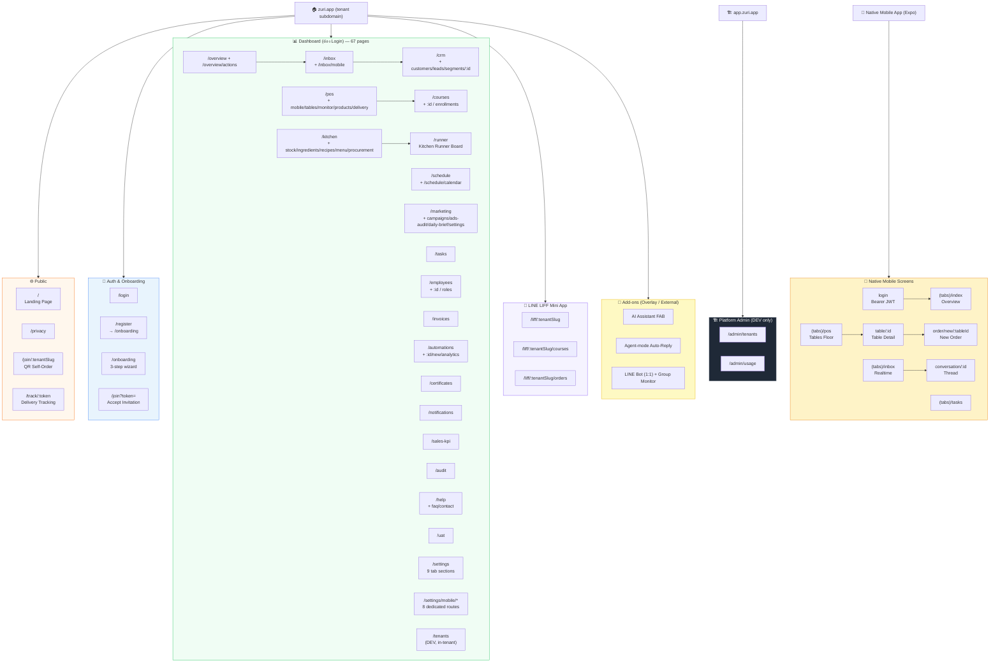

<!-- ADR-005: imported from Zuri V1 — DO NOT EDIT THIS FILE -->
> **Inherited from Zuri V1 · read-only.**
> Source: `G:/zuri/docs/product/roadmap/sitemap.md` @ `0b6d3c3` · imported 2026-08-16
> This describes **V1 semantics**, where *tenant* means **one shop** — V2's scope
> chain (Portfolio → Tenant → Business → Workspace) is different. Corrections belong
> in a V2 document that cites this file, never in this file. Cite its ids with a
> `V1-` prefix (e.g. `V1-ADR-060`) so they cannot be confused with V2 ids.

# Zuri Platform — Site Map

> **Version:** 2.1.0 · **Date:** 2026-07-20 · **Author:** Boss + Claude
> **RBAC:** ADR-068 Persona-Based 6 Roles (OWNER · MANAGER · SALES · KITCHEN · FINANCE · STAFF) + DEV (platform)
> **Updated:** Full refresh against the actual `src/app` route tree (`find src/app -name "page.jsx"`, 83 pages) and the new `mobile/app` Expo Router tree (8 screens). Previous edition (1.2.0, 2026-04-09) was stale — the 2.0.0 pass added ~35 pages shipped since (Automations, Certificates, Invoices, Audit Log, Help Center, UAT, Kitchen Runner, Sales KPI, CRM/Marketing/Kitchen sub-pages, LIFF mini-app, Danger Zone + Billing settings, and the entire native Mobile app section), corrected statuses to ✅ Built, and removed never-shipped rows.
> **v2.1.0 — tech-debt refinements (PRs #105–#108):** No routes added/removed — these were internal refactors, but a few touch listed surfaces: **Certificate + Invoice PDF exports now render Thai** (Sarabun font embedded, C4a); the POS payment step now shows the selected-table card and orders carry `guestCount` (C2/C5). Non-route-visible: FB-send dedup (C1), TenantContext dedup (C3), delivery-fee constant (C4b), deterministic MSP L0 index (I2).

URL base: `https://{tenant}.zuri.app` (dashboard) · `https://app.zuri.app` (platform admin, no tenant context)

---

## 🌐 Public Pages (ไม่ต้อง Login)

| URL | ชื่อหน้า | หมายเหตุ | สถานะ |
|---|---|---|---|
| `/` | Landing Page | Hero + AI Officer showcase + Pricing tiers + CTA (Framer Motion animations) | ✅ Built |
| `/privacy` | Privacy Policy | PDPA compliance statement | ✅ Built |
| `/join/:tenantSlug` | QR Self-Order Menu | Customer-facing mobile menu reached by scanning a table QR code — browse products, place a DINE_IN order without login (`MobileMenuGrid` + `OfflineBanner`) | ✅ Built |
| `/track/:token` | Delivery Order Tracking | Public tracking page for delivery orders — status stepper (รับออเดอร์ → มอบหมายคนขับ → รับของแล้ว → ส่งสำเร็จ), no login | ✅ Built |

> **หมายเหตุ:** ไม่มีหน้า `/terms` ในโค้ดปัจจุบัน — ถ้าต้องการต้องสร้างใหม่
> **`/m`** — internal mobile-optimized variant of `/`, reached only via middleware UA-rewrite (ADR-080), not a page users navigate to directly and not linked anywhere. Canonical URL stays `/`. Omitted from the counts below.

---

## 🔐 Auth & Onboarding

| URL | ชื่อหน้า | หมายเหตุ | สถานะ |
|---|---|---|---|
| `/login` | เข้าสู่ระบบ | Email + Password (NextAuth credentials) | ✅ Built |
| `/register` | สมัครใช้งาน | Redirects to `/onboarding` (M5 MT-4) | ✅ Built (redirect) |
| `/forgot-password` | ลืมรหัสผ่าน | Self-service reset not available — explains that an OWNER/MANAGER resets via Employees; links back to `/login` | ✅ Built |
| `/onboarding` | Onboarding Wizard | 3-step flow (Account → School → Connect) with guided tour (`OnboardingTour`) | ✅ Built |
| `/join?token=` | ยอมรับคำเชิญ (Accept Invitation) | Public invite-token acceptance flow, sets password → creates employee account (FEAT21 / ADR-077) | ✅ Built |

---

## 📊 Overview — Dashboard Home

| URL | ชื่อหน้า | Module | Roles | สถานะ |
|---|---|---|---|---|
| `/overview` | Dashboard KPI Cards | Core | ALL ROLES | ✅ Built |
| `/overview/actions` | Quick Actions Grid | Core | ALL ROLES | ✅ Built |

**`/overview`:** KPI cards แสดง daily sales, pending chats, active users, revenue, targets — พร้อม trend indicators, รองรับ TH/EN

**`/overview/actions`:** Shortcut grid — ลิงก์ไปหน้าหลักแต่ละ module

---

## 📨 Inbox — Unified Omni-Channel

| URL | ชื่อหน้า | Module | Roles | สถานะ |
|---|---|---|---|---|
| `/inbox` | Unified Inbox | FEAT04 | SALES, MANAGER, STAFF, OWNER | ✅ Built |
| `/inbox/mobile` | Mobile Inbox (stack nav) | FEAT04 | SALES, MANAGER, STAFF, OWNER | ✅ Built |
| `/inbox/:channel` | Channel deep-link redirect | FEAT04 | SALES, MANAGER, STAFF, OWNER | ✅ Built (redirect helper) |

**`/inbox` layout (3 Panel):**
- Left — Conversation List (FB badge / LINE badge, filter, search)
- Center — Chat View (send, compose-reply AI, Slip OCR)
- Right — Customer Card + Quick Sale (POS mini) + Billing Tab

**`/inbox/mobile`:** List↔chat stack navigation for phone viewports; reuses desktop APIs, Pusher channel, `ReplyBox`.

**`/inbox/:channel`:** Handles `/inbox/all`, `/inbox/facebook`, `/inbox/line`, `/inbox/pending` — replaces to `/inbox?channel=X`.

---

## 👥 CRM — Customer Relationship Management

| URL | ชื่อหน้า | Module | Roles | สถานะ |
|---|---|---|---|---|
| `/crm` | CRM Overview | FEAT05 | SALES, MANAGER, OWNER | ✅ Built |
| `/crm/:id` | Customer 360 Profile | FEAT02 | SALES, MANAGER, OWNER | ✅ Built |
| `/crm/customers` | Customers List (full table) | FEAT05-CRM | SALES, MANAGER, OWNER | ✅ Built |
| `/crm/leads` | Leads Pipeline (NEW→CONTACTED→INTERESTED) | FEAT05-CRM | SALES, MANAGER, OWNER | ✅ Built |
| `/crm/segments` | Segments (customers grouped by lifecycle stage/channel) | FEAT05-CRM | SALES, MANAGER, OWNER | ✅ Built |

**`/crm` tabs:** All · Lead · Interested · Enrolled · Paid · Churned

**`/crm/:id` sections:** Mini Header · Activity Timeline · Enrollment History + V Points · AI Insight · Quick Actions

---

## 🛒 POS — Point of Sale

| URL | ชื่อหน้า | Module | Roles | สถานะ |
|---|---|---|---|---|
| `/pos` | POS หลัก (Desktop/Tablet) | FEAT06 | SALES, MANAGER, OWNER | ✅ Built |
| `/pos/mobile` | POS Mobile (responsive web) | FEAT06 | SALES, MANAGER, OWNER | ✅ Built |
| `/pos/tables` | Table & Zone Management | FEAT06 | MANAGER, OWNER | ✅ Built |
| `/pos/monitor` | Real-time Seating Monitor | FEAT06 | SALES, MANAGER, OWNER | ✅ Built |
| `/pos/products` | Product Management (back-office CRUD + recipe linking) | FEAT08 | KITCHEN, MANAGER, OWNER | ✅ Built |
| `/pos/delivery` | Delivery Orders Board (Instant/Postal/Cold status flow) | FEAT06 | SALES, MANAGER, OWNER | ✅ Built |
| `/pos/delivery/drivers` | Delivery Driver Directory | FEAT06 | MANAGER, OWNER | ✅ Built |
| `/pos/delivery/zones` | Delivery Zone Editor (fees/areas) | FEAT06 | MANAGER, OWNER | ✅ Built |

**`/pos`:** Full POS — product grid, cart panel, category filter, search, discount, promotion codes, payment modal, Hierarchical Delivery Selection (PremiumPOS component)

**`/pos/mobile`:** Mobile-optimized responsive-web POS — fullscreen cashier canvas (no app-shell Topbar/BottomNav). Cart in a slide-out drawer via floating FAB; secondary actions in a radial FAB. Payment methods (CASH/QR/CARD) + delivery sub-types (LineMan, Postal, Cold). Auto-redirect เมื่อ viewport < 768px (ADR-057, ADR-079). *(Distinct from the native mobile app — see "Native Mobile App" section below.)*

**`/pos/tables`:** Floor Plan management — CRUD zones + tables, shape defs, position (X,Y). APIs: `/api/pos/zones`, `/api/pos/tables`

**`/pos/monitor`:** Real-time seating dashboard — auto-refresh ทุก 30s, table status badges (AVAILABLE/OCCUPIED/RESERVED/BILL_REQUESTED/CLEANING)

**Order Types (Tab):** Onsite · Takeaway · Delivery (Instant/Postal/Cold)

---

## 📚 Courses & Enrollment

| URL | ชื่อหน้า | Module | Roles | สถานะ |
|---|---|---|---|---|
| `/courses` | Course & Package Catalog + Enrollment flow | FEAT07 | SALES, MANAGER, OWNER | ✅ Built |
| `/courses/:id` | Course Detail (tabs: Overview, Curriculum, Students, Sessions, Settings) | FEAT07 | MANAGER, OWNER | ✅ Built |
| `/courses/enrollments` | All Enrollments (tenant-wide list, status filter) | FEAT07 | SALES, MANAGER, OWNER | ✅ Built |
| `/courses/list` | Legacy alias → redirects to `/courses` | FEAT07 | — | ✅ Built (redirect) |

> `/courses/new` was never shipped as a separate route — course creation is a modal on `/courses`.

---

## 📅 Schedule — Class Calendar & Attendance

| URL | ชื่อหน้า | Module | Roles | สถานะ |
|---|---|---|---|---|
| `/schedule` | Class Calendar (Day/Week/Month) + QR Attendance | FEAT07 | STAFF, SALES, MANAGER, OWNER | ✅ Built |
| `/schedule/calendar` | Personal Schedule Month View (read-only, `/api/culinary/schedules`) | FEAT07 | STAFF, SALES, MANAGER, OWNER | ✅ Built |

---

## 🍳 Kitchen Operations

| URL | ชื่อหน้า | Module | Roles | สถานะ |
|---|---|---|---|---|
| `/kitchen` | Kitchen Overview + Prep Sheet | FEAT08 | KITCHEN, MANAGER, OWNER | ✅ Built |
| `/kitchen/stock` | Ingredient Inventory (FEFO) | FEAT08 | KITCHEN, MANAGER | ✅ Built |
| `/kitchen/ingredients` | Ingredient Master Data + Goods Receipt (lots) | FEAT08 | KITCHEN, MANAGER | ✅ Built |
| `/kitchen/recipes` | Recipe Management (grid/list, category filter) | FEAT08 | KITCHEN, MANAGER | ✅ Built |
| `/kitchen/menu` | Menu Items ↔ Recipe linking (read + link view) | FEAT08 | KITCHEN, MANAGER | ✅ Built |
| `/kitchen/procurement` | PO Lifecycle (6 statuses, colored badges) | FEAT08 | KITCHEN, MANAGER, OWNER | ✅ Built |
| `/runner` | Kitchen Runner Board (order cards: PENDING→PREPARING→READY→PAID) | FEAT08 | KITCHEN, MANAGER, OWNER | ✅ Built |

> Product CRUD itself lives at `/pos/products`; `/kitchen/menu` is scoped to recipe wiring so kitchen staff can manage menu↔recipe without leaving the Kitchen module.

---

## 📣 Marketing & Ads Analytics

| URL | ชื่อหน้า | Module | Roles | สถานะ |
|---|---|---|---|---|
| `/marketing` | Ads Dashboard (ROAS, Spend, Revenue, Hourly Heatmap) | FEAT09 | SALES, MANAGER, OWNER | ✅ Built |
| `/marketing/campaigns` | Campaign Table (3-level drill-down: Campaign → AdSet → Ad) | FEAT09 | SALES, MANAGER, OWNER | ✅ Built |
| `/marketing/campaigns/new` | สร้าง Campaign ใหม่ (blast/broadcast builder) | FEAT09 | SALES, MANAGER, OWNER | ✅ Built |
| `/marketing/campaigns/:id` | Campaign Detail (report + recipient log) | FEAT09 | SALES, MANAGER, OWNER | ✅ Built |
| `/marketing/campaign-tracker` | Campaign Tracker (Gantt of ad delivery + status toggles) | FEAT09 | MANAGER, OWNER | ✅ Built |
| `/marketing/ads-audit` | AI-assisted Meta Ads Audit report | FEAT09 | SALES, MANAGER, OWNER | ✅ Built |
| `/marketing/daily-brief` | AI Daily Brief Archive (date picker) | FEAT10 | MANAGER, OWNER | ✅ Built |
| `/marketing/settings` | AskMarketing AI — Business Memory Settings (target ROAS, COGS, budget cap, seasonal peaks) | FEAT15 | MANAGER, OWNER | ✅ Built |

---

## ✅ Tasks

| URL | ชื่อหน้า | Module | Roles | สถานะ |
|---|---|---|---|---|
| `/tasks` | Task Board — Kanban (PENDING/IN_PROGRESS/REVIEW/COMPLETED) + List + Timeline views | Core | STAFF, SALES, KITCHEN, MANAGER, OWNER | ✅ Built |

---

## 👨‍💼 Employees

| URL | ชื่อหน้า | Roles | สถานะ |
|---|---|---|---|
| `/employees` | Employee List (department/status filter, grid/list view) | MANAGER, OWNER | ✅ Built |
| `/employees/:id` | Employee Profile (tabs: Profile, Schedule, Courses, Documents, Activity) | MANAGER, OWNER | ✅ Built |
| `/employees/roles` | Role Assignment (ADR-068 6-role matrix) | MANAGER, OWNER | ✅ Built |

> `/employees/new` was never shipped as a separate route — creation is a modal on `/employees`.

---

## 🧾 Billing & Invoices

| URL | ชื่อหน้า | Module | Roles | สถานะ |
|---|---|---|---|---|
| `/invoices` | Invoice List (status filter, pagination, mark PAID / send receipt / void) · on-demand PDF export renders Thai (C4a) | FEAT03-BILLING | FINANCE, MANAGER, OWNER | ✅ Built |

---

## ⚡ Automations

| URL | ชื่อหน้า | Roles | สถานะ |
|---|---|---|---|
| `/automations` | Workflow List | MANAGER, OWNER | ✅ Built |
| `/automations/new` | New Workflow (template gallery → builder) | MANAGER, OWNER | ✅ Built |
| `/automations/:id` | Workflow Detail (execution log + editor, manual run) | MANAGER, OWNER | ✅ Built |
| `/automations/analytics` | Automation Analytics Dashboard | MANAGER, OWNER | ✅ Built |

---

## 🏆 Certificates

| URL | ชื่อหน้า | Roles | สถานะ |
|---|---|---|---|
| `/certificates` | Certificate List (Basic 30H / Pro 111H / Master 201H, paginated) · on-demand PDF export renders Thai (C4a) | SALES, MANAGER, OWNER | ✅ Built |

---

## 🔔 Notifications

| URL | ชื่อหน้า | Roles | สถานะ |
|---|---|---|---|
| `/notifications` | Notification Signal Center (open conversations, pending orders, pending tasks) | ALL ROLES | ✅ Built |

---

## 📈 Sales KPI

| URL | ชื่อหน้า | Roles | สถานะ |
|---|---|---|---|
| `/sales-kpi` | Sales KPI Deep-dive (revenue, paid orders, hot leads, response time, conversion, AI efficiency) | SALES, MANAGER, OWNER | ✅ Built |

---

## 📋 Compliance & Support

| URL | ชื่อหน้า | Roles | สถานะ |
|---|---|---|---|
| `/audit` | Compliance Audit Log (filter action/actor/date, expandable diff) | DEV (F), OWNER/MANAGER (R) | ✅ Built |
| `/help` | Help Center (Getting Started, Inbox, CRM, POS, Marketing, Kitchen, Settings) | ALL ROLES | ✅ Built |
| `/help/faq` | FAQ | ALL ROLES | ✅ Built |
| `/help/contact` | Contact Support (email / LINE OA channels) | ALL ROLES | ✅ Built |
| `/uat` | UAT Feedback Form (stored in Redis, DEV-only viewing) | DEV (submit: ALL) | ✅ Built |

---

## ⚙️ Settings & Admin

| URL | ชื่อหน้า | Roles | สถานะ |
|---|---|---|---|
| `/settings` | Settings Hub — single page, tab sections | MANAGER, OWNER (+ FINANCE for Accounting) | ✅ Built |
| `/settings/mobile` | Mobile Settings Hub (menu/index) | MANAGER, OWNER | ✅ Built |
| `/settings/mobile/general` | Mobile — General (account info) | MANAGER, OWNER | ✅ Built |
| `/settings/mobile/workspace` | Mobile — Workspace (branding, brand colors) | MANAGER, OWNER | ✅ Built |
| `/settings/mobile/team` | Mobile — Team & Roles | MANAGER, OWNER | ✅ Built |
| `/settings/mobile/billing` | Mobile — Billing (plan summary + upgrade CTA) | OWNER | ✅ Built |
| `/settings/mobile/integrations` | Mobile — Integrations (FB/LINE tokens) | MANAGER, OWNER | ✅ Built |
| `/settings/mobile/notifications` | Mobile — Notification event toggles | MANAGER, OWNER | ✅ Built |
| `/settings/mobile/danger` | Mobile — Danger Zone (export data / delete workspace) | OWNER | ✅ Built |

**`/settings` tabs (desktop, real-time via `activeSection` state — not sub-routes):**

| Tab | รายละเอียด | สถานะ |
|---|---|---|
| General | Profile ผู้ใช้ | ✅ Built |
| Workspace | Branding, brand colors, workspace info | ✅ Built |
| Team & Roles | Employee list + role assignment | ✅ Built |
| Ownership | Transfer ownership (shown only if `canTransferOwnership`) | ✅ Built |
| Billing | Plan card + billing history + payment methods — **read-side only**, no PSP checkout yet (blocked on FEAT-11b PSP provider selection) | 🟡 Partial (read-side ✅, write/checkout blocked) |
| Accounting | FlowAccount API sync + Express X-Import config, sync logs (shown only if `canViewAccounting`) | ✅ Built |
| Integrations | FB Page / LINE OA connect | ✅ Built |
| Notifications | Notification event toggles | ✅ Built |
| Danger Zone | Export tenant data, **delete workspace** (FC-11d, confirm-by-typing-name) | ✅ Built |

> AI Assistant configuration is **not** a Settings tab — it now lives at `/marketing/settings` (AskMarketing AI Business Memory).
> `/settings/roles` as a standalone route was never shipped — role assignment is the "Team & Roles" tab (desktop) / `/settings/mobile/team` (mobile) / `/employees/roles` (dedicated page).

---

## 🏗️ Platform Admin (DEV Only)

| URL | ชื่อหน้า | Host | สถานะ |
|---|---|---|---|
| `/tenants` | Tenant list (in-app, tenant-context DEV view) | `{tenant}.zuri.app` | ✅ Built |
| `/admin` | Redirects to `/admin/tenants` | `app.zuri.app` | ✅ Built (redirect) |
| `/admin/tenants` | Platform Tenant Management — list, activate/deactivate, impersonate, audit log | `app.zuri.app` | ✅ Built |
| `/admin/usage` | Platform Usage Stats (messages, conversations, customers, last 30d) | `app.zuri.app` | ✅ Built |

> `/tenants` (dashboard) and `/admin/*` are two different surfaces: `/tenants` is a simple in-tenant DEV list; `/admin/*` is the no-tenant-context platform control tower on `app.zuri.app`, gated by a client-side DEV-role layout guard.

---

## 🔗 LINE LIFF Mini App

| URL | ชื่อหน้า | หมายเหตุ | สถานะ |
|---|---|---|---|
| `/liff/:tenantSlug` | LIFF Entry Point | Authenticates via LINE LIFF SDK → routes to courses or orders | ✅ Built |
| `/liff/:tenantSlug/courses` | Course Catalog + self-enroll | ลูกค้าดูคอร์ส, ลงทะเบียนเอง | ✅ Built |
| `/liff/:tenantSlug/orders` | Order History + status | ลูกค้าดูสถานะออเดอร์ตัวเอง | ✅ Built |

---

## 📱 Native Mobile App (Expo — `mobile/`)

New since April 2026: a separate React Native / Expo Router app (not the responsive-web `/pos/mobile` or `/settings/mobile/*` — a real native shell), shipped as an XL first-slice POC (FC-13, PRs #95/#96). Authenticates via **Bearer JWT** against `/api/auth/mobile-login` (per-token revocation added in a later slice — see `f6fc8a8`), token stored client-side and attached to every API call; `/api/auth/mobile-logout` revokes it.

| Screen (route) | หน้าจอ | หมายเหตุ | สถานะ |
|---|---|---|---|
| `login.jsx` | เข้าสู่ระบบ | Email + password → `POST /api/auth/mobile-login`, stores Bearer token | ✅ Built |
| `(tabs)/index.jsx` | Overview (ภาพรวม) | KPI pull from `/api/notifications/count` + `/api/analytics/sales-kpi`; degrades gracefully on FREE-plan 402 | ✅ Built |
| `(tabs)/pos.jsx` | POS — Tables Floor View (🧾) | `SectionList` of tables grouped by zone, status badges (AVAILABLE/OCCUPIED/RESERVED/BILL_REQUESTED/CLEANING) | ✅ Built |
| `table/[id].jsx` | Table Detail | Read-only table + active-order summary, reached from the floor view; order management (open/edit/pay) not yet on mobile | ✅ Built (read-only) |
| `order/new/[tableId].jsx` | New Order | Product picker (`SectionList` by category) → `POST /api/pos/orders` for a DINE_IN order | ✅ Built |
| `(tabs)/inbox.jsx` | Inbox (กล่องข้อความ) | Conversation list, realtime via tenant-wide Pusher channel (no per-conversation channel — filtered client-side) | ✅ Built |
| `conversation/[id].jsx` | Conversation Thread | Realtime chat thread, send message | ✅ Built |
| `(tabs)/tasks.jsx` | Tasks (งาน) | "Assigned to me" task list, toggle TODO ↔ DONE | ✅ Built |

> Not yet on mobile: CRM, Marketing, Kitchen, Settings, Employees, Automations — desktop/responsive-web only for now.

---

## 🤖 Add-ons (Non-Page Surfaces)

| Surface | Entry Point | ใครใช้ | สถานะ |
|---|---|---|---|
| **AI Assistant FAB** | Web Overlay (ทุกหน้า) — bubble button มุมขวาล่าง | MANAGER, OWNER | ✅ Built |
| **Agent-mode Auto-Reply** | Inbox — AI ตอบแทนอัตโนมัติเมื่อเปิดโหมด agent | SALES, MANAGER | ✅ Built |
| **LINE Bot (1:1)** | LINE OA → ถามยอด/สต๊อค/สรุป | MANAGER, OWNER | ✅ Built |
| **LINE Group Monitor** | LINE Group → detect slip + auto-record | SALES, MANAGER | ✅ Built |
| **LINE Mini App (LIFF)** | LIFF v2 ใน LINE — ลูกค้าดูคอร์ส, จ่ายเงิน | ลูกค้า | ✅ Built (see LIFF section above) |

---

## 📋 Role Reference (ADR-068)

| Role | ระดับ | เข้าถึง | รวมจาก (เดิม) |
|---|---|---|---|
| `OWNER` | 5 | Read-only ทุกอย่าง | OWNER |
| `MANAGER` | 4 | Full ops + พนักงาน | MGR + ADM + HR |
| `SALES` | 3 | Inbox + CRM + POS + Marketing | SLS + AGT + MKT |
| `KITCHEN` | 2 | Kitchen + Stock + Procurement | TEC + PUR + PD |
| `FINANCE` | 2 | Accounting + Billing | ACC |
| `STAFF` | 1 | View-only + Tasks + Schedule | STF |
| `DEV` | 6 | ทุกอย่าง (hidden in UI) | DEV |

---

## 🗺️ Mermaid Diagram

---

## 📈 Build Status Summary

| Category | ✅ Built | 🟡 Partial | Total |
|---|---|---|---|
| Public Pages | 4 | 0 | 4 |
| Auth & Onboarding | 5 | 0 | 5 |
| Dashboard Pages (`(dashboard)` group) | 67 | 0 | 67 |
| LIFF Mini App | 3 | 0 | 3 |
| Platform Admin (`admin/*`) | 3 | 0 | 3 |
| Top-level standalone (`/join`) | 1 | 0 | 1 |
| **Web app total (`src/app`)** | **82** | **1**¹ | **83** |
| Native Mobile App (Expo, `mobile/app`) | 8 | 0 | 8 |

¹ The one 🟡 is the Settings **Billing tab** — read-side (plan card, history, payment methods) is wired; checkout/write-side is blocked on choosing a PSP provider (FEAT-11b).

> Nearly everything enumerated here has a real implementation behind it (no more placeholder "Planned" rows carried forward from the April edition) — this reflects ~23 live features per the FC-sprint tracking in `gks/`. Two features remain explicitly blocked, not "planned-but-unbuilt": FEAT-11b PSP checkout (needs provider choice) and FEAT-11c photo upload (needs storage decision) — neither has a page stub, so neither appears above.

---

*Updated: 2026-07-19 · Full refresh against `src/app` (83 pages) + `mobile/app` (8 screens) by Claude*
