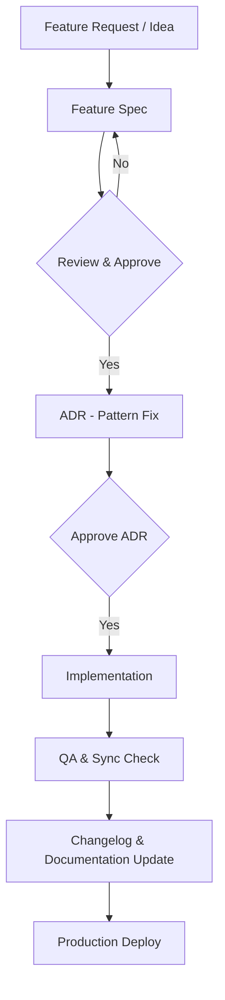

<!-- ADR-005: imported from Zuri V1 — DO NOT EDIT THIS FILE -->
> **Inherited from Zuri V1 · read-only.**
> Source: `G:/zuri/docs/standards/process/doc-to-code.md` @ `0b6d3c3` · imported 2026-08-11
> This describes **V1 semantics**, where *tenant* means **one shop** — V2's scope
> chain (Portfolio → Tenant → Business → Workspace) is different. Corrections belong
> in a V2 document that cites this file, never in this file. Cite its ids with a
> `V1-` prefix (e.g. `V1-ADR-060`) so they cannot be confused with V2 ids.

# Development Process: DOC TO CODE

The "Doc-to-Code" philosophy ensures that the documentation is the source of truth for all implementations. Implementation must never precede an approved specification.

## 1. Interaction Workflow

## 2. Rule of Truth
1. **Spec First**: Always write/update the `.md` or `.yaml` manifest in `docs/` before touching any code.
2. **Modular Dev**: Implement in small, testable chunks.
3. **Double Sync**: After finishing a task, verify that the code behavior matches the spec. If they diverged for a valid reason, **update the spec immediately**.

## 3. Agent Responsibilities
- **Lead Architect (Claude)**: Updates `CLAUDE.md`, core specs, and ADRs.
- **Developer (Senior Agent)**: Implements the code based on the specs.
- **Auditor**: Periodically checks for "Doc-to-Code" drift.
