# GoVibe Migration Roadmap — DDD Execution Plan

> **Source**: [Untitled-1.html](file:///G:/covibe/Untitled-1.html) (6,740 lines, 429KB)
> **Target**: `g:/govibe/` — Tauri v2 + Vite + React-TS
> **Methodology**: Documentation-Driven Development (DDD)
> **Version**: 1.1.0
> **Created**: 2026-06-06T07:20:00+07:00, Rwang
> **Updated**: 2026-06-14T11:30:00+07:00, Rwang

---

CoVibe คือ โปรเจคที่ html นี้กำลังtacking  เราจะใช้ระบบ html นี้เป็น  
GoVibe :: AI-Native Visual Vibe Code Platform
Visual Vibe Code Platform ของไทย 🇹🇭 “No coding No problem” 
อยากใช้ Tauri + Vite/React เพื่อต่อกับ GenesisBlockDB ที่เป็น Rust เพื่อทำembed code and symbollink
1. จงเขียนImplementation Plan การ Migrate GoVibe-Mission-Control.himl → React Components โดยแยก File แบบ Modular  (เผื่อ native)
   verify: npm run dev ยังทำงานได้ 
2. แยก business logic เข้า src/core/          (platform-agnostic)
   verify: logic ไม่มี DOM dependency
3. ติดตั้ง Capacitor                           (เมื่อพร้อม go native)
   verify: npx cap run android/ios ทำงานได้

โดยสร้างเป็น  MASTERPLAN แบ่ง  phase ย่อยเป็น epic แตก sprint + backlog เป็น Task 4 ระดับ 
1. Task:: TSK-{masterplanId}{phasenumber}{epicnumber}{sprintnumber}-{tasknumber}
   example TSK-GVMP01P01EP01SPR02-01 แปลได้ว่า Task ของ โปรเจค GoVibe Master Plan ที่ 1 Phase 1 Epic 1 Sprint 2 task 1
   **masterplanId:: {Projectcodename}MP{number}
   exsample 
        Projectcodename:: GoVibe: GV
        MasterPlan: MP
        number: 01
        = GVMP01
   **phasenumber:: {2 digti}
   exsample 
        Phase: Phase 1
        number: 01
        = 01
   **epicnumber:: {2 digti}
   exsample 
        Epic: Epic 1
        number: 01
        = 01
   **sprintnumber:: {2 digti}
   exsample 
        Sprint: Sprint 2
        number: 02
        = 02
   **tasknumber:: {2 digti}
   exsample 
        Task: Task 1
        number: 01
        = 01
   **example:: TSK-GVMP01P01EP01SPR02-01 
**
2. Sub-Task::SUB-TSK{parent-task}   
   **parent-task:: {parent-task}   
   exsample 
        Sub-Task::S-TSK{TSK-GVMP01P01EP01SPR02-01}
   **example:: S-TSK-GVMP01P01EP01SPR02-01
**
3. Micro-Task::M-TSK{parent-task}
**parent-task:: {parent-task} 
   exsample 
        Micro-Task::M-TSK{TSK-GVMP01P01EP01SPR02-01}
   **example:: M-TSK-GVMP01P01EP01SPR02-01
**
4. Atomic-Task::A-TSK{parent-task}
**parent-task:: {parent-task} 
   exsample 
        Atomic-Task::A-TSK{TSK-GVMP01P01EP01SPR02-01}
   **example:: A-TSK-GVMP01P01EP01SPR02-01
**


## ⚙️ Conventions

| Symbol | Meaning |
|--------|---------|
| `🔓 LOCK` | Dependency blocked — ต้องรอ task ที่ระบุเสร็จก่อน |
| `🔀 PARALLEL` | สามารถทำพร้อมกันได้กับ task อื่นในกลุ่มเดียวกัน |
| `⛓️ SERIAL` | ต้องทำลำดับ ไม่สามารถ parallel ได้ |
| `📐 DDD` | ต้องเขียน Doc spec ก่อน → รอ approve → แล้วค่อย code |
| `⚡ HOTFIX` | Bypass doc-first (typo, syntax, linting fix) |

### Definition of Done (DoD) Template

**ทุก Task  ต้องผ่าน 3 gates::**

```
■ Acceptance Criteria
  [_] Spec/Doc approved (DDD gate)
  [_] Docs updated (README, GEMINI.md, or inline JSDoc)
  [_] Test plan Spec/Doc approved
■ Success Criteria
  [_] Code complete — ไม่มี TODO/FIXME
  [_] Lints clean (TypeScript strict, no any)
  [_] Renders correctly ใน `cargo tauri dev`
■ Exit Criteria
  [_] Tests passed (vitest component test หรือ manual verify)
  [_] Regression free — views อื่นยังทำงานปกติ
  [_] PR diff review — changed lines trace to task scope only
```

---

## Phase 0 — Foundation Scaffold

> **Goal**: สร้าง project structure + extract design system ให้พร้อมรับ components
> **Sprint**: S0 (1 sprint)

### [Epic EP00] Foundation Scaffold

---

#### Sprint S0 — Project Bootstrap

|   Task ID   |           Task                     |Pt|    Mode    |    Dependency    | symbollink |   Source Lines   |  Assign To  |
|  ---------  |    -----------------               |--|   ------   |   ------------   |    ----    |   -----------    | ----------- |
| **TSK-GVMP01P00EP00SPR00-01** | Scaffold Tauri v2 + Vite React-TS  | 3|   SERIAL   |    -             | `d:/GoVibe`|   L01–L111       |  EVA Agent  |
| **TSK-GVMP01P00EP00SPR00-02** | Configure and"GoVibe", identifier  | 1|   SERIAL   |    -             |`tauri.conf.json`|  |  |
| **TSK-GVMP01P00EP00SPR00-03** | Extract CSS design tokens → `src/styles/globals.css` | 5 |  PARALLEL-A | `TSK-GVMP01P00EP00SPR00-01` | L71–L111 | |
| **TSK-GVMP01P00EP00SPR00-04** | Extract glassmorphism + card styles → `src/styles/glassmorphism.css` | 3 |  PARALLEL-A | `TSK-GVMP01P00EP00SPR00-01` | L142–L730 | |
| **TSK-GVMP01P00EP00SPR00-05** | Extract animations + keyframes → `src/styles/animations.css` | 3 |  PARALLEL-A | `TSK-GVMP01P00EP00SPR00-01` | L121–L187, L401–L591 | |
| **TSK-GVMP01P00EP00SPR00-06** | Extract component-specific CSS (sidebar, terminal, carousel, config) → `src/styles/components.css` | 5 |  PARALLEL-A | `TSK-GVMP01P00EP00SPR00-01` | L189–L870, L884–L1812 | |
| **TSK-GVMP01P00EP00SPR00-07** | Setup Tailwind CSS properly (install package, config, remove CDN script) | 2 | 🔀 PARALLEL-A | `TSK-GVMP01P00EP00SPR00-01` | L22, L32–L68 | |

**Parallel Group A**: TSK-GVMP01P00EP00SPR00-03, TSK-GVMP01P00EP00SPR00-04, TSK-GVMP01P00EP00SPR00-05, TSK-GVMP01P00EP00SPR00-06, TSK-GVMP01P00EP00SPR00-07 — ทำพร้อมกันได้ทั้ง 5 task (ไม่ depend กัน) หลัง TSK-GVMP01P00EP00SPR00-01 เสร็จ

#### DoD — Sprint S0
```
■ Acceptance
  [_] `npm run dev` starts Vite dev server
  [_] `cargo tauri dev` opens empty window with correct title
■ Success
  [_] All CSS files imported without error
  [_] Design tokens (:root variables) match original
■ Exit
  [_] Dark theme renders bg-body: #0f1115
  [_] Light theme class toggles correctly
```

---

## Phase 1 — Application Shell

> **Goal**: สร้าง layout skeleton (Header, Sidebar, routing) ที่ navigate ระหว่าง 4 domains ได้
> **Sprints**: S1a (Layout), S1b (State + Routing)

### [Epic EP01] App Shell Layout & Routing

---

#### Sprint S1a — Layout Components

| Task ID | Task | Points | Mode | Dependency | Source Lines |
|---------|------|--------|------|------------|--------------|
| **TSK-GVMP01P01EP01SPR01-01** | `core/state.ts` — Extract `appState` + `siteMap` config | 3 | ⛓️ SERIAL | `TSK-GVMP01P00EP00SPR00-03` | L4461–L4519 |
| **TSK-GVMP01P01EP01SPR01-02** | `components/layout/Header.tsx` — Domain tab switcher, WS status, theme toggle | 5 | 🔀 PARALLEL-B | `TSK-GVMP01P01EP01SPR01-01` | L1822–L1881 |
| **TSK-GVMP01P01EP01SPR01-03** | `components/layout/Sidebar.tsx` — Collapsible sidebar, sub-nav rendering, expanded-lock | 5 | 🔀 PARALLEL-B | `TSK-GVMP01P01EP01SPR01-01` | L1886–L1917 |
| **TSK-GVMP01P01EP01SPR01-04** | `components/layout/MainLayout.tsx` — Flex layout container (header + sidebar + main) | 3 | 🔓 LOCK | `TSK-GVMP01P01EP01SPR01-02`, `TSK-GVMP01P01EP01SPR01-03` | |
| **TSK-GVMP01P01EP01SPR01-05** | `components/shared/ThemeToggle.tsx` — Dark/light toggle with CSS var switching | 2 | 🔀 PARALLEL-B | `TSK-GVMP01P01EP01SPR01-01` | L4729–L4758 |
| **TSK-GVMP01P01EP01SPR01-06** | `components/shared/ShimmerTitle.tsx` — Gradient animated text component | 1 | 🔀 PARALLEL-B | `TSK-GVMP01P01EP01SPR01-05` | L169–L187 |
| **TSK-GVMP01P01EP01SPR01-07** | `components/layout/Footer.tsx` — Status bar footer | 1 | 🔀 PARALLEL-B | `TSK-GVMP01P01EP01SPR01-01` | L4382–L4388 |

**Parallel Group B**: TSK-GVMP01P01EP01SPR01-02, TSK-GVMP01P01EP01SPR01-03, TSK-GVMP01P01EP01SPR01-05, TSK-GVMP01P01EP01SPR01-06, TSK-GVMP01P01EP01SPR01-07 — ทำพร้อมกันได้ (ต้องการแค่ TSK-GVMP01P01EP01SPR01-01)

**🔓 LOCK**: TSK-GVMP01P01EP01SPR01-04 ต้องรอ TSK-GVMP01P01EP01SPR01-02 (Header) + TSK-GVMP01P01EP01SPR01-03 (Sidebar) ทั้งคู่เสร็จก่อน

---

#### Sprint S1b — Domain Routing & View Switching

| Task ID | Task | Points | Mode | Dependency | Source Lines |
|---------|------|--------|------|------------|--------------|
| **TSK-GVMP01P01EP01SPR02-01** | `switchDomain()` logic → React state + domain context provider | 3 | ⛓️ SERIAL | `TSK-GVMP01P01EP01SPR01-04` | L4596–L4656 |
| **TSK-GVMP01P01EP01SPR02-02** | `switchMainView()` logic → view component lazy loading | 3 | ⛓️ SERIAL | `TSK-GVMP01P01EP01SPR02-01` | L4658–L4711 |
| **TSK-GVMP01P01EP01SPR02-03** | Empty placeholder components สำหรับ 17 views (render title + "Coming Soon") | 2 | ⛓️ SERIAL | `TSK-GVMP01P01EP01SPR02-01` | |

#### DoD — Phase 1
```
■ Acceptance
  [_] คลิก Domain A/B/C/D tabs → sidebar sub-nav อัปเดตถูก
  [_] คลิก sub-nav → main content area แสดง view ที่ถูกต้อง
  [_] Orb gradient เปลี่ยนสีตาม domain
■ Success
  [_] Sidebar collapse/expand ทำงาน
  [_] Theme toggle dark↔light ไม่ error
  [_] Footer context text อัปเดตตาม active view
■ Exit
  [_] ทุก 17 views มี placeholder render ไม่ blank
  [_] Console ไม่มี React warning/error
```

---

## Phase 2 — Domain View Migration

> **Goal**: ย้าย HTML + JS logic ของ 17 views เข้า React components
> **Sprints**: S2a (Domain A), S2b (Domain B), S2c (Domain C), S2d (Domain D)

### [Epic EP02] Domain Component Migration

---

#### Sprint S2a — Domain A: Project Overview (5 views)

| Task ID | Task | Points | Mode | Dependency | Source Lines |
|---------|------|--------|------|------------|--------------|
| **TSK-GVMP01P02EP02SPR03-01** | `domains/overview/Dashboard.tsx` (view-A1) — Stats grid, Chart.js integration, Reactor Telemetry panel | 8 | 🔀 PARALLEL-C | `TSK-GVMP01P01EP01SPR02-03` | L1926–L2013 |
| **TSK-GVMP01P02EP02SPR03-02** | `domains/overview/Roadmap.tsx` (view-A2) — Accordion phases, task cards, 3-state checkboxes, export (JSON/YAML/MD), agent drag-assign | 13 | 🔀 PARALLEL-C | `TSK-GVMP01P01EP01SPR02-03` | L2016–L3457 + L4760–L5130 |
| **TSK-GVMP01P02EP02SPR03-03** | `domains/overview/Plugins.tsx` (view-A3) — Capability plugins listing | 3 | 🔀 PARALLEL-C | `TSK-GVMP01P01EP01SPR02-03` | L3458–L3493 |
| **TSK-GVMP01P02EP02SPR03-04** | `domains/overview/BrainConfig.tsx` (view-A4) — Brain & Config panel | 3 | 🔀 PARALLEL-C | `TSK-GVMP01P01EP01SPR02-03` | L3494–L3556 |
| **TSK-GVMP01P02EP02SPR03-05** | `domains/overview/AgentManagement.tsx` (view-A5) — Character select carousel, 3D tilt, flip card config, video switcher | 13 | 🔀 PARALLEL-C | `TSK-GVMP01P01EP01SPR02-03` | L3557–L3872 + L7100–L7394 (initAgentManagement) |

**Parallel Group C**: TSK-GVMP01P02EP02SPR03-01–TSK-GVMP01P02EP02SPR03-05 ทำพร้อมกันได้ทั้ง 5 task (แต่ละ view เป็น independent component)

> [!IMPORTANT]
> **TSK-GVMP01P02EP02SPR03-02 (Roadmap)** เป็น task ใหญ่ที่สุด (13 pts) เพราะรวม:
> - Task definitions data (~70 lines of structured objects per phase)
> - Drag-and-drop agent assignment
> - LocalStorage state persistence
> - Export engine (JSON, YAML, Markdown generators)
> - Phase accordion with progress calculation

> [!IMPORTANT]
> **TSK-GVMP01P02EP02SPR03-05 (Agent Management)** เป็น task ใหญ่เท่ากัน (13 pts) เพราะรวม:
> - Character portrait carousel with vertical arc layout
> - 3D perspective tilt on mouse move
> - Flip card animation (front: stats → back: config form)
> - Video/image switcher
> - Config form with model source pill, sliders, toggles
> - Genesis Knowledge panel sub-component

---

#### Sprint S2b — Domain B: Genesis Knowledge (4 views)

| Task ID | Task | Points | Mode | Dependency | Source Lines |
|---------|------|--------|------|------------|--------------|
| **TSK-GVMP01P02EP02SPR04-01** | `domains/genesis/AstTree.tsx` (view-B1) — Code line selector, draggable AST nodes, SVG bezier edges | 5 | 🔀 PARALLEL-D | `TSK-GVMP01P01EP01SPR02-03` | L3877–L3955 |
| **TSK-GVMP01P02EP02SPR04-02** | `domains/genesis/BusinessSpec.tsx` (view-B2) — Static protocol specification | 2 | 🔀 PARALLEL-D | `TSK-GVMP01P01EP01SPR02-03` | L3958–L3974 |
| **TSK-GVMP01P02EP02SPR04-03** | `domains/genesis/InteractiveGraph.tsx` (view-B3) — Draggable 2D graph canvas (Cytoscape or custom) | 5 | 🔀 PARALLEL-D | `TSK-GVMP01P01EP01SPR02-03` | L3977–L3994 |
| **TSK-GVMP01P02EP02SPR04-04** | `domains/genesis/CallGraph.tsx` (view-B4) — Cytoscape.js call graph, depth controls, node inspector panel | 8 | 🔀 PARALLEL-D | `TSK-GVMP01P01EP01SPR02-03` | L3997–L4051 |

**Parallel Group D**: TSK-GVMP01P02EP02SPR04-01–TSK-GVMP01P02EP02SPR04-04 ทำพร้อมกันได้ทั้ง 4 task

> [!WARNING]
> **TSK-GVMP01P02EP02SPR04-04 (Call Graph)** depends on `cytoscape` npm package — ต้อง `npm install cytoscape @types/cytoscape` ก่อน

---

#### Sprint S2c — Domain C: Block DB (5 views) — 🔑 GenesisBlockDB Frontend

| Task ID | Task | Points | Mode | Dependency | Source Lines |
|---------|------|--------|------|------------|--------------|
| **TSK-GVMP01P02EP02SPR05-01** | `domains/blockdb/SymbolExplorer.tsx` (view-C1) — Symbol table with filter search | 3 | 🔀 PARALLEL-E | `TSK-GVMP01P01EP01SPR02-03` | L4056–L4106 |
| **TSK-GVMP01P02EP02SPR05-02** | `domains/blockdb/IntelligenceZoo.tsx` (view-C2) — Agent roster cards | 3 | 🔀 PARALLEL-E | `TSK-GVMP01P01EP01SPR02-03` | L4109–L4140 |
| **TSK-GVMP01P02EP02SPR05-03** | `domains/blockdb/SrsDebugger.tsx` (view-C3) — Query input, dual RAG output comparison | 3 | 🔀 PARALLEL-E | `TSK-GVMP01P01EP01SPR02-03` | L4143–L4171 |
| **TSK-GVMP01P02EP02SPR05-04** | `domains/blockdb/ErdSchema.tsx` (view-C4) — Draggable ERD table cards with SVG edges | 5 | 🔀 PARALLEL-E | `TSK-GVMP01P01EP01SPR02-03` | L4174–L4218 |
| **TSK-GVMP01P02EP02SPR05-05** | `domains/blockdb/HnswVectorMap.tsx` (view-C5) — HNSW layer switcher with zone visualization | 3 | 🔀 PARALLEL-E | `TSK-GVMP01P01EP01SPR02-03` | L4221–L4260 |

**Parallel Group E**: TSK-GVMP01P02EP02SPR05-01–TSK-GVMP01P02EP02SPR05-05 ทำพร้อมกันได้ทั้ง 5 task

> [!NOTE]
> Sprint S2c เป็น "static UI migration" ก่อน — **จะเชื่อมกับ Tauri IPC ใน Phase 3 (TSK-GVMP01P03EP03SPR07-01–07)**

---

#### Sprint S2d — Domain D: AI Benchmark (3 views)

| Task ID | Task | Points | Mode | Dependency | Source Lines |
|---------|------|--------|------|------------|--------------|
| **TSK-GVMP01P02EP02SPR06-01** | `domains/benchmark/ReactorRun.tsx` (view-D1) — Power regulator slider, safety run progress, oscilloscope Web Audio canvas | 8 | 🔀 PARALLEL-F | `TSK-GVMP01P01EP01SPR02-03` | L4265–L4331 |
| **TSK-GVMP01P02EP02SPR06-02** | `domains/benchmark/CyberHeatmap.tsx` (view-D2) — 8×8 thermal grid, real-time randomizer, overview stats | 5 | 🔀 PARALLEL-F | `TSK-GVMP01P01EP01SPR02-03` | L4334–L4358 |
| **TSK-GVMP01P02EP02SPR06-03** | `domains/benchmark/EabsLogs.tsx` (view-D3) — Static campaign log viewer | 2 | 🔀 PARALLEL-F | `TSK-GVMP01P01EP01SPR02-03` | L4361–L4376 |

**Parallel Group F**: TSK-GVMP01P02EP02SPR06-01–TSK-GVMP01P02EP02SPR06-03 ทำพร้อมกันได้ทั้ง 3 task

#### DoD — Phase 2 (ทุก view)
```
■ Acceptance
  [_] Doc spec per component approved ก่อน code
  [_] UI match กับ original Untitled-1.html visually (screenshot compare)
■ Success
  [_] Component renders ใน `cargo tauri dev` ไม่มี error
  [_] Interactive elements ทำงาน (click, drag, hover effects)
  [_] CSS animations/transitions match original
■ Exit
  [_] Theme toggle ทำงานใน view นี้
  [_] ไม่ break views อื่น (regression check)
  [_] TypeScript strict — no `any` type
```

---

## Phase 3 — Tauri Rust Backend (GenesisBlockDB)

> **Goal**: สร้าง Rust IPC commands เพื่อเชื่อม frontend กับ GenesisBlockDB
> **Sprint**: S3

### [Epic EP03] Rust IPC Backend Integration

---

#### Sprint S3 — Rust IPC & Frontend Hooks

| Task ID | Task | Points | Mode | Dependency | Source Lines |
|---------|------|--------|------|------------|--------------|
| **TSK-GVMP01P03EP03SPR07-01** | `src-tauri/src/commands/mod.rs` — Command module structure | 1 | ⛓️ SERIAL | `TSK-GVMP01P00EP00SPR00-01` | — |
| **TSK-GVMP01P03EP03SPR07-02** | `src-tauri/src/commands/genesis_db.rs` — Stub commands: `query_symbol()`, `insert_block()`, `list_symbols()` | 5 | ⛓️ SERIAL | `TSK-GVMP01P03EP03SPR07-01` | — |
| **TSK-GVMP01P03EP03SPR07-03** | `src-tauri/src/commands/symbol_link.rs` — Stub commands: `resolve_symlink()`, `embed_code_block()` | 5 | 🔀 PARALLEL-G | `TSK-GVMP01P03EP03SPR07-01` | — |
| **TSK-GVMP01P03EP03SPR07-04** | `src/hooks/useGenesisDb.ts` — React hook wrapping `@tauri-apps/api invoke()` calls | 3 | 🔓 LOCK | `TSK-GVMP01P03EP03SPR07-02`, `TSK-GVMP01P03EP03SPR07-03` | — |
| **TSK-GVMP01P03EP03SPR07-05** | Wire `useGenesisDb` into `SymbolExplorer.tsx` (view-C1) — replace static table with IPC query | 3 | 🔓 LOCK | `TSK-GVMP01P03EP03SPR07-04`, `TSK-GVMP01P02EP02SPR05-01` | — |
| **TSK-GVMP01P03EP03SPR07-06** | Wire `useGenesisDb` into `SrsDebugger.tsx` (view-C3) — send query via IPC | 3 | 🔓 LOCK | `TSK-GVMP01P03EP03SPR07-04`, `TSK-GVMP01P02EP02SPR05-03` | — |
| **TSK-GVMP01P03EP03SPR07-07** | Register all commands in `lib.rs` → `generate_handler![]` | 2 | 🔓 LOCK | `TSK-GVMP01P03EP03SPR07-02`, `TSK-GVMP01P03EP03SPR07-03` | — |

**Parallel Group G**: TSK-GVMP01P03EP03SPR07-02, TSK-GVMP01P03EP03SPR07-03 ทำพร้อมกันได้

**🔓 LOCK Chain**:
```
TSK-GVMP01P03EP03SPR07-01 → TSK-GVMP01P03EP03SPR07-02 + TSK-GVMP01P03EP03SPR07-03 (parallel) → TSK-GVMP01P03EP03SPR07-07
                                                                                       → TSK-GVMP01P03EP03SPR07-04 → TSK-GVMP01P03EP03SPR07-05 (ต้องรอ TSK-GVMP01P02EP02SPR05-01 ด้วย)
                                                                                                                 → TSK-GVMP01P03EP03SPR07-06 (ต้องรอ TSK-GVMP02EP02SPR05-03 ด้วย)
```

#### DoD — Phase 3
```
■ Acceptance
  [_] Rust commands compile ไม่มี error
  [_] IPC spec documented (command name, args, return type)
■ Success
  [_] `invoke('query_symbol', { name: 'test' })` returns stub data
  [_] `invoke('resolve_symlink', { linkId: 'test' })` returns mock path
  [_] Frontend receives data and renders in table
■ Exit
  [_] cargo clippy — no warnings
  [_] `cargo tauri dev` — IPC roundtrip works
```

---

## Phase 4 — Cross-Cutting & Polish

> **Goal**: Floating terminal, WebSocket (optional), HITL modal, integration test
> **Sprints**: S4a (Overlays), S4b (Integration)

### [Epic EP04] App Polish & Overlays

---

#### Sprint S4a — Floating Overlays & WebSocket

| Task ID | Task | Points | Mode | Dependency | Source Lines |
|---------|------|--------|------|------------|--------------|
| **TSK-GVMP01P04EP04SPR08-01** | `components/terminal/FloatingTerminal.tsx` — Draggable terminal window, shell selector, log output, input line | 5 | 🔀 PARALLEL-H | `TSK-GVMP01P01EP01SPR01-04` | L4422–L4457 |
| **TSK-GVMP01P04EP04SPR08-02** | `components/overlays/HitlModal.tsx` — Human-in-the-loop verification modal | 3 | 🔀 PARALLEL-H | `TSK-GVMP01P01EP01SPR01-04` | L4392–L4420 |
| **TSK-GVMP01P04EP04SPR08-03** | `core/websocket.ts` — Optional WS client (connect, reconnect, message handler) | 5 | 🔀 PARALLEL-H | `TSK-GVMP01P01EP01SPR01-01` | L4521–L4593 |
| **TSK-GVMP01P04EP04SPR08-04** | `hooks/useWebSocket.ts` — React hook for WS state + terminal log integration | 3 | 🔓 LOCK | `TSK-GVMP01P04EP04SPR08-03`, `TSK-GVMP01P04EP04SPR08-01` | — |

**Parallel Group H**: TSK-GVMP01P04EP04SPR08-01, TSK-GVMP01P04EP04SPR08-02, TSK-GVMP01P04EP04SPR08-03 ทำพร้อมกันได้

**🔓 LOCK**: TSK-GVMP01P04EP04SPR08-04 ต้องรอ TSK-GVMP01P04EP04SPR08-03 (WS client) + TSK-GVMP01P04EP04SPR08-01 (Terminal component)

---

#### Sprint S4b — Integration Testing & Final Polish

| Task ID | Task | Points | Mode | Dependency | Source Lines |
|---------|------|--------|------|------------|--------------|
| **TSK-GVMP01P04EP04SPR09-01** | Interactive card 3D effects — mouse glare, hover border, tilt transform | 2 | 🔀 PARALLEL-I | Phase 2 complete |
| **TSK-GVMP01P04EP04SPR09-02** | `GlassPanel.tsx` — Reusable glass card component (replace repeated patterns) | 2 | 🔀 PARALLEL-I | Phase 2 complete |
| **TSK-GVMP01P04EP04SPR09-03** | Full navigation integration test — click through all 17 views, verify no crash | 3 | ⛓️ SERIAL | ALL tasks | — |
| **TSK-GVMP01P04EP04SPR09-04** | Update GEMINI.md to reflect GoVibe project structure | 2 | ⛓️ SERIAL | `TSK-GVMP01P04EP04SPR09-03` | — |

#### DoD — Phase 4 (Final)
```
■ Acceptance
  [_] All 17 views render correctly in cargo tauri dev
  [_] Terminal floating window opens/closes/drags
  [_] HITL modal opens/closes with verify/halt buttons
■ Success
  [_] Theme toggle works across ALL views
  [_] No console errors or React warnings
  [_] Sidebar navigation correct across all domains
■ Exit
  [_] cargo tauri build succeeds (production bundle)
  [_] GEMINI.md updated with GoVibe structure
  [_] All TypeScript strict — no any types
```

---

## Dependency Graph (Full)

```mermaid
graph TD
    subgraph "Phase 0 — Foundation"
        S001["TSK-GVMP01P00EP00SPR00-01<br/>Scaffold Project"]
        S002["TSK-GVMP01P00EP00SPR00-02<br/>Tauri Config"]
        S003["TSK-GVMP01P00EP00SPR00-03<br/>globals.css"]
        S004["TSK-GVMP01P00EP00SPR00-04<br/>glassmorphism.css"]
        S005["TSK-GVMP01P00EP00SPR00-05<br/>animations.css"]
        S006["TSK-GVMP01P00EP00SPR00-06<br/>components.css"]
        S007["TSK-GVMP01P00EP00SPR00-07<br/>Tailwind Setup"]
        
        S001 --> S002
        S001 --> S003
        S001 --> S004
        S001 --> S005
        S001 --> S006
        S001 --> S007
    end
    
    subgraph "Phase 1 — Shell"
        S101["TSK-GVMP01P01EP01SPR01-01<br/>core/state.ts"]
        S102["TSK-GVMP01P01EP01SPR01-02<br/>Header.tsx"]
        S103["TSK-GVMP01P01EP01SPR01-03<br/>Sidebar.tsx"]
        S104["TSK-GVMP01P01EP01SPR01-04<br/>MainLayout.tsx"]
        S105["TSK-GVMP01P01EP01SPR01-05<br/>ThemeToggle"]
        S106["TSK-GVMP01P01EP01SPR01-06<br/>ShimmerTitle"]
        S107["TSK-GVMP01P01EP01SPR01-07<br/>Footer"]
        S108["TSK-GVMP01P01EP01SPR02-01<br/>switchDomain"]
        S109["TSK-GVMP01P01EP01SPR02-02<br/>switchMainView"]
        S110["TSK-GVMP01P01EP01SPR02-03<br/>17 Placeholders"]
        
        S003 --> S101
        S101 --> S102
        S101 --> S103
        S101 --> S105
        S101 --> S107
        S005 --> S106
        S102 --> S104
        S103 --> S104
        S104 --> S108
        S108 --> S109
        S109 --> S110
    end
    
    subgraph "Phase 2 — Views"
        S201["TSK-GVMP01P02EP02SPR03-01<br/>Dashboard A1"]
        S202["TSK-GVMP01P02EP02SPR03-02<br/>Roadmap A2"]
        S203["TSK-GVMP01P02EP02SPR03-03<br/>Plugins A3"]
        S204["TSK-GVMP01P02EP02SPR03-04<br/>BrainConfig A4"]
        S205["TSK-GVMP01P02EP02SPR03-05<br/>AgentMgmt A5"]
        S206["TSK-GVMP01P02EP02SPR04-01<br/>AST Tree B1"]
        S207["TSK-GVMP01P02EP02SPR04-02<br/>BizSpec B2"]
        S208["TSK-GVMP01P02EP02SPR04-03<br/>Graph B3"]
        S209["TSK-GVMP01P02EP02SPR04-04<br/>CallGraph B4"]
        S210["TSK-GVMP01P02EP02SPR05-01<br/>SymbolExplorer C1"]
        S211["TSK-GVMP01P02EP02SPR05-02<br/>IntelZoo C2"]
        S212["TSK-GVMP01P02EP02SPR05-03<br/>SRS Debugger C3"]
        S213["TSK-GVMP01P02EP02SPR05-04<br/>ERD Schema C4"]
        S214["TSK-GVMP01P02EP02SPR05-05<br/>HNSW Map C5"]
        S215["TSK-GVMP01P02EP02SPR06-01<br/>ReactorRun D1"]
        S216["TSK-GVMP01P02EP02SPR06-02<br/>Heatmap D2"]
        S217["TSK-GVMP01P02EP02SPR06-03<br/>EABS Logs D3"]
        
        S110 --> S201
        S110 --> S202
        S110 --> S203
        S110 --> S204
        S110 --> S205
        S110 --> S206
        S110 --> S207
        S110 --> S208
        S110 --> S209
        S110 --> S210
        S110 --> S211
        S110 --> S212
        S110 --> S213
        S110 --> S214
        S110 --> S215
        S110 --> S216
        S110 --> S217
    end
    
    subgraph "Phase 3 — Rust Backend"
        S301["TSK-GVMP01P03EP03SPR07-01<br/>commands/mod.rs"]
        S302["TSK-GVMP01P03EP03SPR07-02<br/>genesis_db.rs"]
        S303["TSK-GVMP01P03EP03SPR07-03<br/>symbol_link.rs"]
        S304["TSK-GVMP01P03EP03SPR07-04<br/>useGenesisDb Hook"]
        S305["TSK-GVMP01P03EP03SPR07-05<br/>Wire C1"]
        S306["TSK-GVMP01P03EP03SPR07-06<br/>Wire C3"]
        S307["TSK-GVMP01P03EP03SPR07-07<br/>Register Commands"]
        
        S001 --> S301
        S301 --> S302
        S301 --> S303
        S302 --> S307
        S303 --> S307
        S302 --> S304
        S303 --> S304
        S304 --> S305
        S304 --> S306
        S210 --> S305
        S212 --> S306
    end
    
    subgraph "Phase 4 — Polish"
        S401["TSK-GVMP01P04EP04SPR08-01<br/>FloatingTerminal"]
        S402["TSK-GVMP01P04EP04SPR08-02<br/>HITL Modal"]
        S403["TSK-GVMP01P04EP04SPR08-03<br/>WS Client"]
        S404["TSK-GVMP01P04EP04SPR08-04<br/>useWebSocket"]
        S407["TSK-GVMP01P04EP04SPR09-03<br/>Integration Test"]
        S408["TSK-GVMP01P04EP04SPR09-04<br/>Update Docs"]
        
        S104 --> S401
        S104 --> S402
        S101 --> S403
        S403 --> S404
        S401 --> S404
        S407 --> S408
    end
```



---

## Sprint Planning Summary

| Sprint | Phase | Tasks | Total Points | Duration Est. | Parallel Slots |
|--------|-------|-------|-------------|--------------|----------------|
| **S0** | Foundation | TSK-GVMP01P00EP00SPR00-01–TSK-GVMP01P00EP00SPR00-07 | 22 | 1–2 days | 5 parallel after S001 |
| **S1a** | Shell: Layout | TSK-GVMP01P01EP01SPR01-01–TSK-GVMP01P01EP01SPR01-07 | 20 | 1–2 days | 5 parallel after S101 |
| **S1b** | Shell: Routing | TSK-GVMP01P01EP01SPR02-01–TSK-GVMP01P01EP01SPR02-03 | 8 | 0.5 day | serial |
| **S2a** | Domain A | TSK-GVMP01P02EP02SPR03-01–TSK-GVMP01P02EP02SPR03-05 | 40 | 3–4 days | 5 parallel |
| **S2b** | Domain B | TSK-GVMP01P02EP02SPR04-01–TSK-GVMP01P02EP02SPR04-04 | 20 | 1–2 days | 4 parallel |
| **S2c** | Domain C | TSK-GVMP01P02EP02SPR05-01–TSK-GVMP01P02EP02SPR05-05 | 17 | 1–2 days | 5 parallel |
| **S2d** | Domain D | TSK-GVMP01P02EP02SPR06-01–TSK-GVMP01P02EP02SPR06-03 | 15 | 1–2 days | 3 parallel |
| **S3** | Rust Backend | TSK-GVMP01P03EP03SPR07-01–TSK-GVMP01P03EP03SPR07-07 | 22 | 2–3 days | partial parallel |
| **S4a** | Overlays | TSK-GVMP01P04EP04SPR08-01–TSK-GVMP01P04EP04SPR08-04 | 16 | 1–2 days | 3 parallel |
| **S4b** | Polish | TSK-GVMP01P04EP04SPR09-01–TSK-GVMP01P04EP04SPR09-04 | 9 | 1 day | partial parallel |
| | | **44 tasks** | **~189 pts** | **~12–18 days** | |

---

## Backlog (Out of Scope — Future)

| ID | Item | Note |
|----|------|------|
| BL-001 | React Router integration (URL-based routing) | ปัจจุบันใช้ state-based switching เพียงพอ |
| BL-002 | GenesisBlockDB real crate integration | ต้องมี crate จริงจาก Boss ก่อน |
| BL-003 | MSP Telemetry Dashboard integration | ต้องมี telemetry backend endpoint |
| BL-004 | Activity Heatmap Calendar (63-day) | ต้องมี git commit data source |
| BL-005 | Capacitor mobile shell (iOS/Android) | ถ้าต้องการ mobile deployment |
| BL-006 | Auto-updater (Tauri built-in) | Production release feature |
| BL-007 | Code Embed Viewer with syntax highlighting | ต้องมี Prism.js/Shiki integration |

---

## Agent Assignment Guide

เมื่อ assign task ให้ agent อื่น ให้ระบุ:

```yaml
task_id: TSK-GVMP01P02EP02SPR03-01
source_file: "g:/covibe/Untitled-1.html"
source_lines: "L1926–L2013"
target_file: "g:/govibe/src/domains/overview/Dashboard.tsx"
dependencies:
  - TSK-GVMP01P01EP01SPR02-03 (must be DONE)
dod_gates: [acceptance, success, exit]
complexity: C-2  # DDD: Text → Doc → Code
```

> [!CAUTION]
> **ห้ามเริ่มโค้ดก่อนเขียน Doc spec** — ทุก task ที่ไม่ใช่ HOTFIX ต้อง output doc ก่อน → รอ approve → แล้วค่อย code (R5 — Doc First)
